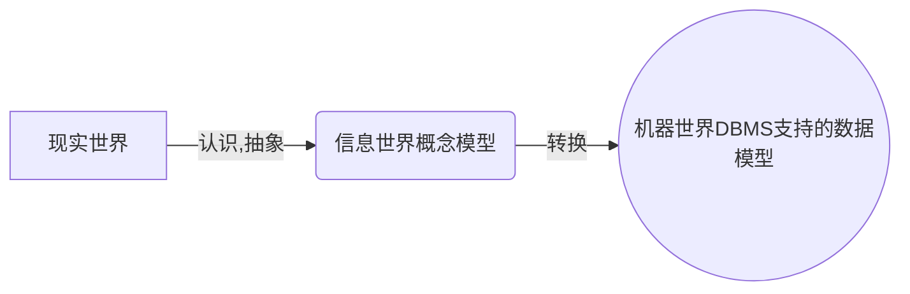
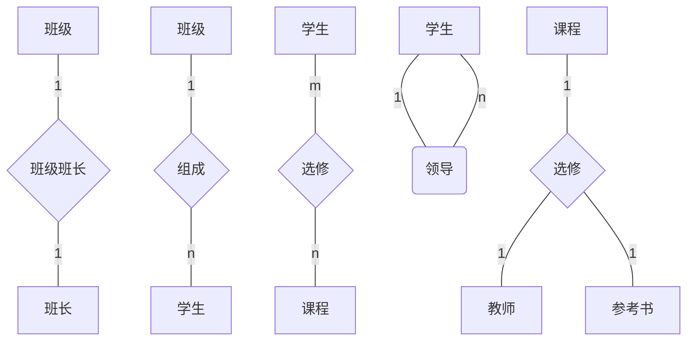
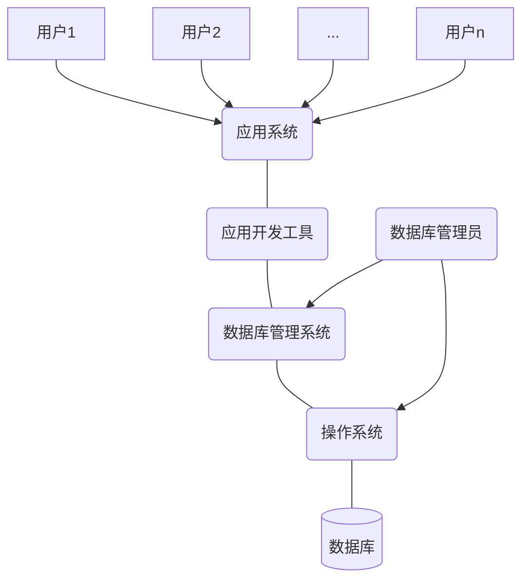

# 课前须知

## 课程主页
[链接1](http://staff.ustc.edu.cn/~ypb/)
http://staff.ustc.edu.cn/~ypb/（这个可能会崩溃）

[链接2](https://git.ustc.edu.cn/ypb/course)
https://git.ustc.edu.cn/ypb/course（建议用这个）

## 关于课程和评分

- [x] 有实验，第六周开始，共五次，前四次为基础了解实验，最后一次为综合实验，交一次实验报告。

- [x] 期末考试百分之60，平时分百分之20，实验百分之20，人少时会点名。

- [x] 作业一章提交一次。

# 第一章.绪论

## 1.1 引言:略（属于数据管理的最新技术）
> 计算机应用的三个方面:科学计算，数据管理，过程控制。

***墨天轮数据库调查报告（2022）
83.4%的企业正在使用中国的数据库产品。企业当前使用中国数据库的情况(10%以上)
达梦数据库20.4%~~（貌似第五个实验用这个数据库会加分？）~~
华为云 GaussDB17.8%
阿里云 PolarDB17.3%
OceanBase 16.4%
openGauss 16.1%
TiDB 13.4%
腾讯云TDSQL11%***

### 1.1.1 数据库系统等相关概念

- 数据（Data）
> 数据是信息的符号记录。数据是数据库处理和研究的对象。
- 数据库（Database）
> 长期存储在计算机内，有组织的、可共享的相关数据的集合。
- 数据库管理系统（DBMS）
> 位于用户和操作系统之间的一层数据管理软件。
- 数据库系统（DBS)
> 计算机硬件为基础的记录保持系统。包括数据库、数据库管理系统、应用系统、管理员和用户，有时还包括计算机硬件。

### 1.1.2 数据库系统发展历程（略）

<div align="center">
<table>
  <tr>
    <th></th>
    <th>阶段</th>
    <th>人工</th>
    <th>文件系统</th>
    <th>数据库系统</th>
  </tr>
  <tr>
    <td rowspan="5">背景</td>
    <td>时间</td>
    <td>20世纪50年代末</td>
    <td>60年代中期</td>
    <td>60年代末</td>
  </tr>
  <tr>
    <td>应用背景</td>
    <td>/</td>
    <td>科学计算、管理</td>
    <td>大规模管理</td>
  </tr>
  <tr>
    <td>硬件背景</td>
    <td>无直接存储设备</td>
    <td>磁盘、磁鼓</td>
    <td>大容量磁盘</td>
  </tr>
  <tr>
    <td>软件背景</td>
    <td>无OS</td>
    <td>有文件系统</td>
    <td>有DBMS</td>
  </tr>
  <tr>
    <td>处理方式</td>
    <td>批处理</td>
    <td>联机和批处理</td>
    <td>联机和批处理</td>
  </tr>
  <tr>
    <td rowspan="6">特点</td>
    <td>数据管理者</td>
    <td>人</td>
    <td>文件系统</td>
    <td>DBMS</td>
  </tr>
  <tr>
    <td>数据面向对象</td>
    <td>/</td>
    <td>某一应用程序</td>
    <td>现实世界</td>
  </tr>
  <tr>
    <td>数据共享程度</td>
    <td>无，冗余大</td>
    <td>共享性差，冗余较大</td>
    <td>共享性高冗余小</td>
  </tr>
  <tr>
    <td>数据独立性</td>
    <td>无</td>
    <td>独立性差（无逻辑）</td>
    <td>有高度独立性</td>
  </tr>
  <tr>
    <td>数据结构化</td>
    <td>无</td>
    <td>记录有结构，整体无</td>
    <td>结构化：数据模型描述</td>
  </tr>
  <tr>
    <td>数据控制能力</td>
    <td>/</td>
    <td>应用程序控制</td>
    <td>DBMS保护：安全性、完整性、并发控制、数据恢复</td>
  </tr>
</table>
</div>

### 1.1.3 数据库技术的研究领域

- 数据库管理系统软件的研制（面向对象、多媒体数据库等）
- 数据库设计（设计方法学和设计工具、数据模型与建模、设计规范与标准）
- 数据库理论（规范化理论）

### 1.1.4* 数据库系统的特点

- 数据的结构化
- 数据的共享性好、冗余度低
- 数据的独立性高：物理、逻辑。
-数据由DBMS统一管理
    > 数据的安全性(Security)
    > 
    > 数据的完整性(Integrity)
    > 
    > 并发控制(Concurrency)
    > 
    > 数据库恢复(Recovery）
- 良好的用户接口

### 1.1.5* 数据库在信息科学中的应用

- 三个世界

<div align="center">
<table>
  <tr>
    <th>现实世界</th>
    <th>信息世界</th>
    <th>计算机世界</th>
  </tr>
  <tr>
    <td>实体(Entity)<br>实体集</td>
    <td>实体记录(Record)<br>记录集</td>
    <td>数据(Data)<br>数据集</td>
  </tr>
  <tr>
    <td>特征<br>特征值<br>特征取值范围</td>
    <td>属性(Atribute)<br>属性值<br>属性值域</td>
    <td>数据项（属性）<br>数据项<br>数据项值域</td>
  </tr>
</table>
</div>

## 1.2 数据模型

- 数据的组织是数据库技术的核心问题
- 数据库的数据组织是通过数据模型来实现的
- 数据模型是创建数据库维护数据库的方式,是数据库系统定义数据内容和数据间联系的方法
- 数据模型的定义：表示实体类型和实体间联系的模型称数据模型

> 数据模型的两个层次: 
> > 概念（数据）模型:
> > - 也称信息模型。用来描述信息结构，又称实体联系模型(ER)
> > - 按照用户观点对信息建模

> >（结构）数据模型:
> > - 面向数据库的逻辑结构，直接涉及到计算机系统和DBMS，又称为（基本）数据模型
> > - 按照计算机系统的观点对数据建模

> ***数据模型的三个方面要求:***
> - ***比较真实模拟真实世界***
> - ***容易为人所理解***
> - ***便于计算机实现***


### 1.2.1 概念模型
- 实体联系模型（Entity Relationship Model，简记ER模型）
> - 直接从现实世界中抽象出实体和实体间联系，然后用实体联系图（ER图）表示信息模型
> - ER模型实际是信息世界的模型
- ER图的四个组成部分
> - 矩形框：实体型
> - 菱形框：联系
> - 椭圆框：实体型和联系的属性
> - 直线：连接实体类型和联系类型，表示联系的种类

#### 1.2.1.1 ER图举例


> 上述五个例子分别为 `两个实体1:1`，`两个实体1:n`，`两个实体m:n`，`同一实体1:n`，`三个实体1:m:n`。

### 1.2.2 结构模型的要素

1. 数据结构:
   > - 用于描述系统的静态特征。
   > - 是对实体类型和实体间联系的表达和实现，命名依据。

2. 数据操作:
   > - 是用于描述系统的动态特征。
   > - 是对数据库检索和更新（插入、修改、删除）两类操作。

3. 数据的约束条件：
   > - 一组完整性规则的集合。
   > - 给出数据及其联系所具有的制约和依赖原则。

### 1.2.3（结构）数据模型
结构数据模型主要有三种:层次模型、网状模型、关系模型。
> - [x] 未来可发展：对象模型、语义模型

> 非关系模型中的数据结构的单位是基本层次联系。所谓基本层次联系是指的两个记录以及它们之间的一对多（包括一对一）的联系。

#### 1.2.3.1 层次模型

##### 典型代表：IBM1968年的IMS

##### 定义
- 用树型（层次）结构表示实体类型及实体间联系的数据模型

##### 数据结构特点
- 有且仅有一个结点无双亲，该结点是根结点
- 其他结点有且仅有一个双亲
- 层次模型中每个结点（片断）表示一个记录类型
- 每个记录类型包含若干个字段，字段有字段名、数据类型和长度等

##### 数据操纵与完整性约束
- 插入时，没有双亲结点不能插入子女结点
- 删除时，删除双亲结点要同时删除子女结点
- 更新时，要更新所有相应的记录

##### 存储结构
- 邻接法
- 链接法

##### 优点
- 模型本身简单
- 实体间联系是固定的，预先设计好的应用系统,性能优于关系型，不低于网状模型
- 层次模型提供了良好的完整性支持

##### 缺点
- 实现多对多关系时，需要采用冗余或虚结点方式,易形成不一致性
- 对插入和删除操作限制较多
- 查询子结点需通过双亲结点
- 结构严谨，层次命令趋于程序化

#### 1.2.3.2 网状模型

##### 典型代表
- DBTG (DataBase Task Group）开发系统
- HP公司的IMAGE/3000
- Honeywll 公司的IDS/I1
- Univac公司的DMS1100等

##### 定义
- 用有向图（网络）结构表示实体类型及实体间联系的数据模型。（networkmodel)

##### 数据结构特征
- 允许一个以上的结点无双亲
- 至少一个结点不止一个双亲

##### 数据操纵与完整性约束
- 插入时，允许插入未确定双亲结点的子女结点值
- 删除时，允许只删除双亲结点值
- 更新时，只需更新指定记录

##### 存储结构
- 常用链接法
- 其它如引元阵列法、二进制阵列法、索引法等

##### 优点
- 更加直接描述现实世界
- 存取效率高，性能

##### 缺点
- 结构复杂，不利于用户掌握，DDL、DML语言复杂
- 数据独立性差

#### 1.2.3.3 关系模型

##### 定义
- 用表格表示实体集和实体间联系，用外键来实现关系间的联系（Relation model)

##### 数据结构特征
- 在用户看来，一个关系模型的逻辑结构就是一张二维表
- 必须使用规范化的关系，如分量是原子的
- 不仅实体用关系表示，实体间的联系也用关系表示

##### 术语
- 关系(relation)：一个关系对应通常一张表记做R
- 元组(Tuple)：表中的一行 $(V_1，V_2..V_n)$
- 字段(field)：表中的一列 $A_1，A_2...A_n$
- 域(Domain)：属性的取值范围
- 分量：元组中的一个属性的取值
- 关系模式：是记录型。对关系的描述，关系模式的实例是一个关系。关系模式的描述包括：关系名、属性名、属性类型、属性长度、主键包含的属性等，记做： $R(U,D,DOM,F)$
- 关系数据库模式：一组关系模式的总称即关系数据库模式，简称模式
- 候选键(Candidate Key)：在给定的关系中,有这样的属性或最小属性组，它在不同的元组中的值是不同的，利用这个(些)值可以唯一地标示关系中地元组，则称该属性(组)为候选键
- 主码(键)(Primary key)：候选键可能不止一个，被指定正在使用的候选键称主键
- 超键(Super Key)：能唯一标识元组的属性集。超键包括所有候选键
- 组合键与全键：当主键不是单一的属性时称组合键，组合键包括所有属性时称全键
- 外部键(Foreign Key)：关系模式R中的属性集是其它关系模式的主键，那么该属性集对关系模式R而言是外键
- 主属性和非主属性：包含在任一候选键中的属性叫主属性，否则称非主属性

##### 操纵与完整性约束
- 插入、删除和更新操作必须满足关系的完整性约束；
- 关系的完整性约束包括：实体完整性、参照完整性和自定义完整性

##### 存储结构 
- 实体和实体间的联系都用表来表示 
- 表通常以文件形式存储

##### 优点：
- 建立在严格的数学概念基础上
- 概念单一，实体、联系均用关系来表示
- 存取路径对用户透明，数据独立性更高，保密性更好。简化程序员工作和数据库开发建立工作。
 
##### 缺点：
- 存取路径对用户透明，查询效率不高
- 因存取路径对用户透明，必须对用户查询进行优化，增加了开发DBMS的难度

## 1.3 数据库系统的结构及功能
### 1.3.1 数据库系统的模式结构(从管理系统角度看)
- SPARC接口分三级结构

<div align="center">
  <table>
  <tr>
    <th></th>
    <th>Schema（模式）</th>
    <th>View（视图）</th>
    <th>Level（级别）</th>
  </tr>
  <tr>
    <td>External（外部）</td>
    <td>外模式<br>子模式</td>
    <td>用户视图<br>外视图</td>
    <td>外部级<br>局部逻辑级</td>
  </tr>
  <tr>
    <td>Conceptual（概念）</td>
    <td>模式<br>概念模式</td>
    <td>概念视图<br>DBA视图</td>
    <td>概念级<br>全局逻辑级</td>
  </tr>
  <tr>
    <td>Internal（内部）</td>
    <td>内模式<br>存储模式</td>
    <td>内部视图<br>内部级</td>
    <td>物理级<br>存储级</td>
  </tr>
</table>
</div>

- 数据库的二级映象功能与数据独立性 
  > 概念模式/内模式的映象
  > 
  > 概念模式/外模式的映象
  > 
  > 物理独立性：当存储结构改变时，可以通过修改概念模式/内模式的映象使概念级保持不便，这样外部级和应用程序也不会改变。
  > 
  > 逻辑独立性：当概念级发生改变时，可以通过修改概念模式/外模式的映象使外部级尽量保持不变，应用也就不需改变。 

<P align="center">
  
  <p align="center">
    <span>数据库系统模式结构</span>
  </p>
</P>

### 1.3.2 数据库系统的体系结构(从用户角度来看)
- 单用户DBS 
- 主从式结构DBS（终端方式） 
- 客户/服务器结构DBS 
- 分布式结构DBS 

### 1.3.3* 数据库系统的组成 
- 计算机硬件  CPU、内存、硬盘
- 计算机软件  OS、DBMS、应用软件包、应用程序
- 数据（库）
- 管理员、用户

> 数据库系统


## 1.4 数据库管理系统
### 1.4.1 数据库管理系统的功能与组成 
- [x] DBMS功能 
  > - [ ] 数据定义
  > - [ ] 数据操纵
  > - [ ] 数据库运行管理
  > > 安全性检查/完整性检查/并发控制/索引、数据字典等内部维护 
  - [ ] 数据组织、存储、管理
  - [ ] 数据库建立与维护功能
  - [ ] 数据通信接口功能 
- [x] DBMS组成 
  > - [ ] 数据定义语言
	> > DDL Data Definition/Description Language
  > - [ ] 数据操纵语言
	> > DML Data Manipulation Language
  > - [ ] 数据库运行控制语言
  > > DCL Data Control Language 
  > - [ ] 实用程序

### 1.4.2 数据库管理系统的工作过程
- 用户存取数据库数据的过程 
  1. 用户在程序中嵌入DML的一个读记录语句。控制转向DBMS
  2. DBMS检查合法性，查找子模式表，确定对应的存取权限
  3. DBMS依据子模式/模式映象的定义，确定应读入的模式记录
  4. DBMS依据模式/内模式映象的定义，确定应读入的物理记录
  5. DBMS向OS发送读取所需物理记录的命令
  6. OS启动IO程序，执行读操作
  7. OS将数据从数据库的存储区送到系统缓冲区
  8. DBMS依据子模式/模式映象定义，导出用户所要读取的记录格式
  9. DBMS将数据记录从系统缓冲区传送到程序的用户工作区
  10. DBMS向应用程序返回命令执行情况和状态信息 

<P align="center">
  
  <p align="center">
    <span>从数据库中读取记录的过程</span>
  </p>
</P>

### 1.4.3 数据库管理系统的实现方法
- N方案 
  > DBMS模块加入到用户进程，DBMS代码出现多副本，性能大幅下降 
- 2N方案
  > 每个用户有一个DBMSshdow进程和一个后台负责读写和日值的进程 
- M＋N方案 
  > 2N方案的改进方案，N用户，M个DBMS进程（M<N） 
- N＋1方案 
  > 1个DBMS进程(可设计成多线程的)，N个用户进程，消息开销大 

## 1.5 数据库工程与应用 
### 1.5.1 数据库设计的目标和特点 
- 数据库设计的任务是：在DBMS的支持下，按照应用的要求，为某一部门或组织设计一个结构合理、使用方便、效率较高的数据库及其应用系统 
- 数据库设计包含两方面内容
  - [x] 结构（数据）设计
  - [x] 行为（处理）设计 

### 1.5.2 数据库设计方法
- 核心是：逻辑设计和物理设计 
- 著名设计方法 
  - [x] 新奥尔良设计：需求分析、概念设计、逻辑设计、物理设计
  - [x] S.B.Yao设计：需求分析、模式构成、模式汇总、模式重构、模式分析、物理设计 

### 1.5.3 数据库设计步骤 
- 步骤
  > 需求分析、概念结构、逻辑结构、物理结构、实施、运行维护 
- 设计注意的问题 
  > - [x] 让用户参与，调动用户积极性
  > - [x] 充分考虑系统的可扩充性（可扩充性有限度）
  > - [x] 设计新系统要考虑旧系统的数据平稳迁移到新系统

### 1.5.4 数据库应用
- [x] 各种用户的数据视图

<P align="center">
  
  <p align="center">
    <span>各种用户的数据视图</span>
  </p>
</P>

- [x] DBA 的职责
  > - 设计与定义数据库
  > - 帮助最终用户使用数据库
  > - 监督和控制数据库
  > - 运行改进和重组数据库
  > - 转储和恢复数据库重构数据库

# 第二章 关系数据库
## 2.1 关系数据库概述
- 关系数据库系统是支持关系模型的数据库系统
- 关系理论是建立在集合代数理论基础上的，关系的定义和各种操作运算可以用集合代数给出
- 关系模型的三要素
  > - [x] 关系数据结构：二维表
  > - [x] 关系操作：选择、投影、连接、除、并，交、差等查询以及增、删、改
  > - [x] 完整性约束 ：实体、参照、自定义

### 关系数据语言
- 关系代数语言 ISBL
- ~~关系演算语言~~
  > - 元组关系演算语言 ALPHA，QUEL
  > - 域关系演算英语 QBE
- 具有关系代数和关系演算双重特点的语言 SQL

## 2.2 关系数据结构
### 2.2.1 关系
#### 定义
- ***域*** ：域是一组具有相同数据类型的值的集合。值的个数称为域的基数
- ***笛卡儿乘积*** :给定一组域: $D_1$ ， $D_2$，… $D_n$ ，域可以相同，定义 $D_1D_2…D_n$ 的笛卡儿乘积为: $D_1×D_2×……×D_n＝\lbrace(d_1，d_2，…d_n) |d_i∈D_i，i＝1，2，…n \rbrace$ ; $（d_1，d_2，…d_n）$ 称为一个元组
- ***关系(Relation)*** ：笛卡儿乘积 $D_1×D_2×…×D_n$ 的任一子集 $D^{\'}$ ，称作 $D_1，D_2，…D_n$ 上的关系。  用 $R（D_1，D_2……D_n）$ 来表示 $D^{\'}$ 中的每个元素 $（d_1，d_2，…d_n）$ 是关系的一个元组 实际应用中关系往往是笛卡儿乘积中有意义的子集构成 n＝1是单元关系/一元关系；n＝2是二元关系
#### 举例
- 域
  - [x] 性别集＝{男、女}。基数＝2
  - [x] 月份集＝{1，2，3，4，5，6，7，8，9，10，11，12}，基数＝12
- 笛卡儿乘积
  - [x] $D_1$ ＝姓名集合＝{赵一平，钱峰，孙英}
  - [x] $D_2$ ＝性别集合＝{男，女}
  - [x] $D_3$ ＝年龄集合＝{16，17，18}
- 关系

<div align="center">
	<table>
  <tr>
    <th>姓名</th>
    <th>性别</th>
    <th>年龄</th>
  </tr>
  <tr>
    <td>赵一平</td>
    <td>男</td>
    <td>16</td>
  </tr>
  <tr>
    <td>钱峰</td>
    <td>男</td>
    <td>17</td>
  </tr>
  <tr>
    <td>孙英</td>
    <td>女</td>
    <td>17</td>
  </tr>
</table>
</div>

### 2.2.2 关系模式
- 关系的描述称为 ***关系模式（Relation schema ）,一般表示为R(U,D,DOM,F)*** 其中，R是关系名，U是组成该关系的属性集合，D为属性组U中属性所来自的域，DOM是属性向域的映象集合，F是属性间数据的依赖关系集合。
### 2.2.3 关系数据库
- 在一个给定的现实世界领域里，所有实体及实体间的联系的关系所构成的集合是一个关系数据库
- 关系数据库有型和值之分：关系数据库的型也称关系数据库模式，是对关系数据库的描述它包括若干域的定义以及在这些域上定义的若干关系模式；关系数据库的值也称为关系数据库，是这些关系模式在某一时刻对应的关系的集合
- 关系数据库的值与关系数据库模式通称为关系数据库 
## 2.3 关系的完整性
- ***实体完整性***
	> 若属性A是基本关系R的主属性，则A不能取空值 
- ***参照完整性***
  > 若属性（或属性组）F是基本关系R的外码，它与基本关系S的主码Ks相对应（关系R、S不一定是不同的关系），则对于R中的每一个元组在F上的取值必须:
  > > 取空值（F的每个属性值均取空值）
  > > 等于S中某个元组的主码值
- ***自定义完整性***

## 2.4 关系代数
- 关系代数由一组关系运算组成，是对于关系的操作集。关系运算以一个或多个关系作为操作的对象，运算结果是一个新的关系。用关系运算实现查询。
- 关系代数运算符
  > - [x] 集合运算符： $\cup (并) －(差) \cap (交) ×(笛卡儿积)$
  > - [x] 专门运算符： $\sigma \ 选择 \ \Pi \ 投影 \ \bowtie \ 连接 \ ÷ \ 除$
  > - [x] 比较运算符： $> \ ≥ \ < \ ≤ \ = \ ≠$
  > - [x] 逻辑运算符： $┑ 非 ∧与 ∨或$
- 常用的关系运算
  > 交、并、差、笛卡儿积、投影、选择、连接、除
- 基本关系运算有
	> 并、差、笛卡儿积、投影、选择
- 同类关系：具有相同的度，且两个关系每个属性属同一个域

### 2.4.1 传统的集合运算

<div align="center">
	<table>
  <tr>
    <th>Name</th>
    <th>Sex</th>
    <th>Age</th>
  </tr>
  <tr>
    <td>Zhang</td>
    <td>F</td>
    <td>22</td>
  </tr>
  <tr>
    <td>Wang</td>
    <td>M</td>
    <td>25</td>
  </tr>
  <tr>
    <td>Lu</td>
    <td>M</td>
    <td>37</td>
  </tr>
  <tr>
    <td>Chen</td>
    <td>F</td>
    <td>27</td>
  </tr>
</table>
<p align="center">
	<span>R</span>
</p>
</div>

<div align="center">
	<table>
  <tr>
    <th>Name</th>
    <th>Sex</th>
    <th>Age</th>
  </tr>
  <tr>
    <td>Zhang</td>
    <td>F</td>
    <td>22</td>
  </tr>
  <tr>
    <td>Wang</td>
    <td>M</td>
    <td>25</td>
  </tr>
  <tr>
    <td>Lu</td>
    <td>F</td>
    <td>30</td>
  </tr>
  <tr>
    <td>Sun</td>
    <td>M</td>
    <td>28</td>
  </tr>
</table>
<p align="center">
	<span>S</span>
</p>
</div>

- [x] 并（Union）：
	> 同类关系R和S的并记为 $R \cup S$ ，或 $R \ union \ S$
 	> 
 	> 定义: $R \cup S=\lbrace t|t∈R ∨ t \in S\rbrace$ 注意去除重复元组 
- $R \cup S$

<div align="center">
	<table>
  <tr>
    <th>Name</th>
    <th>Sex</th>
    <th>Age</th>
  </tr>
  <tr>
    <td>Zhang</td>
    <td>F</td>
    <td>22</td>
  </tr>
  <tr>
    <td>Wang</td>
    <td>M</td>
    <td>25</td>
  </tr>
  <tr>
    <td>Lu</td>
    <td>M</td>
    <td>37</td>
  </tr>
  <tr>
    <td>Chen</td>
    <td>F</td>
    <td>27</td>
  </tr>
  <tr>
    <td>Lu</td>
    <td>F</td>
    <td>30</td>
  </tr>
  <tr>
    <td>Sun</td>
    <td>M</td>
    <td>28</td>
  </tr>
</table>
</div>

- [x] 交（Intersection）
	> 同类关系R和S的交记为 $R \cap S$，或 $R \ intersect \ S$
 	> 
 	> 定义: $R \cap S＝\lbrace t|t \in R \land t\in S \rbrace \equiv R－（R－S）$
- $R \cap S$

<div align="center">
	<table>
  <tr>
    <th>Name</th>
    <th>Sex</th>
    <th>Age</th>
  </tr>
  <tr>
    <td>Zhang</td>
    <td>F</td>
    <td>22</td>
  </tr>
  <tr>
    <td>Wang</td>
    <td>M</td>
    <td>25</td>
  </tr>
</table>
</div>

- [x] 差（Minus/Difference）
	> 同类关系R和S的差记为 $R－S$ 或 $R \ minus \ S$
 	> 
	> 定义: $R－S＝\lbrace t|t \in R \land t \notin S \rbrace$
- $R－S$

<div align="center">
	<table>
  <tr>
    <th>Name</th>
    <th>Sex</th>
    <th>Age</th>
  </tr>
  <tr>
    <td>Lu</td>
    <td>M</td>
    <td>37</td>
  </tr>
  <tr>
    <td>Chen</td>
    <td>F</td>
    <td>27</td>
  </tr>
</table>
</div>

- [x] 笛卡儿积（Cartesian Product）
	> 关系R和S的笛卡儿积记为 $R×S$
 	> 
	> 定义: $R×S＝\lbrace t⌒s|t \in R， s \in S \rbrace $

<div align="center">
	<p align="center"><span>R</span></p>
	<table>
  <tr>
    <th>CNo</th>
    <th>CN</th>
  </tr>
  <tr>
    <td>C-11</td>
    <td>OS</td>
  </tr>
  <tr>
    <td>C-21</td>
    <td>DB</td>
  </tr>
</table>
<p align="center"><span>S</span></p>
<table>
  <tr>
    <th>SNo</th>
    <th>SN</th>
    <th>Age</th>
  </tr>
  <tr>
    <td>S-01</td>
    <td>Huang</td>
    <td>21</td>
  </tr>
  <tr>
    <td>S-21</td>
    <td>Lin</td>
    <td>20</td>
  </tr>
  <tr>
    <td>S-30</td>
    <td>Shao</td>
    <td>22</td>
  </tr>
</table>
<p align="center"><span>R×S</span></p>
	<table>
  <tr>
    <th>CNo</th>
    <th>CN</th>
    <th>SNo</th>
    <th>SN</th>
    <th>Age</th>
  </tr>
  <tr>
    <td>C-11</td>
    <td>OS</td>
    <td>S-01</td>
    <td>Huang</td>
    <td>21</td>
  </tr>
  <tr>
    <td>C-11</td>
    <td>OS</td>
    <td>S-21</td>
    <td>Lin</td>
    <td>20</td>
  </tr>
  <tr>
    <td>C-11</td>
    <td>OS</td>
    <td>S-30</td>
    <td>Shao</td>
    <td>22</td>
  </tr>
  <tr>
    <td>C-21</td>
    <td>DB</td>
    <td>S-01</td>
    <td>Huang</td>
    <td>21</td>
  </tr>
  <tr>
    <td>C-21</td>
    <td>DB</td>
    <td>S-21</td>
    <td>Lin</td>
    <td>20</td>
  </tr>
  <tr>
    <td>C-21</td>
    <td>DB</td>
    <td>S-30</td>
    <td>Shao</td>
    <td>22</td>
  </tr>
</table>
</div>

### 2.4.2 专门的关系运算
- 引入以下记号 : 设关系模式R（ $A_1，A_2，…，A_n$ ），它的一个关系为 $R_t$ ， $t∈R_t$ 表示t是 $R_t$ 的一个元组。 $t[A_i]$ 则表示元组t中相应于 $A_i$ 的一个分量
- 若 $A＝\lbrace A_{i1}，A_{i2}，…，A_{ik}\rbrace$ 是 $A_1，A_2，…，A_n$ 的一部分，k<=n，则A称为属性列（组）或域列。 $t[A]=(t[A_{i1}]，t[A_{i2}]，…，t[A_{ik}])$ 表示元组在属性列A上诸分量的集合
- R为n元关系，S为m元关系。tr∈R，ts∈S， **$tr ⌒ ts$ 称为元组的连接（Concatenation）** 。它是一个m＋n列的元组，前n个分量为R中的一个n元组，后m个分量为S中的一个m元组
- 给定一个关系R（X，Z），X和Z为属性组，定义：当t[X]=x时，x在R中的象集（image set）为 Zx={t[Z]|t∈R，t[X]=x}，表示R中属性组X上值为x的诸元组在Z属性组上的分量的集合
#### 投影（Projection） 
- 关系R上的投影是从R中选择出若干属性，并且去掉重复元组组成一个新关系，属于单目运算 
- 记作: $\Pi_A(R)＝\lbrace t[A]| t \in R \rbrace$ A为R中的属性列 
- [x] 举例：
> _**假设Student**_

<div align="center">
	<table>
  <tr>
    <th>SNo</th>
    <th>SName</th>
    <th>Sex</th>
    <th>Age</th>
  </tr>
  <tr>
    <td>S01</td>
    <td>Wang</td>
    <td>F</td>
    <td>17</td>
  </tr>
  <tr>
    <td>S02</td>
    <td>Zhang</td>
    <td>M</td>
    <td>20</td>
  </tr>
  <tr>
    <td>S03</td>
    <td>Lin</td>
    <td>M</td>
    <td>18</td>
  </tr>
  <tr>
    <td>S04</td>
    <td>Sun</td>
    <td>F</td>
    <td>19</td>
  </tr>
</table>
</div>

> $S_{na}=\Pi_{Sname，Age}(Student)$

<div align="center">
	<table>
  <tr>
    <th>SName</th>
    <th>Age</th>
  </tr>
  <tr>
    <td>Wang</td>
    <td>17</td>
  </tr>
  <tr>
    <td>Zhang</td>
    <td>20</td>
  </tr>
  <tr>
    <td>Lin</td>
    <td>18</td>
  </tr>
  <tr>
    <td>Sun</td>
    <td>19</td>
  </tr>
</table>
</div>

#### 选择（Selection） 
- 又称限制（Restriction），在给定的关系R中，抽出满足条件的元组，组成一个新关系，新关系与原关系同类，是原关系一个子集
- 记做: $\sigma_F(R)=\lbrace t| t \in R \land F（t）='真'\rbrace$ F表示条件 
> $S_{a18}=\sigma_{age>=18}(Student)$

<div align="center">
	<table>
  <tr>
    <th>SNo</th>
    <th>SName</th>
    <th>Sex</th>
    <th>Age</th>
  </tr>
  <tr>
    <td>S02</td>
    <td>Zhang</td>
    <td>M</td>
    <td>20</td>
  </tr>
  <tr>
    <td>S03</td>
    <td>Lin</td>
    <td>M</td>
    <td>18</td>
  </tr>
  <tr>
    <td>S04</td>
    <td>Sun</td>
    <td>F</td>
    <td>19</td>
  </tr>
</table>
</div>

#### 连接(Join)
- 从两个关系的笛卡儿乘积中选取属性满足一定条件的元组，组成新的关系 
- 记做: $R \bowtie_{A\theta B} S ＝\lbrace tr⌒ts| tr\in R \land ts\in S \land tr[A]\theta ts[B]\rbrace \equiv \sigma_{A\theta B}(R×S)$  
- $A\theta B$ 表示R上的属性A和S上的属性B满足 $\theta$ 条件， $\theta$ 是比较运算符，A、B的度数相等且可比。这里假设AB分别在R、S关系的第i、j列，R度为r 
##### 等值连接(equi-join)
- $\theta$ 为“＝”时称为等值连接
	> 记: $R \bowtie_{A=B} S ＝\lbrace tr⌒ts| tr\in R \land ts\in S \land tr[A]＝ts[B]\rbrace$
##### 自然连接(Natioal Join)
- 两个关系中具有相同的属性，并且在相同的属性上做等值连接。自然连接需要取消重复列，而等值连接不需要 。
	> 记: $R \bowtie S ＝\lbrace tr⌒ts| tr∈R ∧ts∈S ∧ tr[A]＝ts[A]\rbrace$
##### 举例

<div align="center">
	<p align="center">R<span></span></p>
	<table>
  <tr>
    <th>A</th>
    <th>C</th>
    <th>D</th>
  </tr>
  <tr>
    <td>30</td>
    <td>C1</td>
    <td>D3</td>
  </tr>
  <tr>
    <td>40</td>
    <td>C2</td>
    <td>D3</td>
  </tr>
  <tr>
    <td>50</td>
    <td>C3</td>
    <td>D1</td>
  </tr>
  <tr>
    <td>10</td>
    <td>C4</td>
    <td>D1</td>
  </tr>
</table>
	<p align="center">R<span></span></p>
	<table>
  <tr>
    <th>B</th>
    <th>E</th>
    <th>F</th>
  </tr>
  <tr>
    <td>20</td>
    <td>E1</td>
    <td>F1</td>
  </tr>
  <tr>
    <td>50</td>
    <td>E2</td>
    <td>F3</td>
  </tr>
  <tr>
    <td>40</td>
    <td>E3</td>
    <td>F1</td>
  </tr>
</table>
</div>

> **$R \bowtie_{A > B} S$**

<div align="center">
	<table>
  <tr>
    <th>A</th>
    <th>B</th>
    <th>C</th>
    <th>D</th>
    <th>E</th>
    <th>F</th>
  </tr>
  <tr>
    <td>30</td>
    <td>20</td>
    <td>C1</td>
    <td>D3</td>
    <td>E1</td>
    <td>F1</td>
  </tr>
  <tr>
    <td>40</td>
    <td>20</td>
    <td>C2</td>
    <td>D3</td>
    <td>E1</td>
    <td>F1</td>
  </tr>
  <tr>
    <td>50</td>
    <td>20</td>
    <td>C3</td>
    <td>D1</td>
    <td>E1</td>
    <td>F1</td>
  </tr>
  <tr>
    <td>50</td>
    <td>40</td>
    <td>C3</td>
    <td>D1</td>
    <td>E3</td>
    <td>F1</td>
  </tr>
</table>
</div>

#### 除法(Division)
- 给定关系R（X，Y）和S（Y，Z），其中X，Y，Z为属性组，R中的Y与S中的Y可以不同属性名，但必须有相同的域。记R÷S。令P（X）＝R÷S，则P是R中满足以下条件的元组在X属性列上的投影：元组在X上的分量值x的象集 $Y_x$包含S在Y上投影的集合
> 记做: $R÷S＝\lbrace tr[X]|tr\in R \land Y_x\supseteq\Pi_Y(S)\rbrace$
>
> $R÷S \equiv \Pi_X(R)－\Pi_X((\Pi_X(R)×\Pi_Y(S))－R) $
##### 举例

<P align="center">
  
  <p align="center">
    <span>除法</span>
  </p>
</P>

#### 外连接(Outer Join)
- 如果R和S在做自然连接时，把该舍弃的元组也保存在新关系中，在新增加的属性上填空值（null），这种操作称为“外连接”。如果把R中该舍弃的元组保留在新关系中称左连接；把S中该舍弃的元组保留在新关系中称右连接 
#### 外部并(Outer Union) 
- 若关系R和S不同类，则新关系的属性由R和S的属性组成，公共属性只取一次，新关系的元组由属于R或S的元组构成，新增的属性上均填空（null） 
#### 半连接(Semijoin)
- 关系R和S的半连接定义为R和S的自然连接在关系R的属性集上的投影

> 举例：

<P align="center">
  
  <p align="center">
    <span>举例1</span>
  </p>
</P>
<P align="center">
  
  <p align="center">
    <span>举例2</span>
  </p>
</P>

### 2.4.3* 关系代数运算应用举例
- [x] 假设
	> S(S＃,SN,SSEX,SAGE)
 	> 
	> C(C＃,CN,TEACHER)
 	> 
	> SC(S＃,C＃,GRADE)
- 检索学习课程号为C2的学生学号与成绩 
	> $\Pi_{S＃,GRADE}(\sigma_{C＃='C2'}(SC))$ 或 $\Pi_{1,3}(\delta_{2='C2'}(SC))$
- 检索学习课程号为C2的学生学号与姓名 
	> $\Pi_{S＃,SN}(\sigma_{C＃='C2'}(S \bowtie SC))$ 
- 检索选修课程名为Maths的学生学号与姓名 
	> $\Pi_{S＃,SN}(\sigma_{CN='Maths'}(S \bowtie SC \bowtie C))$ 
- 检索选修课程为C2或C4的学生学号 
	> $\Pi_{S＃}(\sigma_{C＃='C2'∨C＃='C4'}(SC))$
- 检索至少选修课程为C2和C4的学生学号 
	> $\Pi_{S＃}(\sigma_{1=4∧2='C2'∧5='C4'}(SC×SC))$
- 检索不选修C2课程的学生姓名与年龄 
	> $\Pi_{SN，SAGE}(S)－\Pi_{SN，SAGE}(\sigma_{C＃='C2'}(SC \bowtie S))$
- 检索选修全部课程的学生姓名 
	> $\Pi_SN(S \bowtie (\Pi_{S＃,C＃}(SC)\div \Pi_{C＃}(C)))$ 
- 检索所学课程包含学生S3所学课程的学生学号 
	> $\Pi_{S＃,C＃}(SC) \div \Pi_{C＃}(\sigma_{S＃='S3'}(SC))$

### 2.4.4 关系代数式的等价规则
1. 连接、笛卡尔积交换律
	> - $E_1×E_2 ≡ E_2×E_1$
 	> - $E1 \bowtie E_2 ≡ E_2 \bowtie E_1$
 	> - $E1 \bowtie_F E_2 ≡ E_2 \bowtie_F E_1$
2. 连接、笛卡尔积结合律
	> - $(E_1×E_2) ×E_3 ≡ E_1×(E_2×E_3)$
	> - $(E_1 \bowtie E_2) \bowtie E_3 ≡ E_1 \bowtie (E_2 \bowtie E_3)$
	> - $(E_1 \bowtie_{F_1} E_2) \bowtie_{F_2} E_3 ≡ E_1 \bowtie_{F_1}(E_2 \bowtie_{F_2} E_3)$
3. 投影的串接定律
	> - $\Pi_{A_1,A_2,…,A_n}(\Pi_{A_{k_1},A_{k_2},…,A{k_m}}(R))≡\Pi_{A_1,A_2,…,A_n}(R)$ , $A_1,A_2,…,A_n$ 是 $A_{k_1},A_{k_2},…,A_{k_m}$ 的子集
4. 选择的串接定律
	> - $\sigma_{F_1}(\sigma_{F_2}(R)) ≡ \sigma{F_1∧F_2}(R)$
5. 选择与投影的交换律
	> - $\Pi_{A_1,A_2,…,A_n}(\sigma_F(R)) ≡ \sigma_F(\Pi_{A_1,A_2,…,A_n}(R))$
	> - $\Pi_{A_1,A_2,…,A_n}(\sigma_F(R))≡\Pi_{A_1,A_2,…,A_n}(\sigma_F(\Pi_{A_1,A_2,…,A_n,B_1,B_2,…,B_n}(R)))$
	> > 例： $\Pi_A (\sigma_{R.A=S.B}(R×S))$ ≡ $\Pi_A (\sigma_{R.A=S.B}(\Pi_{A,B}(R×S)))$ ≡ $\Pi_A (\sigma_{R.A=S.B}(\Pi_A(R)×\Pi_B(S)))$
6. 选择对笛卡尔积的分配率
	> - $\sigma_F(E_1×E_2)≡\sigma_{F_1}(E_1)×\sigma_{F_2}(E_2)$
	> > $F=F_1∧F_2$ , $F_1$ 只涉及 $E_1$ ，$F_2$ 只涉及 $E_2$
 	> - $\sigma_F(E_1×E_2)≡ \sigma_F(E_1)×E_2$
 	> > F只涉及 $E_1$
 	> - $\sigma_F(E_1×E_2)≡\sigma_{F2}(\sigma_{F_1}(E_1)×E_2)$
	> > $F_1$ 只涉及 $E_1$ ， $F_2$ 涉及 $E_1$ ， $E_2$
7. 选择对并的分配率
	> - $\sigma_F(E_1 \cup E_2)≡\sigma_{F_1}(E_1)\cup \sigma_{F_2}(E_2)$
8. 选择对差的分配率
	> - $\sigma_F(E_1 - E_2)≡\sigma_{F_1}(E_1) - \sigma_{F_2}(E_2)$
9. 投影对笛卡尔积的分配率
	> - $\Pi_{A_1,A_2,…,A_n,B_1,B_2,…,B_n}(E_1×E_2)≡ \Pi_{A_1,A_2,…,A_n}(E+1)×\Pi_{B_1,B_2,…,B_n}(E2)$ ,其中 $A_1,A_2,…,A_n$ 是 $E_1$ 属性， $B_1,B_2,…,B_n$ 是 $E_2$ 属性
10. 投影对并的分配率
	> - $\Pi_{A_1,A_2,…,A_n}(E_1 \cup E_2)≡\Pi_{A_1,A_2,…,A_n}(E_1)\cup \Pi_{A_1,A_2,…,A_n}(E_2)$
11. 选择对自然连接的分配率
	> - $\sigma_F(E_1 \bowtie E_2)≡\sigma_{F_1}(E_1) \bowtie \sigma_{F_2}(E_2)$
	> > $F=F_1∧F_2$ , $F_1$ 只涉及 $E_1$ ， $F_2$ 只涉及 $E_2$
12. 选择与连接操作的结合率
	> - $\sigma_{F}(E_1×E_2)≡E_1 \infty_F E_2$
    > > F形如 $E_1.A \theta E_2.B$
 	> - $\sigma_{F_1}(E_1 \bowtie_{F_2} E_2)≡E_1 \bowtie_{F1∧F2} E_2$
    > > $F_1$ , $F_2$ 形如 $E_1.A \theta E_2.B$
### 2.4.5 利用规则优化查询
> 例：设学生选课系统中，学生关系S有1000条记录，每个学生平均选课10门，则SC关系有10000条记录，课程关系C有1000条记录。若需要查询学生“王芳”所选修课程的成绩在85分以上的课程名。
> > 设 $F_1$ 表示S.sno=SC.sno、 $F_2$ 表示SC.cno=C.cno、 $F_3$ 表示S.sn='王芳'、 $F_4$ 表示SC.grade>=85
> > > $\Pi_{cn}(\sigma_{F_1∧F_2∧F3∧F_4}(S×SC×C))$    $10^{10}$ 条连接记录 $O(10^{10})$
> > >
> > > $\Pi_{cn}(\sigma_{F_3∧F_4}(S\bowtie_{F_1}SC\bowtie_{F_2}C))$    $10^4$ 条记录，运算 $O(10^7)$
> > >
> > > $\Pi_{cn}(\sigma{F_3}(S)\bowtie\sigma_{F_4}(SC)\bowtie C))$      <=10条记录，运算 $O(10^4)$
#### 优化过程
> $\Pi_{cn}(\sigma_{F_1∧F_2∧F_3∧F_4}(S×SC×C))$   //①式
>
> $= \Pi_{cn}(\sigma_{F_3∧F_4}\sigma_{F_2}(\sigma_{F_1}((S×SC)×C)))$  //规则4，2
>
> $= \Pi_{cn}(\sigma_{F_3∧F_4}\sigma_{F_2}(\sigma_{F_1}(S×SC)×C))$  //规则6
>
> $= \Pi_{cn}(\sigma_{F_3∧F_4}\sigma_{F_2}((S\bowtie SC)×C))$    //规则12
>
> $= \Pi_{cn}(\sigma_{F_3∧F_4}((S\bowtie SC)\bowtie C))$    //规则12  ②式
>
> $= \Pi_{cn}(\sigma_{F_3}(S)\bowtie (\sigma_{F_4}(SC)\bowtie C)$    //规则11  ③式

#### 基于语法树优化
- 检索选修DB课程的女生学号及姓名。
	> $\Pi_{sno,sname}(\sigma_{cname='db'∧sex='F'}(\sigma_{S.sno=SC.sno∧SC.cno=C.no}(S×SC×C)))$

<P align="center">
  
  <p align="center">
    <span>基于语法树优化1</span>
  </p>
</P>
<P align="center">
  
  <p align="center">
    <span>基于语法树优化2</span>
  </p>
</P>
<P align="center">
  
  <p align="center">
    <span>基于语法树优化3</span>
  </p>
</P>
<P align="center">
  
  <p align="center">
    <span>基于语法树优化4</span>
  </p>
</P>

## 2.5关系演算** 
### 2.5.1 元组关系演算语言ALPHA 
### 2.5.2 域关系演算语言QBE 
## 2.6 关系数据库管理系统 
- 关系数据库管理系统简称关系系统
- 一个数据库管理系统可成为关系系统的最小条件 
	- [x] 关系数据库（即关系数据结构）
	- [x] 支持选择、投影和连接运算  
- E.F.Codd思想对关系系统的分类
	- [x] 表式系统：仅只是关系数据结构，不支持集合级操作
 	- [x] 最小关系系统：支持关系结构和选择、投影、连接集合操作
	- [x] 关系完备系统：支持关系结构和所有关系代数操作
	- [x] 全关系系统：支持关系模型的所有特征。 

 # 第三章 关系数据库标准查询语言SQL 
##  3.1 SQL概述
- SQL(Standard/Structured Query Language)是关系数据库标准 - 1986年10月，美国国家标准局（American National Standard Institute ANSI）公布第一个标准ANSI X3.135-1986，国际标准化组织（International Organization for Standardization ISO）也通过这一标准称SQL－86 
- 1989年ANSI再次公布标准ANSI X3.135-1989 ，ISO 相应SQL－89 
- 1999年，ISO公布 SQL-1999（SQL99，SQL3） 
- 2003年，ISO公布 SQL-2003

### 3.1.1 SQL语言的组成
- [x] 数据定义（DDL Data Definition/Description Language ）
  > 定义数据库的逻辑结构，包括基本表、视图、索引等
- [x] 数据操纵（DML Data Manipulation Language） 
  > 包括查询和更新，更新又包含插入、删除和修改 
- [x] 数据控制（DCL Data Control Language  ）  
  > 授权、完整性规则描述、事务控制等 
- [x] 嵌入式SQL（ESQL）
  > 在宿主语言中使用SQL的规则

### 3.1.2 SQL语言的特点 
- [x] 综合统一：集DDL、DML、DCL于一体，语言风格统一 
- [x] 面向集合的操作方式：操作对象、查询结果都可以是元组的集合 
- [x] 高度非过程化：存取路进透明。
- [x] 以统一的语法结构提供两种使用方式：自含式、嵌入式
- [x] 语言简洁，易学易用，主要共使用11个关键词
  > DDL：create drop alter
  >
  > DML：select insert delete update
  >
  > DCL：grant revoke commit rollback 

## 3.2 数据定义语言(DDL)
### 3.2.1 定义、删除与修改基本表 
#### 定义基本表语法 
> CREATE &nbsp; TABLE <表名> (<列名><数据类型>[列级约束条件][,<列名><数据类型>[列级约束条件]... ...][,<表级完整性约束条件>])

```举例
CREATE TABLE S（
	S＃	CHAR(5) ，
	SN	CHAR(20) NOT NULL UNIQUE ，
	SA  INT，
	SD CHAR(3),
	PRIMARY KEY  (S#)
）；
```

#### 修改表语法 
> ALTER TABLE <表名> 
>
> [ADD <新列名><数据类型>[列级约束条件]]
>
> [DROP <完整性约束条件>]
>
> [MODIFY <列名><数据类型>];

```举例
ALTER TABLE S ADD SCome DATE；
ALTER TABLE S MODIFY SA SMALLINT；
ALTER TABLE S DROP UNIQUE(S#)；
```

#### 删除表语法 
> DROP TABLE <表名> 

```举例
DROP TABLE S
```

### 3.2.2 建立和删除索引
#### 索引的建立语法
> CREATE [UNIQUE][CLUSTER] INDEX <索引名>
>
> ON <表名>（<列名1>[<次序>][，<列名2><次序>... ...]）
>
> <次序>可以是ASC和DESC

```举例
CREATE UNIQUE INDEX S_S# ON S(S#)
CREATE UNIQUE INDEX C_C# ON C(C#)
CREATE UNIQUE INDEX SC_S#_C# ON SC(S# ASC,C# DESC)
```

#### 索引的删除语法
> DROP INDEX [<表名>.]<索引名>

```举例
DROP INDEX [S.]S_S#
```
## 3.3 SQL的数据查询(DML)
- 关系代数表达式 

$$\Pi _{A_1,A_2,...,A_n}(\sigma _F(R_1×R_2×...×R_n))$$ 

- SQL语句

$$SELECT \ A_1，A_2,...,A_n$$

$$FROM \ R_1，R_2,...,R_m$$

$$WHERE \ F$$

- 详细语法 
> SELECT [ALL|DISTINCT] {*|<目标表达式1> [,<目标表达式2> ... ...]}
>
> FROM <表名或视图名1> [，<表名或视图名2>]... ...
>
> [WHERE <条件表达式>]
>
> [GROUP BY <列名表达式1>[，<列名表达式2>]] [HAVING <条件表达式> ]
>
> [ORDER BY <列名表达式1> [ASC|DESC]], <列名表达式2> [ASC|DESC]]

- 执行过程 
1. 先按WHERE子句条件从FROM子句指定的表/视图中找出满足条件的元组(选择);
2. 如有GROUP子句，则将结果按<列名表达式>的值分组，该<列名表达式>值相等的元组为一个组，通	常会在每组中使用聚合函数。
3. 如果GROUP子句带HAVING子句，则对组过虑，将满足条件的组输出
4. 再按SELECT子句中的目标表达式选择出元组中的属性，形成结果表(投影)；
5. 如果ORDER子句，则将结果按<列名表达式1>的值升序或降序排列

### 3.3.1 单表查询
> 假设(表格见下)
> > S(S#，SN，SS，SA，SD)
> >
> > C(C#，CN，CP，CR)
> >
> > SC(S#，C#，GR)

<P align="center">
  
  <p align="center">
    <span>假设对应的图表</span>
  </p>
</P>

- [x] 选取表中的某些列，即投影运算
	> 查指定列(见下图)
	> > SELECT S#,SN FROM S 
	>
	> 查全部列 
	> > SELECT * FROM STUDENT 
	>
	> 查经过计算的列(见下图) 
	> > SELECT SN，2015-SA FROM S 

<P align="center">
  
  <p align="center">
    <span>投影运算和选择运算对应的图表</span>
  </p>
</P>

- [x] 选择表中的若干元组，即选择运算
	> 消除取值重复行(见上图)
	> > SELECT DISTINCT SD FROM S
	>  
	> 查询满足条件的元组  
	> > 比较大小：<、<= 、>、>=、=、<> 
	> > > SELECT SN,SA FROM S WHERE SD=’CS’
	> > >
	> > > SELECT * FROM S WHERE SA<20
	>
	> > 确定范围：BETWEEN... AND 
	> > > SELECT * FROM S WHERE SA BETWEEN 20 AND 21
	> 
	> > 确定集合：IN 
	> > > SELECT * FROM S WHERE SD IN (‘CS’,’IS’,’MA’) 
	> 
	> > 字符匹配：LIKE，转义字符’\’
	> > > SELECT * FROM S WHERE S# LIKE ‘TB%’
	> > >
	> > > SELECT * FROM S WHERE SN LIKE ‘刘_’
	> 
	> > 涉及空值的查询：IS NULL 
	> > > SELECT * FROM SC WHERE GR IS NULL 
	> 
	> > 多重条件查询：
	> > > SELECT * FROM S WHERE SD=’CS’ AND SA<20 

- [x] 查询结果排序
	> ORDER BY <字段表达式> ASC|DESC
	>
	> SELECT * FROM SC WHERE C#=’3’ ORDER BY GR DESC(见下图)

- [x] 使用集(聚合)函数 
	> COUNT 、SUM、AVG、MAX、MIN
	>
	> SELECT COUNT(*) FROM S
	>
	> SELECT COUNT(DISTINCT S#) FROM SC
	>
	> SELECT AVG(GR) FROM SC WHERE S#='95001'
	>
	> SELECT MAX(GR) FROM SC WHERE C#='1'

- [x] 查询分组：GROUP BY 
	> SELECT C#,COUNT(\*) FROM SC GROUP BY C#(见下图)
	>
	> SELECT S# FROM SC GROUP BY S# HAVING COUNT(*) >3(见下图)  &nbsp; &nbsp; &nbsp;    检索选修>3门的课学生学号 

<P align="center">
  
  <p align="center">
    <span>查询对应的部分图表</span>
  </p>
</P>

### 3.3.2 连接查询
- [x] 等值连接  
	> SELECT  * FROM S,SC WHERE S.S# = SC.S#(见下表)
	> > (SQL92 ，SQL99,自然连接通过select列体现)
	> 
	> SELECT * FROM S [inner] join SC 
	> > on  S.S# = SC.S#   (SQL92 ,SQL99)
- [x] 自然连接 (消除重复列sid)
	> SELECT * FROM S natural  join SC    (SQL99)
	>
	> SELECT * FROM S join SC using (s#)   (SQL99)

> **_注：99标准更灵活_**
> > SELECT ...  FROM table1
> >
> > JOIN table2 ON table1 和 table2 的连接条件
> >
> > JOIN table3 ON table2 和 table3 的连接

- [x] 自连接
	> 检索每门课的间接预修课 
	> > SELECT f.C#, s.CP FROM C f,C s WHERE f.CP=s.C(见下表)
 
 <P align="center">
  
  <p align="center">
    <span>连接查询对应的部分图表</span>
  </p>
</P>

<P align="center">
  
  <p align="center">
    <span>SELECT f.C#, s.CP FROM C f,C s WHERE f.CP=s.C的推导过程</span>
  </p>
</P>

- [x] 外连接 
> 列出所有学生的修课情况，如果没有选课也列出其基本信息(左外连接)
> > SELECT S#,SN,SS,SA,SD,C#,GR FROM S, SC WHERE S.S# *=SC.S#   (SYBASE MSSQL)
 
> > SELECT S#,SN,SS,SA,SD,C#,GR FROM S, SC WHERE S.S# =SC.S#(+)   (ORACLE|SQL92标准)

> > SELECT S#,SN,SS,SA,SD,C#,GR FROM S LEFT OUTER JION SC ON S.S#=SC.S#(见下表)
> >
> > (MYSQL MSSQL|SQL99标准)

<P align="center">
  
  <p align="center">
    <p>SELECT S#,SN,SS,SA,SD,C#,GR</p>
	<p>FROM S LEFT OUTER JION SC ON S.S#=SC.S#的推导过程</p>
  </p>
</P>

- [x] 复合条件连接(表格见下图)
	> 检索选修课程号‘2’且成绩在90分以上的所有学生
	> > SELECT S.S# ,SN FROM S,SC WHERE S.S# = SC.S# AND SC.C#=’2’ AND SC.GR>=90
	> 
	> 检索每个学生选修的课程名及其成绩
	> > SELECT S.S#,SN,C.CN,SC.GR from S,SC,C WHERE S.S# = SC.S# AND SC.C# = C.C#

<P align="center">
  
  <p align="center">
    <span>复合条件连接对应的图表</span>
  </p>
</P>

### 3.3.3嵌套查询 
- [x] 带IN谓词的子查询 
> 检索与“刘晨”同在一系的学生信息
> > SELECT S#,SN,SD FROM S WHERE SD IN (SELECT SD FROM S WHERE SN＝'刘晨')
> 
> 本例可以通过自连接来实现 
> > SELECT s1.S#, s1.SN, s1.SD FROM S s1, S s2 WHERE s1.SD = s2.SD AND s2.SN='刘晨'

> 检索选修了课程名的为‘MA’的学生学号和姓名 
> > SELECT S#, SN FROM S WHERE S# IN (SELECT S# FROM SC WHERE C# IN (SELECT C# FROM C WHERE CN='MA'))
>
> 本例同样可以用连接来实现 
> > SELECT S#,SN FROM S,SC,C WHERE S.S# = SC.S# AND SC.C# = C.C# AND C.CN='MA'

- [x] 带比较运算的子查询 
	> 当确定子查询的返回值是唯一时，可以使用比较运算符(注意子查询在比较符后)
	> > SELECT S#,SN FROM S WHERE SD=(SELECT SD FROM S WHERE CN='刘晨')

- [x] 带ANY和ALL的子查询(子查询返回多值时用)
	> 检索其他系中比IS系任一学生年龄小的学生名单 
	> > SELECT S＃,SN FROM S WHERE SA < ANY (SELECT SA FROM S WHERE SD＝'IS') AND SD<>‘IS’ ORDER BY SA DESC
	> 
	> > 等价于
	> >
	> > SELECT S#，SN FROM S WHERE SA < (SELECT MAX（SA） FROM S WHERE SD＝'IS') AND SD <> 'IS' ORDER BY SA DESC 
	> 
	> 检索其他系中比IS系所有学生年龄都小的学生名单
	> > SELECT S＃，SN FROM S WHERE SA < ALL (SELECT SA FROM S WHERE SD＝‘IS’) AND SD<>'IS'  
	> 
	> > 等价于
	> >
	> > SELECT S＃，SN FROM S WHERE SA < (SELECT MIN（SA） FROM S WHERE SD＝'IS') AND SD <> 'IS' ORDER BY SA DESC

- [x] 带EXISTS的子查询(不返回任何数据，只返回Ture和False) 
	> 检索所有选修了课程号为'1'的学生姓名 
	> > SELECT SN FROM S WHERE EXISTS (SELECT * FROM SC WHERE S# = S.S# AND C# = '1')
	> > > _**注意：此例中子查询的查询条件依赖于外层父查询，称此类查询为相关子查询(corelated subquery)。**_
	> 
	> 等价连接实现：
	> > SELECT SN FROM S,SC WHERE S.S# = SC.S# AND C# = '1'

- [ ] SQL中没有(∀x)p，故须转换为¬(∃x(¬p)) 
	> 如检索选修了全部课程的学生,即没有一门课没有选的学生
	> > SELECT SN FROM S WHERE NOT EXISTS (SELECT * FROM C WHERE NOT EXISTS (SELECT * FROM SC WHERE C#＝ C.C# AND S# = S.S#))
- [ ] p→q应被等价为¬p∨q
	> 如检索至少选修了学生S001选修的全部课程的学生
	>
	> 令p='学生S001选修了y' &nbsp; q＝'学生x选修了y'
	
	$$(∀y)(p→q)=¬∃y(¬(p→q))= ¬∃y(¬(¬p∨q))= ¬∃y(p∧¬q))$$
	
	> 即不存在这么一门课程，学生S001选修了而x没有选修
	> > SELECT SN FROM S WHERE NOT EXISTS(SELECT * FROM SC SC2 WHERE S# = 'S001' AND NOT EXISTS (SELECT * FROM SC WHERE C# = SC2.C# AND S# = S.S#))  

### 3.3.4集合查询
- [x] 使用交、并、差的集合运算概念,INTERSECT,UNION,MINUS  
	- [ ] 检索计算机科学系及年龄不大于19岁的学生 
		> SELECT * FROM S WHER SD=’CS’ UNION SELECT * FROM S WHERE SA<＝19
		> 
		> 等价于：
		> > SELECT * FROM S WHERE SD＝‘CS’ OR SA <=19
	- [ ] 检索选修了课程号为C01或C02的学生学号
		> SELECT S# FROM SC WHERE C#＝'C01' UNION SELECT S# FROM SC WHERE C＃＝‘C02’
		>
		> 等价于：
		> > SELECT S# FROM SC WHERE C# IN ('C01','C02')
	- [ ] 检索同时选修了课程号为C01和C02的学生学号 
		> SELECT S# FROM SC WHERE C#＝'C01' INTERSECT SELECT S# FROM SC WHERE C#＝'C02'(仅ORACLE)
		>
		>  等价于：
		> > SELECT S# FROM SC WHERE C# = ‘C01’ AND S# IN (SELECT S# FROM SC WHERE C# = 'C02')
	- [ ] 检索选修了课程号为C01而未选修C02的学生学号。
> SELECT S# FROM SC WHERE C#＝'C01' MINUS SELECT S# FROM SC WHERE C#＝'C02'(仅ORACLE)
>
> 等价于：
> > SELECT S# FROM SC WHERE C#＝'C01' AND S# NOT IN (SELECT S# FROM SC WHERE C#＝'C02')

## 3.4 SQL的数据更新(DML)
### 3.4.1 数据插入 
#### 插入单个元组 
- [x] 语法：
	> INSERT INTO <表名>[ (<列名1> [, <列名2>]......)]
	>
	> VALUES(<常量1>[,<常量2>]......)
	> > 例：INSERT INTO S VALUES('S001','张三’,'男',18,'IS')
#### 插入子查询结果 
- [x] 语法:
	> INSERT INTO <表名> [ (<列名1> [, <列名2>]......)]<子查询>
	> > 例：为所有学生插入一条选修C01课程的记录
	> > > INSERT INTO SC SELECT  S#,'C01',null FROM S  
### 3.4.2 数据修改 
- [x] 语法:
	> UPDATE <表名> SET <列名>＝<表达式>[, <列名>＝<表达式>]...... [WHERE <条件>]; 
- [x] 修改某一个元组的值 
	> 将学生S001的年龄该为22岁
	> > UPDATE S SET SA=22 WHERE S# =’S001’ 
- [x] 修改多个元组的值 
	> 将所有的学生年龄增加1岁 
	> > UPDATE S SET SA＝SA＋1
- [x] 带子查询的修改语句 
	> 将计算机科学系所有的学生成绩置零 
	> > UPDATE SC SET GR=0 WHERE 'CS' = (SELECT SD FROM S WHERE S# = SC.S#) (相关子查询) 
	>
	> 不同的DBMS可以使用join实现同样功能，如SYBASE UPDATE SC set GR=0 from S where S.S#=SC.S# and SD='CS' 或 UPDATE SC set GR=0 where S# in (SELECT S# from S where SD='CS') 
- [x] 修改操作与数据库的一致性 
	> 如同时修改S和SC两表中的S#的值
	> 
	> 为了保证数据库的一致性，引入事务概念 
### 3.4.3 数据删除 
- [x] 语法： 
	> DELETE FROM <表名> [WHERE <条件>];
- [x] 删除某一个元组的值 
	> 删除学号为S001的学生 
	> > DELETE FROM S WHERE S#='S001' 
- [x] 删除多个元组的值 
	> 删除所有学生的选课记录 
	> > DELETE FROM SC 
- [x] 带子查询的删除语句 
	> 删除计算机科学系所有学生的选课记录 
	> > DELETE FROM SC WHERE ‘CS’=(SELECT SD FROM S WHERE S#=SC.S#) (相关子查询) 
	> >
	> > DELETE from SC where S# in (SELECT S# from S where SD=’CS’) (非相关子查询) 

## 3.5 视图
> 视图只是一个窗口，其数据依赖于基本表

### 3.5.1 定义视图 
#### 建立视图 
- [x] 语法 ：
	> CREATE VIEW <视图名> [(<列名1>[，<列名2>......])] AS <子查询>  [WITH CHECK OPTION] 

- **_列名在以下情况必须列出_**
	- [ ] 1. 子查询的目标列是集函数等，不是单纯的列
	- [ ] 2. 多表连接时出现同名的列作为视图字段 
	- [ ] 3. 需要在视图中启用新的名字  
- [x] WITH CHECK OPTION 表示对视图更新时自动验证子查询条件 
- [x] 行列子集视图：若一个视图是从单个基本表导出的，并且只是去掉了基本表的某些行和某些列，但保留了码，称行列子集视图 
	> 例：建立学生视图 
	> > CREATE VIEW IS_S AS SELECT S#, SN , SA FROM S WHERE SD = 'IS'

- [x] 建立信息系选修了C1号课程的学生视图 
	> CREATE VIEW IS_S1 (S#, SN ,GR) AS SELECT S.S# ,SN ,GR FROM S, SC WHERE S.S# = SC.S# AND S.SD='IS' AND SC.C# = 'C1' 

- [x] 视图之上可以建立视图 
	> 建立选修了C1课程且成绩在90以上的学生视图 
	> > CREATE VIEW IS_S2 AS SELECT S#, SN, GR FROM IS_S1 WHERE GR>=90

- [x] 其它视图建立例子
	> 建立一个反映学生出生年月的视图 
	> > CREATE VIEW BT_S（S＃，SN，SB）AS SELECT S#, SN,2003－SA FROM S  
	>
	> 建立一个学生学号和平均成绩的视图 
	> > CREATE VIEW S_G（S＃，AVG_GR）AS SELECT S#, AVG(GR) FROM SC GROUP BY S# 
	>
	> 建立一个女学生的视图 
	> > CREATE VIEW S_F（S＃，SN，SS，SA，SD）AS SELECT * FROM S  WHERE SS=’女’ 
	> > > 本视图在S表结构改变时会出错，解决办法是去掉列说明或改*为列表

#### 删除视图 
- [x] 语法
	> DROP VIEW <视图名>
	> > 例子：删除视图IS_S
	> > > DROP VIEW IS_S  
### 3.5.2 查询视图 
- [X] 把对视图的查询转化为对基本表的查询称为视图的消解(View Resolution) 
	> SELECT S#，SA FROM IS_S WHERE SA < 20 
	>
	>  消解为:
	>
	> SELECT S# ,SA FROM S WHERE SD=’IS’ AND SA <20 
	> 
	> SELECT * FROM S_G WHERE AVG_GR>90
	>
	> 消解为:
	>
	> SELECT S#, AVG(GR) FROM SC WHERE AVG(GR)>90 GROUP BY S# &nbsp; &nbsp; &nbsp; (错误)
	>
	> SELECT S#, AVG(GR) FROM SC GROUP BY S# HAVING AVG(GR)>90 &nbsp; &nbsp; &nbsp; (正确)
### 3.5.3 更新视图 
#### 视图的修改 
- [x] 将信息系学生视图中学号为S001的学生姓名改为'刘辰'
	> UPDATE IS_S SET SN='刘辰' WHERE S#='S001' 
	>
	> 视图消解为：
	>
	> UPDATE S SET SN='刘辰' WHERE S#='S001' AND SD='IS' 

#### 视图的插入 
- [x] 在信息系学生视图中插入记录 
	> INSERT INTO IS_S VALUES ('S001','刘辰',20) 
	>
	> 视图消解： 
	>
	> INSERT INTO S VALUES ('S001','刘辰',NULL,20,'IS') 

#### 视图的删除： 
- [X] 在信息系学生视图中插入记录 
	> DELETE FROM IS_S WHERE S#='S001'
	>
	> 视图消解 :
	>
	> DELETE FROM S WHERE S#='S001' AND SD='IS'  

#### 某些带聚合/集函数的视图是不可修改的
> 例如: UPDATE S_G SET AVG_GR=80 WHERE S#='S001'(错误)

#### 不允许更新的视图规则 
1. 由两个以上基本表导出的视图
2. 视图的字段来自常数或表达式，只运行DELETE
3. 视图的字段来自集函数
4. 视图中含有GROUP BY子句
5. 视图中含有DISTINCT语句
6. 视图定义有嵌套查询，且内层查询涉及到导出本视图的基本表
7. 不允许更新的视图上定义的视图 
### 3.5.4 视图的用途
1. 视图能简化用户的操作
2. 视图可以使用户多角度看待同一数据
3. 视图对重构数据库提供了一定的逻辑独立性
	> 例如：S(S#, SN, SS, SA, SD)需要拆分为 
	> > SX(S#，SN, SS, SA),  SY(S#, SD)
	> > 
	> > 则可以通过视图来保证应用不需改变
	> > 
	> > CREATE VIEW S AS SELECT SX.S#, SN, SS, SA, SD FROM SX, SY WHERE SX.S# = SY.S#
4. 视图能对数据提供安全保护 

## 3.6 数据控制语言(DCL)
### 3.6.1 授权 
- [x] 语法 
> GRANT {ALL PRIVILEGES|<权限>[,<权限>... ...]} [ON <对象类型> <对象名>] TO {PUBLIC|<用户>[,<用户>]... ...} [WITH GRANT OPTION]; 
- [x] 示例：
	- GRANT SELECT ON TABLE S TO USER1;
	- GRANT ALL Privileges ON TABLE S, C TO U2,U3;
	- GRANT SELECT ON TABLE SC TO PUBLIC;
	- GRANT UPDATE(SD),SELECT ON TABLE S TO U4;
	- GRANT INSERT ON TABLE SC TO U5 WITH GRANT OPTION;
	- GRANT CREATETAB ON DATABASE S_C TO U8;

 ### 3.6.2 收回权限
- [x] 语法 
> REVOKE {ALL PRIVILEGES|<权限>[,<权限>... ...]} [ON <对象类型> <对象名>] FROM {PUBLIC|<用户>[,<用户>]... ...};
- [x] 示例
	- REVOKE SELECT ON TABLE SC FROM PUBLIC;
	- REVOKE UPDATE(SD),SELECT ON TABLE S FROM U4;
	- REVOKE INSERT ON TABLE SC FROM U5;

## 3.7 嵌入式SQL语言
- [x] SQL语言是非过程的，而应用大多是过程化的，故通过高级语言来弥补SQL过程控制的不足.
- [x] 将SQL嵌入(Embedded SQL)高级语言（宿主语言）来执行，称嵌入式SQL语言(简称ESQL)。

### 3.7.1 嵌入式SQL的一般形式 
- [x] 对于ESQL的处理，DBMS一般有两种处理方式： 
	- 1. 预编译
	- 2. 修改和扩充宿主语言以处理SQL
- [x] ESQL一般形式：EXEC SQL <SQL 语句> 
- [x] ESQL根据其作用不同分为两类 :
	- 1. 可执行语句
	- 2. 说明性语句 
	> 可执行语句包括DDL、DML、DCL。两类SQL语句应和宿主语言两类语句出现在同一地方

### 3.7.2 嵌入式SQL语句与主语言之间的通信
- [x] 数据库工作单元和主语言工作单元之间的通信有
	- 1. 向主语言传递SQL语句的执行状态
	- 2. 主语言向SQL语句提供参数 
	- 3. 将SQL语句查询数据库结果交主语言进一步处理 
- [x] 相应地通过SQLCA、主变量、游标来实现

#### SQL通信区  
- [x] SQLCA（SQL Communication Area）是一个数据结构，定义语句 
	> EXEC SQL INCLUDE SQLCA ;
- [x] SQLCODE反映每次执行SQL语句的结果 

#### 主变量 
- [x] 主要功能：ESQL可以使用主语言的变量来输入和输出数据 
- [x] 分类：输入、输出主变量、指示变量
- [x] 使用方法 
	- 1. 所有主变量在定义区定义（BEGIN DECLARE SECTION、END DECLARE SECTION）oracle中可以在之外定义。
	- 2. 可以在SQL中任意表达式的对方出现。
	- 3. 在SQL语句中，主变量前要加‘：’,而在主语言中不必加。
	- 4. 指示变量用于为输入变量赋空值或指示输出变量是否空值。

#### 游标 
- [x] 使用原因：SQL语句是面向集合的，而主语言是面向记录的
- [x] 主语言和SQL语言的分工 
	- 1. SQL语言负责直接与数据库打交道
	- 2. 主语言用来控制程序流程以及对SQL的执行结构进一步处理
	- 3. SQL语言用主变量从主语言接受执行参数操作数据库→SQL语言的执行状态由DBMS送至SQLCA→主语言从SQLCA取出状态信息，据此决定下一步操作。
	- 4. SQL的执行结果通过主变量或游标传给主语言处理

### 3.7.3 不使用游标的SQL语句 
#### 不使用游标的SQL语句的种类
1. 说明性语句
2. 数据定义语句
3. 数据控制语句
4. 查询结果为单记录的SELECT语句
5. 非CURRENT形式的UPDATE语句
6. 非CURRENT形式的DELETE语句
7. INSERT语句

#### 1. 说明性语句 
> EXEC SQL INCLUDE SQLCA；
>
> EXEC SQL BEGIN DECALRE SECTION；
>
> EXEC SQL END DECALRE SECTION

#### 2. 数据定义语句 
> EXEC SQL CREATE TABLE S(S# char(10), SN char(10), SS char(2),SA int, SD char(5));
>
> EXEC SQL DROP TABLE； 
- [x] **_数据定义语句中不允许使用主变量_** 
	> EXEC SQL DROP TABLE :tablename; （错误）

#### 3. 数据控制语句 
- [x] 授权：EXEC SQL GRANT SELECT ON TABLE S TO U1 
- [x] 出错处理：EXEC SQL WHENEVER SQLERROR do sql_error()
- [x] 连接数据库：
	> EXEC SQL CONNECT :user IDENTIFIED BY :pass USING :tnsname;

#### 4. 查询结果为单条记录SELECT语句 
- [x] 语法 
	> EXEC SQL SELECT [ALL|DISTINCT] {*|<目标表达式1> [,<目标表达式2> ... ...]} INTO <主变量1> [<指示变量1>] [,<主变量1> [<指示变量1>]......] FROM <表名或视图名1> [，<表名或视图名2>]...[WHERE <条件表达式>] [GROUP BY <列名表达式1>[，<列名表达式2>]] [HAVING <条件表达式> ] [ORDER BY <列名表达式1> [ASC|DESC][,<列名表达式2> [ASC|DESC]]
- [x] 示例：
	> EXEC SQL SELECT S#, SN INTO :sno, :sn FROM S WHERE S# =:GivenSno
- [x] **_注意_**：
	- 1. **into、where和having子句中均可以使用主变量，需要事先申明。**
	- 2. **返回值某列为NULL时，系统会将指示变量赋值为-1，主变量不变。**
	- 3. **如查询结果没有满足条件的记录，则DBMS置sqlcode值为100，正常有结果为0。** 
	- 4. **如结果不止单条，程序出错，SQLCA中包含返回信息。**

#### 5. 非CURRENT形式的UPDATE语句 
- [x] 将课程C01全部提分
	> EXEC SQL UPDATE SC SET GR=GR+:Raise WHERE C# =' C01'
- [x] 重新设置某个学生成绩
	> EXEC SQL UPDATE SC SET GR=:newgr WHERE S# = 'S001'
- [x] 将计算机系所有同学成绩置空 
	> Grid=-1
	>
	> EXEC SQL UPDATE SC SET GR=:newgr :grid WHERE S# IN (SELECT S# FROM S WHERE SD='CS')
	>
	> 等价：
	> EXEC SQL UPDATE SC SET GR=NULL WHERE S# IN (SELECT S# FROM S WHERE SD='CS')
#### 6. 非CURRENT形式的DELETE语句
- [x] 例:删除某学生的选课情况 
	> EXEC SQL  DELETE FROM SC WHERE S# IN (SELECT S# FROM S WHERE SN=:sname)  
	>
	> 或者:
	>
	> EXEC SQL  DELETE FROM SC WHERE :sname= (SELECT SN FROM S WHERE S.S# = SC.S#)
#### 7. INSERT语句 
- [x] 例：某个学生选修了一门课程 
	> grid=-1;
	>
	> EXEC SQL INSERT INTO SC VALUES (:sno, :cno, :gr  :grid);
	>
	> 或者：
	> EXEC SQL INSERT INTO SC (S#, C#) VALUES (:sno, :cno);

### 3.7.4 使用游标的SQL语句 
#### 使用游标的语句 
1. 查询结果为多条记录的SELECT语句
2. CURRENT形式的UPDATE语句
3. CURRENT形式的DELETE语句

#### 1. 查询结果为多条记录的SELECT语句 
> 游标在SELECT语句的集合和主语言的一次只能处理一条记录之间架起桥梁 
##### 游标步骤
- [x] 1. 说明游标：仅仅是定义，并不执行查询 
	> EXEC SQL DECLARE <游标名> CURSOR FOR <SELECT 语句> 
- [x] 2. 打开游标：执行相应的查询，把结果放进缓冲区，并把指针指向第一条记录 
	> EXEC SQL OPEN  <游标名> 
- [x] 3. 读取当前记录并推进游标指针
	> EXEC SQL FETCH <游标名> 
	>
	> INTO <主变量>[<指示变量>][,<主变量>[<指示变量>]......] 
- [x] 4. 关闭游标：释放缓冲区等资源 
	> EXEC SQL CLOSE <游标名>； 
##### 例：查询某个指定系的所有学生情况
```C
EXEC SQL INCLEDE SQLCA；  //说明性语句
EXEC SQL BEGIN DECLARE SECTION； 
	VARCHAR 	depname[5]； /*oracle中当作struct处理*/
	VARCHAR 	HSno[10]；     /*用char 更简单*/
	VARCHAR 	HSname[10]；
	VARCHAR 	HSex[2]；
	int		HSage；
EXEC SQL END DECLARE SECTION；
... ...
gets(depname)；
... ...
EXEC SQL DECLARE SX CURSOR FOR    	//说明游标
		SELECT S# , SN ,SS , SA FROM S 
		WHERE SD = :depname；
EXEC SQL OPEN SX；                   		//打开游标
while (1){
	EXEC SQL FETCH SX INTO :Hsno,:Hsname,:Hsex,:HSage；
				//读取当前记录并推进游标指针
	if（sqlca.sqlcode!=SUCCESS）break；            
	printf(“%s,%s,%s,%d\n”, Hsno, Hsname, Hsex, HSage);
	... ... 
}
EXEC SQL CLOSE SX；   //关闭游标
```
> **_注：depname值改变后可以重新打开游标，获得不同的集合。_** 

#### 2. CURRENT形式的UPDATE和DELETE语句 
##### 操作步骤 
- [x] 1. 说明游标 
	> EXEC SQL DECLARE <游标名> CURSOR FOR <SELECT查询> FOR UPDATE [OF <列名>]； 
- [x] 2. OPEN游标 
- [x] 3. FETCH游标 
- [x] 4. 检查是否要修改或删除，若是执行DELETE或UPDATE，并且使用WHERE CURRENT OF <游标名>
- [x] 5. 处理完毕CLOSE游标  

##### 例：检索某系的学生，根据要求处理数据 
```C
... ...
EXEC SQL INCLEDE SQLCA；
EXEC SQL BEGIN DECLARE SECTION；
	VARCHAR 	depname[5]；
	VARCHAR 	HSno[10]；
	VARCHAR 	HSname[10]；
	VARCHAR 	HSex[2]；
	int 		HSage；
EXEC SQL END DECLARE SECTION；
.... ...
gets(depname)；
... ...
EXEC SQL DECLARE SX CURSOR FOR
	SELECT S# , SN ,SS , SA FROM S
	WHERE SD =:depname 
	[FOR UPDATE OF SA]；
EXEC SQL OPEN SX；
while (1){
	EXEC SQL FETCH SX INTO :Hsno, :Hsname,
	:Hsex, :Hsage;
	if（sqlca.sqlcode!=SUCCESS）break；
 printf(“%s,%s,%s,%d\n”, Hsno, Hsname, Hsex, HSage);
	printf(“UPDATE(U) or DELETE(D) or NO(N)?\n”);
	scanf(“%c”,&op);
	if(op==’U’){
		printf(“Input new age:”);
		scanf(“%d”,&newage);
		EXEC SQL UPDATE S SET SA=:newage WHERE 	CURRENT OF SX;
	}
	else if(OP==’D’)
	EXEC SQL DELETE FROM S WHERE CURRENT OF SX;
	else continue;
	... ... 
}
EXEC SQL CLOSE SX；
```

### 3.7.5 动态SQL语句(以SYBASE的ESQL为例)
- 在预编译时无法获得如下信息的必须使用动态SQL技术，未知信息可能包括：
	- 1. SQL语句正文
	- 2. 主变量个数
	- 3. 主变量数据类型
	- 4. SQL语句引用的数据对象
#### 动态语句的四种实现方式(仅介绍方法一)
- [x] 特点：执行语句不能返回任何结果
- [x] 语法 
	> EXEC SQL  EXECUTE IMMEDIATE {: host_variable | string}
- [x] 示例：

```C
EXEC SQL BEGIN DECLARE SECTION;
CS_CHAR sqlstring[200];
EXEC SQL END DECLARE SECTION;
char cond[150];
strcpy(sqlstring,"update titles set price=price*1.10 where");
printf("Enter search condition:");
scanf("%s", cond);
strcat(sqlstring, cond);
EXEC SQL EXECUTE IMMEDIATE :sqlstring;
```
