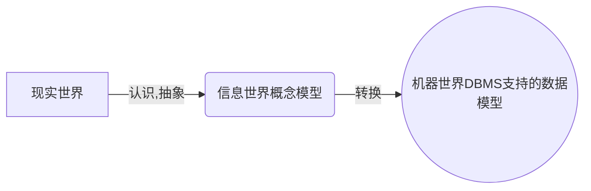
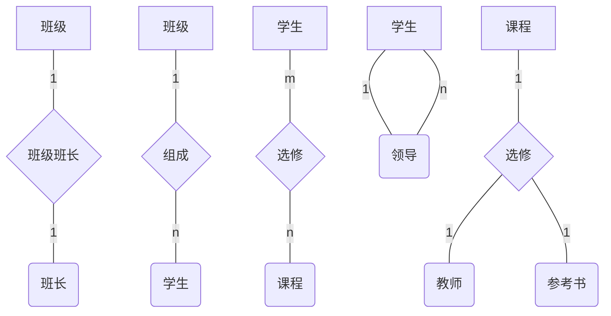
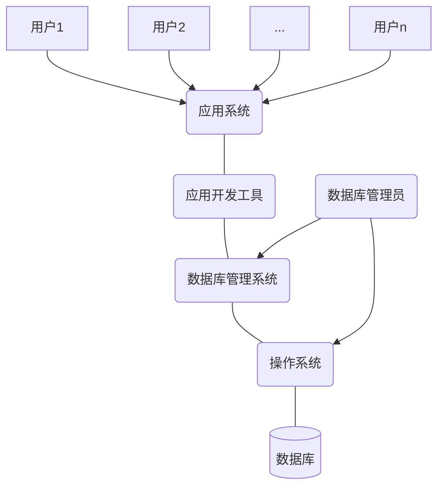
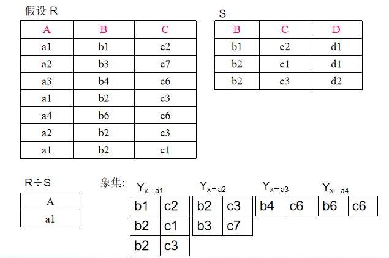

# 课前须知

## 课程主页
[链接1](http://staff.ustc.edu.cn/~ypb/)
http://staff.ustc.edu.cn/~ypb/（这个可能会崩溃）

[链接2](https://git.ustc.edu.cn/ypb/course)
https://git.ustc.edu.cn/ypb/course（建议用这个）

## 关于课程和评分

- [x] 有实验，第六周开始，共五次，前四次为基础了解实验，最后一次为综合实验，交一次实验报告。

- [x] 期末考试百分之60，平时分百分之20，实验百分之20，人少时会点名。

- [x] 作业一章提交一次。

# 第一章.绪论

## 1.1 引言:略（属于数据管理的最新技术）
> 计算机应用的三个方面:科学计算，数据管理，过程控制。

***墨天轮数据库调查报告（2022）
83.4%的企业正在使用中国的数据库产品。企业当前使用中国数据库的情况(10%以上)
达梦数据库20.4%~~（貌似第五个实验用这个数据库会加分？）~~
华为云 GaussDB17.8%
阿里云 PolarDB17.3%
OceanBase 16.4%
openGauss 16.1%
TiDB 13.4%
腾讯云TDSQL11%***

### 1.1.1 数据库系统等相关概念

- 数据（Data）
> 数据是信息的符号记录。数据是数据库处理和研究的对象。
- 数据库（Database）
> 长期存储在计算机内，有组织的、可共享的相关数据的集合。
- 数据库管理系统（DBMS）
> 位于用户和操作系统之间的一层数据管理软件。
- 数据库系统（DBS)
> 计算机硬件为基础的记录保持系统。包括数据库、数据库管理系统、应用系统、管理员和用户，有时还包括计算机硬件。

### 1.1.2 数据库系统发展历程（略）

<table>
  <tr>
    <th></th>
    <th>阶段</th>
    <th>人工</th>
    <th>文件系统</th>
    <th>数据库系统</th>
  </tr>
  <tr>
    <td rowspan="5">背景</td>
    <td>时间</td>
    <td>20世纪50年代末</td>
    <td>60年代中期</td>
    <td>60年代末</td>
  </tr>
  <tr>
    <td>应用背景</td>
    <td>/</td>
    <td>科学计算、管理</td>
    <td>大规模管理</td>
  </tr>
  <tr>
    <td>硬件背景</td>
    <td>无直接存储设备</td>
    <td>磁盘、磁鼓</td>
    <td>大容量磁盘</td>
  </tr>
  <tr>
    <td>软件背景</td>
    <td>无OS</td>
    <td>有文件系统</td>
    <td>有DBMS</td>
  </tr>
  <tr>
    <td>处理方式</td>
    <td>批处理</td>
    <td>联机和批处理</td>
    <td>联机和批处理</td>
  </tr>
  <tr>
    <td rowspan="6">特点</td>
    <td>数据管理者</td>
    <td>人</td>
    <td>文件系统</td>
    <td>DBMS</td>
  </tr>
  <tr>
    <td>数据面向对象</td>
    <td>/</td>
    <td>某一应用程序</td>
    <td>现实世界</td>
  </tr>
  <tr>
    <td>数据共享程度</td>
    <td>无，冗余大</td>
    <td>共享性差，冗余较大</td>
    <td>共享性高冗余小</td>
  </tr>
  <tr>
    <td>数据独立性</td>
    <td>无</td>
    <td>独立性差（无逻辑）</td>
    <td>有高度独立性</td>
  </tr>
  <tr>
    <td>数据结构化</td>
    <td>无</td>
    <td>记录有结构，整体无</td>
    <td>结构化：数据模型描述</td>
  </tr>
  <tr>
    <td>数据控制能力</td>
    <td>/</td>
    <td>应用程序控制</td>
    <td>DBMS保护：安全性、完整性、并发控制、数据恢复</td>
  </tr>
</table>

### 1.1.3 数据库技术的研究领域

- 数据库管理系统软件的研制（面向对象、多媒体数据库等）
- 数据库设计（设计方法学和设计工具、数据模型与建模、设计规范与标准）
- 数据库理论（规范化理论）

### 1.1.4* 数据库系统的特点

- 数据的结构化
- 数据的共享性好、冗余度低
- 数据的独立性高：物理、逻辑。
-数据由DBMS统一管理
    > 数据的安全性（Security)
    > 数据的完整性（Integrity)
    > 并发控制（Concurrency)
    > 数据库恢复（Recovery）
- 良好的用户接口

### 1.1.5* 数据库在信息科学中的应用

- 三个世界

<table>
  <tr>
    <th>现实世界</th>
    <th>信息世界</th>
    <th>计算机世界</th>
  </tr>
  <tr>
    <td>实体(Entity) 实体集</td>
    <td>实体记录(Record) 记录集</td>
    <td>数据(Data) 数据集</td>
  </tr>
  <tr>
    <td>特征 特征值 特征取值范围</td>
    <td>属性(Atribute) 属性值 属性值域</td>
    <td>数据项（属性） 数据项 数据项值域</td>
  </tr>
</table>

## 1.2 数据模型

- 数据的组织是数据库技术的核心问题
- 数据库的数据组织是通过数据模型来实现的
- 数据模型是创建数据库维护数据库的方式,是数据库系统定义数据内容和数据间联系的方法
- 数据模型的定义：表示实体类型和实体间联系的模型称数据模型

> 数据模型的两个层次: 
> > 概念（数据）模型:
> > - 也称信息模型。用来描述信息结构，又称实体联系模型（ER)
> > - 按照用户观点对信息建模

> >（结构）数据模型:
> > - 面向数据库的逻辑结构，直接涉及到计算机系统和DBMS，又称为（基本）数据模型
> > - 按照计算机系统的观点对数据建模

> ***数据模型的三个方面要求:***
> - ***比较真实模拟真实世界***
> - ***容易为人所理解***
> - ***便于计算机实现***

### 1.2.1 概念模型
- 实体联系模型（Entity Relationship Model，简记ER模型）
> - 直接从现实世界中抽象出实体和实体间联系，然后用实体联系图（ER图）表示信息模型
> - ER模型实际是信息世界的模型
- ER图的四个组成部分
> - 矩形框：实体型
> - 菱形框：联系
> - 椭圆框：实体型和联系的属性
> - 直线：连接实体类型和联系类理，表示联系的种类

#### 1.2.1.1 ER图举例

> 上述五个例子分别为 `两个实体1:1`，`两个实体1:n`，`两个实体m:n`，`同一实体1:n`，`三个实体1:m:n`。

### 1.2.2 结构模型的要素

1. 数据结构:
   > - 用于描述系统的静态特征。
   > - 是对实体类型和实体间联系的表达和实现，命名依据。

2. 数据操作:
   > - 是用于描述系统的动态特征。
   > - 是对数据库检索和更新（插入、修改、删除）两类操作。

3. 数据的约束条件：
   > - 一组完整性规则的集合。
   > - 给出数据及其联系所具有的制约和依赖原则。

### 1.2.3（结构）数据模型
结构数据模型主要有三种:层次模型、网状模型、关系模型。
> - [x] 未来可发展：对象模型、语义模型

> 非关系模型中的数据结构的单位是基本层次联系。所谓基本层次联系是指的两个记录以及它们之间的一对多（包括一对一）的联系。

#### 1.2.3.1 层次模型

##### 典型代表：IBM1968年的IMS

##### 定义
- 用树型（层次）结构表示实体类型及实体间联系的数据模型

##### 数据结构特点
- 有且仅有一个结点无双亲，该结点是根结点
- 其他结点有且仅有一个双亲
- 层次模型中每个结点（片断）表示一个记录类型
- 每个记录类型包含若干个字段，字段有字段名、数据类型和长度等

##### 数据操纵与完整性约束
- 插入时，没有双亲结点不能插入子女结点
- 删除时，删除双亲结点要同时删除子女结点
- 更新时，要更新所有相应的记录

##### 存储结构
- 邻接法链接法

##### 优点
- 模型本身简单
- 实体间联系是固定的，预先设计好的应用系统,性能优于关系型，不低于网状模型
- 层次模型提供了良好的完整性支持

##### 缺点
- 实现多对多关系时，需要采用冗余或虚结点方式,易形成不一致性
- 对插入和删除操作限制较多
- 查询子结点需通过双亲结点
- 结构严谨，层次命令趋于程序化

#### 1.2.3.2 网状模型

##### 典型代表
- DBTG (DataBase Task Group）开发系统
- HP公司的IMAGE/3000
- Honeywll 公司的IDS/I1
- Univac公司的DMS1100等

##### 定义
- 用有向图（网络）结构表示实体类型及实体间联系的数据模型。（networkmodel)

##### 数据结构特征
- 允许一个以上的结点无双亲
- 至少一个结点不止一个双亲

##### 数据操纵与完整性约束
- 插入时，允许插入未确定双亲结点的子女结点值
- 删除时，允许只删除双亲结点值
- 更新时，只需更新指定记录

##### 存储结构
- 常用链接法
- 其它如引元阵列法、二进制阵列法、索引法等

##### 优点
- 更加直接描述现实世界
- 存取效率高，性能

##### 缺点
- 结构复杂，不利于用户掌握，DDL、DML语言复杂
- 数据独立性差

#### 1.2.3.3 关系模型

##### 定义
- 用表格表示实体集和实体间联系，用外键来实现关系间的联系（Relation model)

##### 数据结构特征
- 在用户看来，一个关系模型的逻辑结构就是一张二维表
- 必须使用规范化的关系，如分量是原子的
- 不仅实体用关系表示，实体间的联系也用关系表示

##### 术语
- 关系（relation）：一个关系对应通常一张表记做R
- 元组（Tuple）：表中的一行（V1，V2..Vn)
- 字段（field）：表中的一列A1，A2.…...An
- 域（Domain）：属性的取值范围
- 分量：元组中的一个属性的取值
- 关系模式：是记录型。对关系的描述，关系模式的实例是一个关系。关系模式的描述包括：关系名、属性名、属性类型、属性长度、主键包含的属性等，记做：R（U，D，DOM,F)
- 关系数据库模式：一组关系模式的总称即关系数据库模式，简称模式
- 候选键（Candidate Key）：在给定的关系中,有这样的属性或最小属性组，它在不同的元组中的值是不同的，利用这个（些）值可以唯一地标示关系中地元组，则称该属性（组）为候选键
- 主码（键）（Primary key）：候选键可能不止一个，被指定正在使用地候选键称主键
- 超键（Super Key）：能唯一标识元组的属性集。超键包括所有候选键
- 组合键与全键：当主键不是单一的属性时称组合键，组合键包括所有属性时称全键
- 外部键（Foreign Key）：关系模式R中的属性集是其它关系模式的主键，那么该属性集对关系模式R而言是外键
- 主属性和非主属性：包含在任一候选键中的属性叫主属性，否则称非主属性

##### 操纵与完整性约束
- 插入、删除和更新操作必须满足关系的完整性约束；
- 关系的完整性约束包括：实体完整性、参照完整性和自定义完整性

##### 存储结构 
- 实体和实体间的联系都用表来表示 
- 表通常以文件形式存储

##### 优点：
- 建立在严格的数学概念基础上
- 概念单一，实体、联系均用关系来表示
- 存取路径对用户透明，数据独立性更高，保密性更好。简化程序员工作和数据库开发建立工作。
 
##### 缺点：
- 存取路径对用户透明，查询效率不高
- 因存取路径对用户透明，必须对用户查询进行优化，增加了开发DBMS的难度

## 1.3 数据库系统的结构及功能
### 1.3.1 数据库系统的模式结构(从管理系统角度看)
- SPARC接口分三级结构

  <table>
  <tr>
    <th></th>
    <th>Schema（模式）</th>
    <th>View（视图）</th>
    <th>Level（级别）</th>
  </tr>
  <tr>
    <td>External（外部）</td>
    <td>外模式 子模式</td>
    <td>用户视图 外视图</td>
    <td>外部级 局部逻辑级</td>
  </tr>
  <tr>
    <td>Conceptual（概念）</td>
    <td>模式 概念模式</td>
    <td>概念视图 DBA视图</td>
    <td>概念级 全局逻辑级</td>
  </tr>
  <tr>
    <td>Internal（内部）</td>
    <td>内模式 存储模式</td>
    <td>内部视图 内部级</td>
    <td>物理级 存储级</td>
  </tr>
</table>

- 数据库的二级映象功能与数据独立性 
  > 概念模式/内模式的映象
  > 概念模式/外模式的映象
  > 物理独立性：当存储结构改变时，可以通过修改概念模式/内模式的映象使概念级保持不便，这样外部级和应用程序也不会改变。
  > 逻辑独立性：当概念级发生改变时，可以通过修改概念模式/外模式的映象使外部级尽量保持不变，应用也就不需改变。 

  
  

    数据库系统模式结构
  

### 1.3.2 数据库系统的体系结构(从用户角度来看)
- 单用户DBS 
- 主从式结构DBS（终端方式） 
- 客户/服务器结构DBS 
- 分布式结构DBS 

### 1.3.3* 数据库系统的组成 
- 计算机硬件  CPU、内存、硬盘
- 计算机软件  OS、DBMS、应用软件包、应用程序
- 数据（库）
- 管理员、用户

> 数据库系统

## 1.4 数据库管理系统
### 1.4.1 数据库管理系统的功能与组成 
- [x] DBMS功能 
  > - [ ] 数据定义
  > - [ ] 数据操纵
  > - [ ] 数据库运行管理
  > > 安全性检查/完整性检查/并发控制/索引、数据字典等内部维护 
  - [ ] 数据组织、存储、管理
  - [ ] 数据库建立与维护功能
  - [ ] 数据通信接口功能 
- [x] DBMS组成 
  > - [ ] 数据定义语言
	> > DDL Data Definition/Description Language
  > - [ ] 数据操纵语言
	> > DML Data Manipulation Language
  > - [ ] 数据库运行控制语言
  > > DCL Data Control Language 
  > - [ ] 实用程序

### 1.4.2 数据库管理系统的工作过程
- 用户存取数据库数据的过程 
  1. 用户在程序中嵌入DML的一个读记录语句。控制转向DBMS
  2. DBMS检查合法性，查找子模式表，确定对应的存取权限
  3. DBMS依据子模式/模式映象的定义，确定应读入的模式记录
  4. DBMS依据模式/内模式映象的定义，确定应读入的物理记录
  5. DBMS向OS发送读取所需物理记录的命令
  6. OS启动IO程序，执行读操作
  7. OS将数据从数据库的存储区送到系统缓冲区
  8. DBMS依据子模式/模式映象定义，导出用户所要读取的记录格式
  9. DBMS将数据记录从系统缓冲区传送到程序的用户工作区
  10. DBMS向应用程序返回命令执行情况和状态信息 

  
  

    从数据库中读取记录的过程
  

### 1.4.3 数据库管理系统的实现方法
- N方案 
  > DBMS模块加入到用户进程，DBMS代码出现多副本，性能大幅下降 
- 2N方案
  > 每个用户有一个DBMSshdow进程和一个后台负责读写和日值的进程 
- M＋N方案 
  > 2N方案的改进方案，N用户，M个DBMS进程（M<N） 
- N＋1方案 
  > 1个DBMS进程(可设计成多线程的)，N个用户进程，消息开销大 

## 1.5 数据库工程与应用 
### 1.5.1 数据库设计的目标和特点 
- 数据库设计的任务是：在DBMS的支持下，按照应用的要求，为某一部门或组织设计一个结构合理、使用方便、效率较高的数据库及其应用系统 
- 数据库设计包含两方面内容
  - [x] 结构（数据）设计
  - [x] 行为（处理）设计 

### 1.5.2 数据库设计方法
- 核心是：逻辑设计和物理设计 
- 著名设计方法 
  - [x] 新奥尔良设计：需求分析、概念设计、逻辑设计、物理设计
  - [x] S.B.Yao设计：需求分析、模式构成、模式汇总、模式重构、模式分析、物理设计 

### 1.5.3 数据库设计步骤 
- 步骤
  > 需求分析、概念结构、逻辑结构、物理结构、实施、运行维护 
- 设计注意的问题 
  > - [x] 让用户参与，调动用户积极性
  > - [x] 充分考虑系统的可扩充性（可扩充性有限度）
  > - [x] 设计新系统要考虑旧系统的数据平稳迁移到新系统

### 1.5.4 数据库应用
- [x] 各种用户的数据视图

  
  

    各种用户的数据视图
  

- [x] DBA 的职责
  > - 设计与定义数据库
  > - 帮助最终用户使用数据库
  > - 监督和控制数据库
  > - 运行改进和重组数据库
  > - 转储和恢复数据库重构数据库

# 第二章 关系数据库
## 2.1 关系数据库概述
- 关系数据库系统是支持关系模型的数据库系统
- 关系理论是建立在集合代数理论基础上的，关系的定义和各种操作运算可以用集合代数给出
- 关系模型的三要素
  > - [x] 关系数据结构：二维表
  > - [x] 关系操作：选择、投影、连接、除、并，交、差等查询以及增、删、改
  > - [x] 完整性约束 ：实体、参照、自定义

### 关系数据语言
- 关系代数语言 ISBL
- ~~关系演算语言~~
  > - 元组关系演算语言 ALPHA，QUEL
  > - 域关系演算英语 QBE
- 具有关系代数和关系演算双重特点的语言 SQL

## 2.2 关系数据结构
### 2.2.1 关系
#### 定义
- ***域*** ：域是一组具有相同数据类型的值的集合。值的个数称为域的基数
- ***笛卡儿乘积*** :给定一组域: $D_1$ ， $D_2$，… $D_n$ ，域可以相同，定义 $D_1D_2…D_n$ 的笛卡儿乘积为: $D_1×D_2×……×D_n＝\lbrace(d_1，d_2，…d_n) |d_i∈D_i，i＝1，2，…n \rbrace$ ; $（d_1，d_2，…d_n）$ 称为一个元组
- ***关系(Relation)*** ：笛卡儿乘积 $D_1×D_2×…×D_n$ 的任一子集 $D^{\'}$ ，称作 $D_1，D_2，…D_n$ 上的关系。  用 $R（D_1，D_2……D_n）$ 来表示 $D^{\'}$ 中的每个元素 $（d_1，d_2，…d_n）$ 是关系的一个元组 实际应用中关系往往是笛卡儿乘积中有意义的子集构成 n＝1是单元关系/一元关系；n＝2是二元关系
#### 举例
- 域
  - [x] 性别集＝{男、女}。基数＝2
  - [x] 月份集＝{1，2，3，4，5，6，7，8，9，10，11，12}，基数＝12
- 笛卡儿乘积
  - [x] $D_1$ ＝姓名集合＝{赵一平，钱峰，孙英}
  - [x] $D_2$ ＝性别集合＝{男，女}
  - [x] $D_3$ ＝年龄集合＝{16，17，18}
- 关系

	<table>
  <tr>
    <th>姓名</th>
    <th>性别</th>
    <th>年龄</th>
  </tr>
  <tr>
    <td>赵一平</td>
    <td>男</td>
    <td>16</td>
  </tr>
  <tr>
    <td>钱峰</td>
    <td>男</td>
    <td>17</td>
  </tr>
  <tr>
    <td>孙英</td>
    <td>女</td>
    <td>17</td>
  </tr>
</table>

### 2.2.2 关系模式
- 关系的描述称为 ***关系模式（Relation schema ）,一般表示为R(U,D,DOM,F)*** 其中，R是关系名，U是组成该关系的属性集合，D为属性组U中属性所来自的域，DOM是属性向域的映象集合，F是属性间数据的依赖关系集合。
### 2.2.3 关系数据库
- 在一个给定的现实世界领域里，所有实体及实体间的联系的关系所构成的集合是一个关系数据库
- 关系数据库有型和值之分：关系数据库的型也称关系数据库模式，是对关系数据库的描述它包括若干域的定义以及在这些域上定义的若干关系模式；关系数据库的值也称为关系数据库，是这些关系模式在某一时刻对应的关系的集合
- 关系数据库的值与关系数据库模式通称为关系数据库 
## 2.3 关系的完整性
- ***实体完整性***
	> 若属性A是基本关系R的主属性，则A不能取空值 
- ***参照完整性***
  > 若属性（或属性组）F是基本关系R的外码，它与基本关系S的主码Ks相对应（关系R、S不一定是不同的关系），则对于R中的每一个元组在F上的取值必须:
  > > 取空值（F的每个属性值均取空值）
  > > 等于S中某个元组的主码值
- ***自定义完整性***

## 2.4 关系代数
- 关系代数由一组关系运算组成，是对于关系的操作集。关系运算以一个或多个关系作为操作的对象，运算结果是一个新的关系。用关系运算实现查询。
- 关系代数运算符
  > - [x] 集合运算符： $\cup (并) －(差) \cap (交) ×(笛卡儿积)$
  > - [x] 专门运算符： $\sigma \ 选择 \ \Pi \ 投影 \ \bowtie \ 连接 \ ÷ \ 除$
  > - [x] 比较运算符： $> \ ≥ \ < \ ≤ \ = \ ≠$
  > - [x] 逻辑运算符： $┑ 非 ∧与 ∨或$
- 常用的关系运算
  > 交、并、差、笛卡儿积、投影、选择、连接、除
- 基本关系运算有
	> 并、差、笛卡儿积、投影、选择
- 同类关系：具有相同的度，且两个关系每个属性属同一个域

### 2.4.1 传统的集合运算

	<table>
  <tr>
    <th>Name</th>
    <th>Sex</th>
    <th>Age</th>
  </tr>
  <tr>
    <td>Zhang</td>
    <td>F</td>
    <td>22</td>
  </tr>
  <tr>
    <td>Wang</td>
    <td>M</td>
    <td>25</td>
  </tr>
  <tr>
    <td>Lu</td>
    <td>M</td>
    <td>37</td>
  </tr>
  <tr>
    <td>Chen</td>
    <td>F</td>
    <td>27</td>
  </tr>
</table>

	R

	<table>
  <tr>
    <th>Name</th>
    <th>Sex</th>
    <th>Age</th>
  </tr>
  <tr>
    <td>Zhang</td>
    <td>F</td>
    <td>22</td>
  </tr>
  <tr>
    <td>Wang</td>
    <td>M</td>
    <td>25</td>
  </tr>
  <tr>
    <td>Lu</td>
    <td>F</td>
    <td>30</td>
  </tr>
  <tr>
    <td>Sun</td>
    <td>M</td>
    <td>28</td>
  </tr>
</table>

	S

- [x] 并（Union）：
	> 同类关系R和S的并记为 $R \cup S$ ，或 $R \ union \ S$
 	> 
 	> 定义: $R \cup S=\lbrace t|t∈R ∨ t \in S\rbrace$ 注意去除重复元组 
- $R \cup S$

	<table>
  <tr>
    <th>Name</th>
    <th>Sex</th>
    <th>Age</th>
  </tr>
  <tr>
    <td>Zhang</td>
    <td>F</td>
    <td>22</td>
  </tr>
  <tr>
    <td>Wang</td>
    <td>M</td>
    <td>25</td>
  </tr>
  <tr>
    <td>Lu</td>
    <td>M</td>
    <td>37</td>
  </tr>
  <tr>
    <td>Chen</td>
    <td>F</td>
    <td>27</td>
  </tr>
  <tr>
    <td>Lu</td>
    <td>F</td>
    <td>30</td>
  </tr>
  <tr>
    <td>Sun</td>
    <td>M</td>
    <td>28</td>
  </tr>
</table>

- [x] 交（Intersection）
	> 同类关系R和S的交记为 $R \cap S$，或 $R \ intersect \ S$
 	> 
 	> 定义: $R \cap S＝\lbrace t|t \in R \land t\in S \rbrace \equiv R－（R－S）$
- $R \cap S$

	<table>
  <tr>
    <th>Name</th>
    <th>Sex</th>
    <th>Age</th>
  </tr>
  <tr>
    <td>Zhang</td>
    <td>F</td>
    <td>22</td>
  </tr>
  <tr>
    <td>Wang</td>
    <td>M</td>
    <td>25</td>
  </tr>
</table>

- [x] 差（Minus/Difference）
	> 同类关系R和S的差记为 $R－S$ 或 $R \ minus \ S$
 	> 
	> 定义: $R－S＝\lbrace t|t \in R \land t \notin S \rbrace$
- $R－S$

	<table>
  <tr>
    <th>Name</th>
    <th>Sex</th>
    <th>Age</th>
  </tr>
  <tr>
    <td>Lu</td>
    <td>M</td>
    <td>37</td>
  </tr>
  <tr>
    <td>Chen</td>
    <td>F</td>
    <td>27</td>
  </tr>
</table>

- [x] 笛卡儿积（Cartesian Product）
	> 关系R和S的笛卡儿积记为 $R×S$
 	> 
	> 定义: $R×S＝\lbrace t⌒s|t \in R， s \in S \rbrace $

	
R

	<table>
  <tr>
    <th>CNo</th>
    <th>CN</th>
  </tr>
  <tr>
    <td>C-11</td>
    <td>OS</td>
  </tr>
  <tr>
    <td>C-21</td>
    <td>DB</td>
  </tr>
</table>

S

<table>
  <tr>
    <th>SNo</th>
    <th>SN</th>
    <th>Age</th>
  </tr>
  <tr>
    <td>S-01</td>
    <td>Huang</td>
    <td>21</td>
  </tr>
  <tr>
    <td>S-21</td>
    <td>Lin</td>
    <td>20</td>
  </tr>
  <tr>
    <td>S-30</td>
    <td>Shao</td>
    <td>22</td>
  </tr>
</table>

R×S

	<table>
  <tr>
    <th>CNo</th>
    <th>CN</th>
    <th>SNo</th>
    <th>SN</th>
    <th>Age</th>
  </tr>
  <tr>
    <td>C-11</td>
    <td>OS</td>
    <td>S-01</td>
    <td>Huang</td>
    <td>21</td>
  </tr>
  <tr>
    <td>C-11</td>
    <td>OS</td>
    <td>S-21</td>
    <td>Lin</td>
    <td>20</td>
  </tr>
  <tr>
    <td>C-11</td>
    <td>OS</td>
    <td>S-30</td>
    <td>Shao</td>
    <td>22</td>
  </tr>
  <tr>
    <td>C-21</td>
    <td>DB</td>
    <td>S-01</td>
    <td>Huang</td>
    <td>21</td>
  </tr>
  <tr>
    <td>C-21</td>
    <td>DB</td>
    <td>S-21</td>
    <td>Lin</td>
    <td>20</td>
  </tr>
  <tr>
    <td>C-21</td>
    <td>DB</td>
    <td>S-30</td>
    <td>Shao</td>
    <td>22</td>
  </tr>
</table>

### 2.4.2 专门的关系运算
- 引入以下记号 : 设关系模式R（ $A_1，A_2，…，A_n$ ），它的一个关系为 $R_t$ ， $t∈R_t$ 表示t是 $R_t$ 的一个元组。 $t[A_i]$ 则表示元组t中相应于 $A_i$ 的一个分量
- 若 $A＝\lbrace A_{i1}，A_{i2}，…，A_{ik}\rbrace$ 是 $A_1，A_2，…，A_n$ 的一部分，k<=n，则A称为属性列（组）或域列。 $t[A]=(t[A_{i1}]，t[A_{i2}]，…，t[A_{ik}])$ 表示元组在属性列A上诸分量的集合
- R为n元关系，S为m元关系。tr∈R，ts∈S， **$tr ⌒ ts$ 称为元组的连接（Concatenation）** 。它是一个m＋n列的元组，前n个分量为R中的一个n元组，后m个分量为S中的一个m元组
- 给定一个关系R（X，Z），X和Z为属性组，定义：当t[X]=x时，x在R中的象集（image set）为 Zx={t[Z]|t∈R，t[X]=x}，表示R中属性组X上值为x的诸元组在Z属性组上的分量的集合
#### 投影（Projection） 
- 关系R上的投影是从R中选择出若干属性，并且去掉重复元组组成一个新关系，属于单目运算 
- 记作: $\Pi_A(R)＝\lbrace t[A]| t \in R \rbrace$ A为R中的属性列 
- [x] 举例：
> _**假设Student**_

	<table>
  <tr>
    <th>SNo</th>
    <th>SName</th>
    <th>Sex</th>
    <th>Age</th>
  </tr>
  <tr>
    <td>S01</td>
    <td>Wang</td>
    <td>F</td>
    <td>17</td>
  </tr>
  <tr>
    <td>S02</td>
    <td>Zhang</td>
    <td>M</td>
    <td>20</td>
  </tr>
  <tr>
    <td>S03</td>
    <td>Lin</td>
    <td>M</td>
    <td>18</td>
  </tr>
  <tr>
    <td>S04</td>
    <td>Sun</td>
    <td>F</td>
    <td>19</td>
  </tr>
</table>

> $S_{na}=\Pi_{Sname，Age}(Student)$

	<table>
  <tr>
    <th>SName</th>
    <th>Age</th>
  </tr>
  <tr>
    <td>Wang</td>
    <td>17</td>
  </tr>
  <tr>
    <td>Zhang</td>
    <td>20</td>
  </tr>
  <tr>
    <td>Lin</td>
    <td>18</td>
  </tr>
  <tr>
    <td>Sun</td>
    <td>19</td>
  </tr>
</table>

#### 选择（Selection） 
- 又称限制（Restriction），在给定的关系R中，抽出满足条件的元组，组成一个新关系，新关系与原关系同类，是原关系一个子集
- 记做: $\sigma_F(R)=\lbrace t| t \in R \land F（t）='真'\rbrace$ F表示条件 
> $S_{a18}=\sigma_{age>=18}(Student)$

	<table>
  <tr>
    <th>SNo</th>
    <th>SName</th>
    <th>Sex</th>
    <th>Age</th>
  </tr>
  <tr>
    <td>S02</td>
    <td>Zhang</td>
    <td>M</td>
    <td>20</td>
  </tr>
  <tr>
    <td>S03</td>
    <td>Lin</td>
    <td>M</td>
    <td>18</td>
  </tr>
  <tr>
    <td>S04</td>
    <td>Sun</td>
    <td>F</td>
    <td>19</td>
  </tr>
</table>

#### 连接(Join)
- 从两个关系的笛卡儿乘积中选取属性满足一定条件的元组，组成新的关系 
- 记做: $R \bowtie_{A\theta B} S ＝\lbrace tr⌒ts| tr\in R \land ts\in S \land tr[A]\theta ts[B]\rbrace \equiv \sigma_{A\theta B}(R×S)$  
- $A\theta B$ 表示R上的属性A和S上的属性B满足 $\theta$ 条件， $\theta$ 是比较运算符，A、B的度数相等且可比。这里假设AB分别在R、S关系的第i、j列，R度为r 
##### 等值连接(equi-join)
- $\theta$ 为“＝”时称为等值连接
	> 记: $R \bowtie_{A=B} S ＝\lbrace tr⌒ts| tr\in R \land ts\in S \land tr[A]＝ts[B]\rbrace$
##### 自然连接(Natioal Join)
- 两个关系中具有相同的属性，并且在相同的属性上做等值连接。自然连接需要取消重复列，而等值连接不需要 。
	> 记: $R \bowtie S ＝\lbrace tr⌒ts| tr∈R ∧ts∈S ∧ tr[A]＝ts[A]\rbrace$
##### 举例

	
R

	<table>
  <tr>
    <th>A</th>
    <th>C</th>
    <th>D</th>
  </tr>
  <tr>
    <td>30</td>
    <td>C1</td>
    <td>D3</td>
  </tr>
  <tr>
    <td>40</td>
    <td>C2</td>
    <td>D3</td>
  </tr>
  <tr>
    <td>50</td>
    <td>C3</td>
    <td>D1</td>
  </tr>
  <tr>
    <td>10</td>
    <td>C4</td>
    <td>D1</td>
  </tr>
</table>
	
R

	<table>
  <tr>
    <th>B</th>
    <th>E</th>
    <th>F</th>
  </tr>
  <tr>
    <td>20</td>
    <td>E1</td>
    <td>F1</td>
  </tr>
  <tr>
    <td>50</td>
    <td>E2</td>
    <td>F3</td>
  </tr>
  <tr>
    <td>40</td>
    <td>E3</td>
    <td>F1</td>
  </tr>
</table>

> **$R \bowtie_{A > B} S$**

	<table>
  <tr>
    <th>A</th>
    <th>B</th>
    <th>C</th>
    <th>D</th>
    <th>E</th>
    <th>F</th>
  </tr>
  <tr>
    <td>30</td>
    <td>20</td>
    <td>C1</td>
    <td>D3</td>
    <td>E1</td>
    <td>F1</td>
  </tr>
  <tr>
    <td>40</td>
    <td>20</td>
    <td>C2</td>
    <td>D3</td>
    <td>E1</td>
    <td>F1</td>
  </tr>
  <tr>
    <td>50</td>
    <td>20</td>
    <td>C3</td>
    <td>D1</td>
    <td>E1</td>
    <td>F1</td>
  </tr>
  <tr>
    <td>50</td>
    <td>40</td>
    <td>C3</td>
    <td>D1</td>
    <td>E3</td>
    <td>F1</td>
  </tr>
</table>

#### 除法(Division)
- 给定关系R（X，Y）和S（Y，Z），其中X，Y，Z为属性组，R中的Y与S中的Y可以不同属性名，但必须有相同的域。记R÷S。令P（X）＝R÷S，则P是R中满足以下条件的元组在X属性列上的投影：元组在X上的分量值x的象集 $Y_x$包含S在Y上投影的集合
> 记做: $R÷S＝\lbrace tr[X]|tr\in R \land Y_x\supseteq\Pi_Y(S)\lbrace$
>
> $R÷S \equiv \Pi_X(R)－\Pi_X((\Pi_X(R)×\Pi_Y(S))－R) $
##### 举例

  
  

    除法
  

#### 外连接(Outer Join)
- 如果R和S在做自然连接时，把该舍弃的元组也保存在新关系中，在新增加的属性上填空值（null），这种操作称为“外连接”。如果把R中该舍弃的元组保留在新关系中称左连接；把S中该舍弃的元组保留在新关系中称右连接 
#### 外部并(Outer Union) 
- 若关系R和S不同类，则新关系的属性由R和S的属性组成，公共属性只取一次，新关系的元组由属于R或S的元组构成，新增的属性上均填空（null） 
#### 半连接(Semijoin)
- 关系R和S的半连接定义为R和S的自然连接在关系R的属性集上的投影

> 举例：

  
  

    举例1
  

  
  

    举例2
  

