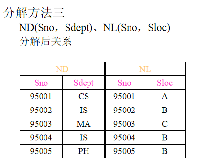
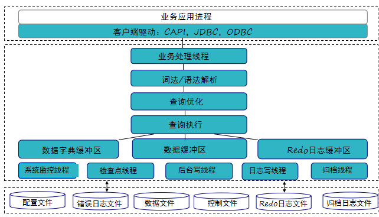

# 课前须知

## 课程主页
[链接1](http://staff.ustc.edu.cn/~ypb/)
http://staff.ustc.edu.cn/~ypb/（这个可能会崩溃）

[链接2](https://git.ustc.edu.cn/ypb/course)
https://git.ustc.edu.cn/ypb/course（建议用这个）

## 关于课程和评分

- [x] 有实验，第六周开始，共五次，前四次为基础了解实验，最后一次为综合实验，交一次实验报告。

- [x] 期末考试百分之60，平时分百分之20，实验百分之20，人少时会点名。

- [x] 作业一章提交一次。

# 第一章.绪论

## 1.1 引言:略（属于数据管理的最新技术）
> 计算机应用的三个方面:科学计算，数据管理，过程控制。

***墨天轮数据库调查报告（2022）
83.4%的企业正在使用中国的数据库产品。企业当前使用中国数据库的情况(10%以上)
达梦数据库20.4%~~（貌似第五个实验用这个数据库会加分？）~~
华为云 GaussDB17.8%
阿里云 PolarDB17.3%
OceanBase 16.4%
openGauss 16.1%
TiDB 13.4%
腾讯云TDSQL11%***

### 1.1.1 数据库系统等相关概念

- 数据（Data）
> 数据是信息的符号记录。数据是数据库处理和研究的对象。
- 数据库（Database）
> 长期存储在计算机内，有组织的、可共享的相关数据的集合。
- 数据库管理系统（DBMS）
> 位于用户和操作系统之间的一层数据管理软件。
- 数据库系统（DBS)
> 计算机硬件为基础的记录保持系统。包括数据库、数据库管理系统、应用系统、管理员和用户，有时还包括计算机硬件。

### 1.1.2 数据库系统发展历程（略）

<div align="center">
<table>
  <tr>
    <th></th>
    <th>阶段</th>
    <th>人工</th>
    <th>文件系统</th>
    <th>数据库系统</th>
  </tr>
  <tr>
    <td rowspan="5">背景</td>
    <td>时间</td>
    <td>20世纪50年代末</td>
    <td>60年代中期</td>
    <td>60年代末</td>
  </tr>
  <tr>
    <td>应用背景</td>
    <td>/</td>
    <td>科学计算、管理</td>
    <td>大规模管理</td>
  </tr>
  <tr>
    <td>硬件背景</td>
    <td>无直接存储设备</td>
    <td>磁盘、磁鼓</td>
    <td>大容量磁盘</td>
  </tr>
  <tr>
    <td>软件背景</td>
    <td>无OS</td>
    <td>有文件系统</td>
    <td>有DBMS</td>
  </tr>
  <tr>
    <td>处理方式</td>
    <td>批处理</td>
    <td>联机和批处理</td>
    <td>联机和批处理</td>
  </tr>
  <tr>
    <td rowspan="6">特点</td>
    <td>数据管理者</td>
    <td>人</td>
    <td>文件系统</td>
    <td>DBMS</td>
  </tr>
  <tr>
    <td>数据面向对象</td>
    <td>/</td>
    <td>某一应用程序</td>
    <td>现实世界</td>
  </tr>
  <tr>
    <td>数据共享程度</td>
    <td>无，冗余大</td>
    <td>共享性差，冗余较大</td>
    <td>共享性高冗余小</td>
  </tr>
  <tr>
    <td>数据独立性</td>
    <td>无</td>
    <td>独立性差（无逻辑）</td>
    <td>有高度独立性</td>
  </tr>
  <tr>
    <td>数据结构化</td>
    <td>无</td>
    <td>记录有结构，整体无</td>
    <td>结构化：数据模型描述</td>
  </tr>
  <tr>
    <td>数据控制能力</td>
    <td>/</td>
    <td>应用程序控制</td>
    <td>DBMS保护：安全性、完整性、并发控制、数据恢复</td>
  </tr>
</table>
</div>

### 1.1.3 数据库技术的研究领域

- 数据库管理系统软件的研制（面向对象、多媒体数据库等）
- 数据库设计（设计方法学和设计工具、数据模型与建模、设计规范与标准）
- 数据库理论（规范化理论）

### 1.1.4* 数据库系统的特点

- 数据的结构化
- 数据的共享性好、冗余度低
- 数据的独立性高：物理、逻辑。
-数据由DBMS统一管理
    > 数据的安全性(Security)
    > 
    > 数据的完整性(Integrity)
    > 
    > 并发控制(Concurrency)
    > 
    > 数据库恢复(Recovery）
- 良好的用户接口

### 1.1.5* 数据库在信息科学中的应用

- 三个世界

<div align="center">
<table>
  <tr>
    <th>现实世界</th>
    <th>信息世界</th>
    <th>计算机世界</th>
  </tr>
  <tr>
    <td>实体(Entity)<br>实体集</td>
    <td>实体记录(Record)<br>记录集</td>
    <td>数据(Data)<br>数据集</td>
  </tr>
  <tr>
    <td>特征<br>特征值<br>特征取值范围</td>
    <td>属性(Atribute)<br>属性值<br>属性值域</td>
    <td>数据项（属性）<br>数据项<br>数据项值域</td>
  </tr>
</table>
</div>

## 1.2 数据模型

- 数据的组织是数据库技术的核心问题
- 数据库的数据组织是通过数据模型来实现的
- 数据模型是创建数据库维护数据库的方式,是数据库系统定义数据内容和数据间联系的方法
- 数据模型的定义：表示实体类型和实体间联系的模型称数据模型

> 数据模型的两个层次: 
> > 概念（数据）模型:
> > - 也称信息模型。用来描述信息结构，又称实体联系模型(ER)
> > - 按照用户观点对信息建模

> >（结构）数据模型:
> > - 面向数据库的逻辑结构，直接涉及到计算机系统和DBMS，又称为（基本）数据模型
> > - 按照计算机系统的观点对数据建模

> ***数据模型的三个方面要求:***
> - ***比较真实模拟真实世界***
> - ***容易为人所理解***
> - ***便于计算机实现***


### 1.2.1 概念模型
- 实体联系模型（Entity Relationship Model，简记ER模型）
> - 直接从现实世界中抽象出实体和实体间联系，然后用实体联系图（ER图）表示信息模型
> - ER模型实际是信息世界的模型
- ER图的四个组成部分
> - 矩形框：实体型
> - 菱形框：联系
> - 椭圆框：实体型和联系的属性
> - 直线：连接实体类型和联系类型，表示联系的种类

#### 1.2.1.1 ER图举例


> 上述五个例子分别为 `两个实体1:1`，`两个实体1:n`，`两个实体m:n`，`同一实体1:n`，`三个实体1:m:n`。

### 1.2.2 结构模型的要素

1. 数据结构:
   > - 用于描述系统的静态特征。
   > - 是对实体类型和实体间联系的表达和实现，命名依据。

2. 数据操作:
   > - 是用于描述系统的动态特征。
   > - 是对数据库检索和更新（插入、修改、删除）两类操作。

3. 数据的约束条件：
   > - 一组完整性规则的集合。
   > - 给出数据及其联系所具有的制约和依赖原则。

### 1.2.3（结构）数据模型
结构数据模型主要有三种:层次模型、网状模型、关系模型。
> - [x] 未来可发展：对象模型、语义模型

> 非关系模型中的数据结构的单位是基本层次联系。所谓基本层次联系是指的两个记录以及它们之间的一对多（包括一对一）的联系。

#### 1.2.3.1 层次模型

##### 典型代表：IBM1968年的IMS

##### 定义
- 用树型（层次）结构表示实体类型及实体间联系的数据模型

##### 数据结构特点
- 有且仅有一个结点无双亲，该结点是根结点
- 其他结点有且仅有一个双亲
- 层次模型中每个结点（片断）表示一个记录类型
- 每个记录类型包含若干个字段，字段有字段名、数据类型和长度等

##### 数据操纵与完整性约束
- 插入时，没有双亲结点不能插入子女结点
- 删除时，删除双亲结点要同时删除子女结点
- 更新时，要更新所有相应的记录

##### 存储结构
- 邻接法
- 链接法

##### 优点
- 模型本身简单
- 实体间联系是固定的，预先设计好的应用系统,性能优于关系型，不低于网状模型
- 层次模型提供了良好的完整性支持

##### 缺点
- 实现多对多关系时，需要采用冗余或虚结点方式,易形成不一致性
- 对插入和删除操作限制较多
- 查询子结点需通过双亲结点
- 结构严谨，层次命令趋于程序化

#### 1.2.3.2 网状模型

##### 典型代表
- DBTG (DataBase Task Group）开发系统
- HP公司的IMAGE/3000
- Honeywll 公司的IDS/I1
- Univac公司的DMS1100等

##### 定义
- 用有向图（网络）结构表示实体类型及实体间联系的数据模型。（networkmodel)

##### 数据结构特征
- 允许一个以上的结点无双亲
- 至少一个结点不止一个双亲

##### 数据操纵与完整性约束
- 插入时，允许插入未确定双亲结点的子女结点值
- 删除时，允许只删除双亲结点值
- 更新时，只需更新指定记录

##### 存储结构
- 常用链接法
- 其它如引元阵列法、二进制阵列法、索引法等

##### 优点
- 更加直接描述现实世界
- 存取效率高，性能

##### 缺点
- 结构复杂，不利于用户掌握，DDL、DML语言复杂
- 数据独立性差

#### 1.2.3.3 关系模型

##### 定义
- 用表格表示实体集和实体间联系，用外键来实现关系间的联系(Relation model)

##### 数据结构特征
- 在用户看来，一个关系模型的逻辑结构就是一张二维表
- 必须使用规范化的关系，如分量是原子的
- 不仅实体用关系表示，实体间的联系也用关系表示

##### 术语
- 关系(relation)：一个关系对应通常一张表记做R
- 元组(Tuple)：表中的一行 $(V_1，V_2..V_n)$
- 字段(field)：表中的一列 $A_1，A_2...A_n$
- 域(Domain)：属性的取值范围
- 分量：元组中的一个属性的取值
- 关系模式：是记录型。对关系的描述，关系模式的实例是一个关系。关系模式的描述包括：关系名、属性名、属性类型、属性长度、主键包含的属性等，记做： $R(U,D,DOM,F)$
- 关系数据库模式：一组关系模式的总称即关系数据库模式，简称模式
- 候选键(Candidate Key)：在给定的关系中,有这样的属性或最小属性组，它在不同的元组中的值是不同的，利用这个(些)值可以唯一地标示关系中的元组，则称该属性(组)为候选键
- 主码(键)(Primary key)：候选键可能不止一个，被指定正在使用的候选键称主键
- 超键(Super Key)：能唯一标识元组的属性集。超键包括所有候选键
- 组合键与全键：当主键不是单一的属性时称组合键，组合键包括所有属性时称全键
- 外部键(Foreign Key)：关系模式R中的属性集是其它关系模式的主键，那么该属性集对关系模式R而言是外键
- 主属性和非主属性：包含在任一候选键中的属性叫主属性，否则称非主属性

##### 操纵与完整性约束
- 插入、删除和更新操作必须满足关系的完整性约束；
- 关系的完整性约束包括：实体完整性、参照完整性和自定义完整性

##### 存储结构 
- 实体和实体间的联系都用表来表示 
- 表通常以文件形式存储

##### 优点
- 建立在严格的数学概念基础上
- 概念单一，实体、联系均用关系来表示
- 存取路径对用户透明，数据独立性更高，保密性更好。简化程序员工作和数据库开发建立工作。
 
##### 缺点
- 存取路径对用户透明，查询效率不高
- 因存取路径对用户透明，必须对用户查询进行优化，增加了开发DBMS的难度

## 1.3 数据库系统的结构及功能
### 1.3.1 数据库系统的模式结构(从管理系统角度看)
- SPARC接口分三级结构

<div align="center">
  <table>
  <tr>
    <th></th>
    <th>Schema（模式）</th>
    <th>View（视图）</th>
    <th>Level（级别）</th>
  </tr>
  <tr>
    <td>External（外部）</td>
    <td>外模式<br>子模式</td>
    <td>用户视图<br>外视图</td>
    <td>外部级<br>局部逻辑级</td>
  </tr>
  <tr>
    <td>Conceptual（概念）</td>
    <td>模式<br>概念模式</td>
    <td>概念视图<br>DBA视图</td>
    <td>概念级<br>全局逻辑级</td>
  </tr>
  <tr>
    <td>Internal（内部）</td>
    <td>内模式<br>存储模式</td>
    <td>内部视图<br>内部级</td>
    <td>物理级<br>存储级</td>
  </tr>
</table>
</div>

- 数据库的二级映象功能与数据独立性 
  > 概念模式/内模式的映象
  > 
  > 概念模式/外模式的映象
  > 
  > 物理独立性：当存储结构改变时，可以通过修改概念模式/内模式的映象使概念级保持不便，这样外部级和应用程序也不会改变。
  > 
  > 逻辑独立性：当概念级发生改变时，可以通过修改概念模式/外模式的映象使外部级尽量保持不变，应用也就不需改变。 

<P align="center">
  
  <p align="center">
    <span>数据库系统模式结构</span>
  </p>
</P>

### 1.3.2 数据库系统的体系结构(从用户角度来看)
- 单用户DBS 
- 主从式结构DBS（终端方式） 
- 客户/服务器结构DBS 
- 分布式结构DBS 

### 1.3.3* 数据库系统的组成 
- 计算机硬件  CPU、内存、硬盘
- 计算机软件  OS、DBMS、应用软件包、应用程序
- 数据（库）
- 管理员、用户

> 数据库系统


## 1.4 数据库管理系统
### 1.4.1 数据库管理系统的功能与组成 
- [x] DBMS功能 
  > - [ ] 数据定义
  > - [ ] 数据操纵
  > - [ ] 数据库运行管理
  > > 安全性检查/完整性检查/并发控制/索引、数据字典等内部维护 
  - [ ] 数据组织、存储、管理
  - [ ] 数据库建立与维护功能
  - [ ] 数据通信接口功能 
- [x] DBMS组成 
  > - [ ] 数据定义语言
	> > DDL Data Definition/Description Language
  > - [ ] 数据操纵语言
	> > DML Data Manipulation Language
  > - [ ] 数据库运行控制语言
  > > DCL Data Control Language 
  > - [ ] 实用程序

### 1.4.2 数据库管理系统的工作过程
- 用户存取数据库数据的过程 
  1. 用户在程序中嵌入DML的一个读记录语句。控制转向DBMS
  2. DBMS检查合法性，查找子模式表，确定对应的存取权限
  3. DBMS依据子模式/模式映象的定义，确定应读入的模式记录
  4. DBMS依据模式/内模式映象的定义，确定应读入的物理记录
  5. DBMS向OS发送读取所需物理记录的命令
  6. OS启动IO程序，执行读操作
  7. OS将数据从数据库的存储区送到系统缓冲区
  8. DBMS依据子模式/模式映象定义，导出用户所要读取的记录格式
  9. DBMS将数据记录从系统缓冲区传送到程序的用户工作区
  10. DBMS向应用程序返回命令执行情况和状态信息 

<P align="center">
  
  <p align="center">
    <span>从数据库中读取记录的过程</span>
  </p>
</P>

### 1.4.3 数据库管理系统的实现方法
- N方案 
  > DBMS模块加入到用户进程，DBMS代码出现多副本，性能大幅下降 
- 2N方案
  > 每个用户有一个DBMSshdow进程和一个后台负责读写和日值的进程 
- M＋N方案 
  > 2N方案的改进方案，N用户，M个DBMS进程（M<N） 
- N＋1方案 
  > 1个DBMS进程(可设计成多线程的)，N个用户进程，消息开销大 

## 1.5 数据库工程与应用 
### 1.5.1 数据库设计的目标和特点 
- 数据库设计的任务是：在DBMS的支持下，按照应用的要求，为某一部门或组织设计一个结构合理、使用方便、效率较高的数据库及其应用系统 
- 数据库设计包含两方面内容
  - [x] 结构（数据）设计
  - [x] 行为（处理）设计 

### 1.5.2 数据库设计方法
- 核心是：逻辑设计和物理设计 
- 著名设计方法 
  - [x] 新奥尔良设计：需求分析、概念设计、逻辑设计、物理设计
  - [x] S.B.Yao设计：需求分析、模式构成、模式汇总、模式重构、模式分析、物理设计 

### 1.5.3 数据库设计步骤 
- 步骤
  > 需求分析、概念结构、逻辑结构、物理结构、实施、运行维护 
- 设计注意的问题 
  > - [x] 让用户参与，调动用户积极性
  > - [x] 充分考虑系统的可扩充性（可扩充性有限度）
  > - [x] 设计新系统要考虑旧系统的数据平稳迁移到新系统

### 1.5.4 数据库应用
- [x] 各种用户的数据视图

<P align="center">
  
  <p align="center">
    <span>各种用户的数据视图</span>
  </p>
</P>

- [x] DBA 的职责
  > - 设计与定义数据库
  > - 帮助最终用户使用数据库
  > - 监督和控制数据库
  > - 运行改进和重组数据库
  > - 转储和恢复数据库重构数据库

# 第二章 关系数据库
## 2.1 关系数据库概述
- 关系数据库系统是支持关系模型的数据库系统
- 关系理论是建立在集合代数理论基础上的，关系的定义和各种操作运算可以用集合代数给出
- 关系模型的三要素
  > - [x] 关系数据结构：二维表
  > - [x] 关系操作：选择、投影、连接、除、并，交、差等查询以及增、删、改
  > - [x] 完整性约束 ：实体、参照、自定义

### 关系数据语言
- 关系代数语言 ISBL
- ~~关系演算语言~~
  > - 元组关系演算语言 ALPHA，QUEL
  > - 域关系演算英语 QBE
- 具有关系代数和关系演算双重特点的语言 SQL

## 2.2 关系数据结构
### 2.2.1 关系
#### 定义
- ***域*** ：域是一组具有相同数据类型的值的集合。值的个数称为域的基数
- ***笛卡儿乘积*** :给定一组域: $D_1$ ， $D_2$，… $D_n$ ，域可以相同，定义 $D_1D_2…D_n$ 的笛卡儿乘积为: $D_1×D_2×……×D_n＝\lbrace(d_1，d_2，…d_n) |d_i∈D_i，i＝1，2，…n \rbrace$ ; $（d_1，d_2，…d_n）$ 称为一个元组
- ***关系(Relation)*** ：笛卡儿乘积 $D_1×D_2×…×D_n$ 的任一子集 $D^{\'}$ ，称作 $D_1，D_2，…D_n$ 上的关系。  用 $R（D_1，D_2……D_n）$ 来表示 $D^{\'}$ 中的每个元素 $（d_1，d_2，…d_n）$ 是关系的一个元组 实际应用中关系往往是笛卡儿乘积中有意义的子集构成 n＝1是单元关系/一元关系；n＝2是二元关系
#### 举例
- 域
  - [x] 性别集＝{男、女}。基数＝2
  - [x] 月份集＝{1，2，3，4，5，6，7，8，9，10，11，12}，基数＝12
- 笛卡儿乘积
  - [x] $D_1$ ＝姓名集合＝{赵一平，钱峰，孙英}
  - [x] $D_2$ ＝性别集合＝{男，女}
  - [x] $D_3$ ＝年龄集合＝{16，17，18}
- 关系

<div align="center">
	<table>
  <tr>
    <th>姓名</th>
    <th>性别</th>
    <th>年龄</th>
  </tr>
  <tr>
    <td>赵一平</td>
    <td>男</td>
    <td>16</td>
  </tr>
  <tr>
    <td>钱峰</td>
    <td>男</td>
    <td>17</td>
  </tr>
  <tr>
    <td>孙英</td>
    <td>女</td>
    <td>17</td>
  </tr>
</table>
</div>

### 2.2.2 关系模式
- 关系的描述称为 ***关系模式（Relation schema ）,一般表示为R(U,D,DOM,F)*** 其中，R是关系名，U是组成该关系的属性集合，D为属性组U中属性所来自的域，DOM是属性向域的映象集合，F是属性间数据的依赖关系集合。
### 2.2.3 关系数据库
- 在一个给定的现实世界领域里，所有实体及实体间的联系的关系所构成的集合是一个关系数据库
- 关系数据库有型和值之分：关系数据库的型也称关系数据库模式，是对关系数据库的描述它包括若干域的定义以及在这些域上定义的若干关系模式；关系数据库的值也称为关系数据库，是这些关系模式在某一时刻对应的关系的集合
- 关系数据库的值与关系数据库模式通称为关系数据库 
## 2.3 关系的完整性
- ***实体完整性***
	> 若属性A是基本关系R的主属性，则A不能取空值 
- ***参照完整性***
  > 若属性（或属性组）F是基本关系R的外码，它与基本关系S的主码Ks相对应（关系R、S不一定是不同的关系），则对于R中的每一个元组在F上的取值必须:
  > > 取空值（F的每个属性值均取空值）
  > > 等于S中某个元组的主码值
- ***自定义完整性***

## 2.4 关系代数
- 关系代数由一组关系运算组成，是对于关系的操作集。关系运算以一个或多个关系作为操作的对象，运算结果是一个新的关系。用关系运算实现查询。
- 关系代数运算符
  > - [x] 集合运算符： $\cup (并) －(差) \cap (交) ×(笛卡儿积)$
  > - [x] 专门运算符： $\sigma \ 选择 \ \Pi \ 投影 \ \bowtie \ 连接 \ ÷ \ 除$
  > - [x] 比较运算符： $> \ ≥ \ < \ ≤ \ = \ ≠$
  > - [x] 逻辑运算符： $┑ 非 ∧与 ∨或$
- 常用的关系运算
  > 交、并、差、笛卡儿积、投影、选择、连接、除
- 基本关系运算有
	> 并、差、笛卡儿积、投影、选择
- 同类关系：具有相同的度，且两个关系每个属性属同一个域

### 2.4.1 传统的集合运算

<div align="center">
	<table>
  <tr>
    <th>Name</th>
    <th>Sex</th>
    <th>Age</th>
  </tr>
  <tr>
    <td>Zhang</td>
    <td>F</td>
    <td>22</td>
  </tr>
  <tr>
    <td>Wang</td>
    <td>M</td>
    <td>25</td>
  </tr>
  <tr>
    <td>Lu</td>
    <td>M</td>
    <td>37</td>
  </tr>
  <tr>
    <td>Chen</td>
    <td>F</td>
    <td>27</td>
  </tr>
</table>
<p align="center">
	<span>R</span>
</p>
</div>

<div align="center">
	<table>
  <tr>
    <th>Name</th>
    <th>Sex</th>
    <th>Age</th>
  </tr>
  <tr>
    <td>Zhang</td>
    <td>F</td>
    <td>22</td>
  </tr>
  <tr>
    <td>Wang</td>
    <td>M</td>
    <td>25</td>
  </tr>
  <tr>
    <td>Lu</td>
    <td>F</td>
    <td>30</td>
  </tr>
  <tr>
    <td>Sun</td>
    <td>M</td>
    <td>28</td>
  </tr>
</table>
<p align="center">
	<span>S</span>
</p>
</div>

- [x] 并（Union）：
	> 同类关系R和S的并记为 $R \cup S$ ，或 $R \ union \ S$
 	> 
 	> 定义: $R \cup S=\lbrace t|t∈R ∨ t \in S\rbrace$ 注意去除重复元组 
- $R \cup S$

<div align="center">
	<table>
  <tr>
    <th>Name</th>
    <th>Sex</th>
    <th>Age</th>
  </tr>
  <tr>
    <td>Zhang</td>
    <td>F</td>
    <td>22</td>
  </tr>
  <tr>
    <td>Wang</td>
    <td>M</td>
    <td>25</td>
  </tr>
  <tr>
    <td>Lu</td>
    <td>M</td>
    <td>37</td>
  </tr>
  <tr>
    <td>Chen</td>
    <td>F</td>
    <td>27</td>
  </tr>
  <tr>
    <td>Lu</td>
    <td>F</td>
    <td>30</td>
  </tr>
  <tr>
    <td>Sun</td>
    <td>M</td>
    <td>28</td>
  </tr>
</table>
</div>

- [x] 交（Intersection）
	> 同类关系R和S的交记为 $R \cap S$，或 $R \ intersect \ S$
 	> 
 	> 定义: $R \cap S＝\lbrace t|t \in R \land t\in S \rbrace \equiv R－（R－S）$
- $R \cap S$

<div align="center">
	<table>
  <tr>
    <th>Name</th>
    <th>Sex</th>
    <th>Age</th>
  </tr>
  <tr>
    <td>Zhang</td>
    <td>F</td>
    <td>22</td>
  </tr>
  <tr>
    <td>Wang</td>
    <td>M</td>
    <td>25</td>
  </tr>
</table>
</div>

- [x] 差（Minus/Difference）
	> 同类关系R和S的差记为 $R－S$ 或 $R \ minus \ S$
 	> 
	> 定义: $R－S＝\lbrace t|t \in R \land t \notin S \rbrace$
- $R－S$

<div align="center">
	<table>
  <tr>
    <th>Name</th>
    <th>Sex</th>
    <th>Age</th>
  </tr>
  <tr>
    <td>Lu</td>
    <td>M</td>
    <td>37</td>
  </tr>
  <tr>
    <td>Chen</td>
    <td>F</td>
    <td>27</td>
  </tr>
</table>
</div>

- [x] 笛卡儿积（Cartesian Product）
	> 关系R和S的笛卡儿积记为 $R×S$
 	> 
	> 定义: $R×S＝\lbrace t⌒s|t \in R， s \in S \rbrace $

<div align="center">
	<p align="center"><span>R</span></p>
	<table>
  <tr>
    <th>CNo</th>
    <th>CN</th>
  </tr>
  <tr>
    <td>C-11</td>
    <td>OS</td>
  </tr>
  <tr>
    <td>C-21</td>
    <td>DB</td>
  </tr>
</table>
<p align="center"><span>S</span></p>
<table>
  <tr>
    <th>SNo</th>
    <th>SN</th>
    <th>Age</th>
  </tr>
  <tr>
    <td>S-01</td>
    <td>Huang</td>
    <td>21</td>
  </tr>
  <tr>
    <td>S-21</td>
    <td>Lin</td>
    <td>20</td>
  </tr>
  <tr>
    <td>S-30</td>
    <td>Shao</td>
    <td>22</td>
  </tr>
</table>
<p align="center"><span>R×S</span></p>
	<table>
  <tr>
    <th>CNo</th>
    <th>CN</th>
    <th>SNo</th>
    <th>SN</th>
    <th>Age</th>
  </tr>
  <tr>
    <td>C-11</td>
    <td>OS</td>
    <td>S-01</td>
    <td>Huang</td>
    <td>21</td>
  </tr>
  <tr>
    <td>C-11</td>
    <td>OS</td>
    <td>S-21</td>
    <td>Lin</td>
    <td>20</td>
  </tr>
  <tr>
    <td>C-11</td>
    <td>OS</td>
    <td>S-30</td>
    <td>Shao</td>
    <td>22</td>
  </tr>
  <tr>
    <td>C-21</td>
    <td>DB</td>
    <td>S-01</td>
    <td>Huang</td>
    <td>21</td>
  </tr>
  <tr>
    <td>C-21</td>
    <td>DB</td>
    <td>S-21</td>
    <td>Lin</td>
    <td>20</td>
  </tr>
  <tr>
    <td>C-21</td>
    <td>DB</td>
    <td>S-30</td>
    <td>Shao</td>
    <td>22</td>
  </tr>
</table>
</div>

### 2.4.2 专门的关系运算
- 引入以下记号 : 设关系模式R（ $A_1，A_2，…，A_n$ ），它的一个关系为 $R_t$ ， $t∈R_t$ 表示t是 $R_t$ 的一个元组。 $t[A_i]$ 则表示元组t中相应于 $A_i$ 的一个分量
- 若 $A＝\lbrace A_{i1}，A_{i2}，…，A_{ik}\rbrace$ 是 $A_1，A_2，…，A_n$ 的一部分，k<=n，则A称为属性列（组）或域列。 $t[A]=(t[A_{i1}]，t[A_{i2}]，…，t[A_{ik}])$ 表示元组在属性列A上诸分量的集合
- R为n元关系，S为m元关系。tr∈R，ts∈S， **$tr ⌒ ts$ 称为元组的连接（Concatenation）** 。它是一个m＋n列的元组，前n个分量为R中的一个n元组，后m个分量为S中的一个m元组
- 给定一个关系R（X，Z），X和Z为属性组，定义：当t[X]=x时，x在R中的象集（image set）为 Zx={t[Z]|t∈R，t[X]=x}，表示R中属性组X上值为x的诸元组在Z属性组上的分量的集合
#### 投影（Projection） 
- 关系R上的投影是从R中选择出若干属性，并且去掉重复元组组成一个新关系，属于单目运算 
- 记作: $\Pi_A(R)＝\lbrace t[A]| t \in R \rbrace$ A为R中的属性列 
- [x] 举例：
> _**假设Student**_

<div align="center">
	<table>
  <tr>
    <th>SNo</th>
    <th>SName</th>
    <th>Sex</th>
    <th>Age</th>
  </tr>
  <tr>
    <td>S01</td>
    <td>Wang</td>
    <td>F</td>
    <td>17</td>
  </tr>
  <tr>
    <td>S02</td>
    <td>Zhang</td>
    <td>M</td>
    <td>20</td>
  </tr>
  <tr>
    <td>S03</td>
    <td>Lin</td>
    <td>M</td>
    <td>18</td>
  </tr>
  <tr>
    <td>S04</td>
    <td>Sun</td>
    <td>F</td>
    <td>19</td>
  </tr>
</table>
</div>

> $S_{na}=\Pi_{Sname，Age}(Student)$

<div align="center">
	<table>
  <tr>
    <th>SName</th>
    <th>Age</th>
  </tr>
  <tr>
    <td>Wang</td>
    <td>17</td>
  </tr>
  <tr>
    <td>Zhang</td>
    <td>20</td>
  </tr>
  <tr>
    <td>Lin</td>
    <td>18</td>
  </tr>
  <tr>
    <td>Sun</td>
    <td>19</td>
  </tr>
</table>
</div>

#### 选择（Selection） 
- 又称限制（Restriction），在给定的关系R中，抽出满足条件的元组，组成一个新关系，新关系与原关系同类，是原关系一个子集
- 记做: $\sigma_F(R)=\lbrace t| t \in R \land F（t）='真'\rbrace$ F表示条件 
> $S_{a18}=\sigma_{age>=18}(Student)$

<div align="center">
	<table>
  <tr>
    <th>SNo</th>
    <th>SName</th>
    <th>Sex</th>
    <th>Age</th>
  </tr>
  <tr>
    <td>S02</td>
    <td>Zhang</td>
    <td>M</td>
    <td>20</td>
  </tr>
  <tr>
    <td>S03</td>
    <td>Lin</td>
    <td>M</td>
    <td>18</td>
  </tr>
  <tr>
    <td>S04</td>
    <td>Sun</td>
    <td>F</td>
    <td>19</td>
  </tr>
</table>
</div>

#### 连接(Join)
- 从两个关系的笛卡儿乘积中选取属性满足一定条件的元组，组成新的关系 
- 记做: $R \bowtie_{A\theta B} S ＝\lbrace tr⌒ts| tr\in R \land ts\in S \land tr[A]\theta ts[B]\rbrace \equiv \sigma_{A\theta B}(R×S)$  
- $A\theta B$ 表示R上的属性A和S上的属性B满足 $\theta$ 条件， $\theta$ 是比较运算符，A、B的度数相等且可比。这里假设AB分别在R、S关系的第i、j列，R度为r 
##### 等值连接(equi-join)
- $\theta$ 为“＝”时称为等值连接
	> 记: $R \bowtie_{A=B} S ＝\lbrace tr⌒ts| tr\in R \land ts\in S \land tr[A]＝ts[B]\rbrace$
##### 自然连接(Natioal Join)
- 两个关系中具有相同的属性，并且在相同的属性上做等值连接。自然连接需要取消重复列，而等值连接不需要 。
	> 记: $R \bowtie S ＝\lbrace tr⌒ts| tr∈R ∧ts∈S ∧ tr[A]＝ts[A]\rbrace$
##### 举例

<div align="center">
	<p align="center">R<span></span></p>
	<table>
  <tr>
    <th>A</th>
    <th>C</th>
    <th>D</th>
  </tr>
  <tr>
    <td>30</td>
    <td>C1</td>
    <td>D3</td>
  </tr>
  <tr>
    <td>40</td>
    <td>C2</td>
    <td>D3</td>
  </tr>
  <tr>
    <td>50</td>
    <td>C3</td>
    <td>D1</td>
  </tr>
  <tr>
    <td>10</td>
    <td>C4</td>
    <td>D1</td>
  </tr>
</table>
	<p align="center">R<span></span></p>
	<table>
  <tr>
    <th>B</th>
    <th>E</th>
    <th>F</th>
  </tr>
  <tr>
    <td>20</td>
    <td>E1</td>
    <td>F1</td>
  </tr>
  <tr>
    <td>50</td>
    <td>E2</td>
    <td>F3</td>
  </tr>
  <tr>
    <td>40</td>
    <td>E3</td>
    <td>F1</td>
  </tr>
</table>
</div>

> **$R \bowtie_{A > B} S$**

<div align="center">
	<table>
  <tr>
    <th>A</th>
    <th>B</th>
    <th>C</th>
    <th>D</th>
    <th>E</th>
    <th>F</th>
  </tr>
  <tr>
    <td>30</td>
    <td>20</td>
    <td>C1</td>
    <td>D3</td>
    <td>E1</td>
    <td>F1</td>
  </tr>
  <tr>
    <td>40</td>
    <td>20</td>
    <td>C2</td>
    <td>D3</td>
    <td>E1</td>
    <td>F1</td>
  </tr>
  <tr>
    <td>50</td>
    <td>20</td>
    <td>C3</td>
    <td>D1</td>
    <td>E1</td>
    <td>F1</td>
  </tr>
  <tr>
    <td>50</td>
    <td>40</td>
    <td>C3</td>
    <td>D1</td>
    <td>E3</td>
    <td>F1</td>
  </tr>
</table>
</div>

#### 除法(Division)
- 给定关系R（X，Y）和S（Y，Z），其中X，Y，Z为属性组，R中的Y与S中的Y可以不同属性名，但必须有相同的域。记R÷S。令P（X）＝R÷S，则P是R中满足以下条件的元组在X属性列上的投影：元组在X上的分量值x的象集 $Y_x$包含S在Y上投影的集合
> 记做: $R÷S＝\lbrace tr[X]|tr\in R \land Y_x\supseteq\Pi_Y(S)\rbrace$
>
> $R÷S \equiv \Pi_X(R)－\Pi_X((\Pi_X(R)×\Pi_Y(S))－R) $
##### 举例

<P align="center">
  
  <p align="center">
    <span>除法</span>
  </p>
</P>

#### 外连接(Outer Join)
- 如果R和S在做自然连接时，把该舍弃的元组也保存在新关系中，在新增加的属性上填空值（null），这种操作称为“外连接”。如果把R中该舍弃的元组保留在新关系中称左连接；把S中该舍弃的元组保留在新关系中称右连接 
#### 外部并(Outer Union) 
- 若关系R和S不同类，则新关系的属性由R和S的属性组成，公共属性只取一次，新关系的元组由属于R或S的元组构成，新增的属性上均填空（null） 
#### 半连接(Semijoin)
- 关系R和S的半连接定义为R和S的自然连接在关系R的属性集上的投影

> 举例：

<P align="center">
  
  <p align="center">
    <span>举例1</span>
  </p>
</P>
<P align="center">
  
  <p align="center">
    <span>举例2</span>
  </p>
</P>

### 2.4.3* 关系代数运算应用举例
- [x] 假设
	> S(S＃,SN,SSEX,SAGE)
 	> 
	> C(C＃,CN,TEACHER)
 	> 
	> SC(S＃,C＃,GRADE)
- 检索学习课程号为C2的学生学号与成绩 
	> $\Pi_{S＃,GRADE}(\sigma_{C＃='C2'}(SC))$ 或 $\Pi_{1,3}(\delta_{2='C2'}(SC))$
- 检索学习课程号为C2的学生学号与姓名 
	> $\Pi_{S＃,SN}(\sigma_{C＃='C2'}(S \bowtie SC))$ 
- 检索选修课程名为Maths的学生学号与姓名 
	> $\Pi_{S＃,SN}(\sigma_{CN='Maths'}(S \bowtie SC \bowtie C))$ 
- 检索选修课程为C2或C4的学生学号 
	> $\Pi_{S＃}(\sigma_{C＃='C2'∨C＃='C4'}(SC))$
- 检索至少选修课程为C2和C4的学生学号 
	> $\Pi_{S＃}(\sigma_{1=4∧2='C2'∧5='C4'}(SC×SC))$
- 检索不选修C2课程的学生姓名与年龄 
	> $\Pi_{SN，SAGE}(S)－\Pi_{SN，SAGE}(\sigma_{C＃='C2'}(SC \bowtie S))$
- 检索选修全部课程的学生姓名 
	> $\Pi_SN(S \bowtie (\Pi_{S＃,C＃}(SC)\div \Pi_{C＃}(C)))$ 
- 检索所学课程包含学生S3所学课程的学生学号 
	> $\Pi_{S＃,C＃}(SC) \div \Pi_{C＃}(\sigma_{S＃='S3'}(SC))$

### 2.4.4 关系代数式的等价规则
1. 连接、笛卡尔积交换律
	> - $E_1×E_2 ≡ E_2×E_1$
 	> - $E1 \bowtie E_2 ≡ E_2 \bowtie E_1$
 	> - $E1 \bowtie_F E_2 ≡ E_2 \bowtie_F E_1$
2. 连接、笛卡尔积结合律
	> - $(E_1×E_2) ×E_3 ≡ E_1×(E_2×E_3)$
	> - $(E_1 \bowtie E_2) \bowtie E_3 ≡ E_1 \bowtie (E_2 \bowtie E_3)$
	> - $(E_1 \bowtie_{F_1} E_2) \bowtie_{F_2} E_3 ≡ E_1 \bowtie_{F_1}(E_2 \bowtie_{F_2} E_3)$
3. 投影的串接定律
	> - $\Pi_{A_1,A_2,…,A_n}(\Pi_{A_{k_1},A_{k_2},…,A{k_m}}(R))≡\Pi_{A_1,A_2,…,A_n}(R)$ , $A_1,A_2,…,A_n$ 是 $A_{k_1},A_{k_2},…,A_{k_m}$ 的子集
4. 选择的串接定律
	> - $\sigma_{F_1}(\sigma_{F_2}(R)) ≡ \sigma{F_1∧F_2}(R)$
5. 选择与投影的交换律
	> - $\Pi_{A_1,A_2,…,A_n}(\sigma_F(R)) ≡ \sigma_F(\Pi_{A_1,A_2,…,A_n}(R))$
	> - $\Pi_{A_1,A_2,…,A_n}(\sigma_F(R))≡\Pi_{A_1,A_2,…,A_n}(\sigma_F(\Pi_{A_1,A_2,…,A_n,B_1,B_2,…,B_n}(R)))$
	> > 例： $\Pi_A (\sigma_{R.A=S.B}(R×S))$ ≡ $\Pi_A (\sigma_{R.A=S.B}(\Pi_{A,B}(R×S)))$ ≡ $\Pi_A (\sigma_{R.A=S.B}(\Pi_A(R)×\Pi_B(S)))$
6. 选择对笛卡尔积的分配率
	> - $\sigma_F(E_1×E_2)≡\sigma_{F_1}(E_1)×\sigma_{F_2}(E_2)$
	> > $F=F_1∧F_2$ , $F_1$ 只涉及 $E_1$ ，$F_2$ 只涉及 $E_2$
 	> - $\sigma_F(E_1×E_2)≡ \sigma_F(E_1)×E_2$
 	> > F只涉及 $E_1$
 	> - $\sigma_F(E_1×E_2)≡\sigma_{F2}(\sigma_{F_1}(E_1)×E_2)$
	> > $F_1$ 只涉及 $E_1$ ， $F_2$ 涉及 $E_1$ ， $E_2$
7. 选择对并的分配率
	> - $\sigma_F(E_1 \cup E_2)≡\sigma_{F_1}(E_1)\cup \sigma_{F_2}(E_2)$
8. 选择对差的分配率
	> - $\sigma_F(E_1 - E_2)≡\sigma_{F_1}(E_1) - \sigma_{F_2}(E_2)$
9. 投影对笛卡尔积的分配率
	> - $\Pi_{A_1,A_2,…,A_n,B_1,B_2,…,B_n}(E_1×E_2)≡ \Pi_{A_1,A_2,…,A_n}(E+1)×\Pi_{B_1,B_2,…,B_n}(E2)$ ,其中 $A_1,A_2,…,A_n$ 是 $E_1$ 属性， $B_1,B_2,…,B_n$ 是 $E_2$ 属性
10. 投影对并的分配率
	> - $\Pi_{A_1,A_2,…,A_n}(E_1 \cup E_2)≡\Pi_{A_1,A_2,…,A_n}(E_1)\cup \Pi_{A_1,A_2,…,A_n}(E_2)$
11. 选择对自然连接的分配率
	> - $\sigma_F(E_1 \bowtie E_2)≡\sigma_{F_1}(E_1) \bowtie \sigma_{F_2}(E_2)$
	> > $F=F_1∧F_2$ , $F_1$ 只涉及 $E_1$ ， $F_2$ 只涉及 $E_2$
12. 选择与连接操作的结合率
	> - $\sigma_{F}(E_1×E_2)≡E_1 \infty_F E_2$
    > > F形如 $E_1.A \theta E_2.B$
 	> - $\sigma_{F_1}(E_1 \bowtie_{F_2} E_2)≡E_1 \bowtie_{F1∧F2} E_2$
    > > $F_1$ , $F_2$ 形如 $E_1.A \theta E_2.B$
### 2.4.5 利用规则优化查询
> 例：设学生选课系统中，学生关系S有1000条记录，每个学生平均选课10门，则SC关系有10000条记录，课程关系C有1000条记录。若需要查询学生“王芳”所选修课程的成绩在85分以上的课程名。
> > 设 $F_1$ 表示S.sno=SC.sno、 $F_2$ 表示SC.cno=C.cno、 $F_3$ 表示S.sn='王芳'、 $F_4$ 表示SC.grade>=85
> > > $\Pi_{cn}(\sigma_{F_1∧F_2∧F3∧F_4}(S×SC×C))$    $10^{10}$ 条连接记录 $O(10^{10})$
> > >
> > > $\Pi_{cn}(\sigma_{F_3∧F_4}(S\bowtie_{F_1}SC\bowtie_{F_2}C))$    $10^4$ 条记录，运算 $O(10^7)$
> > >
> > > $\Pi_{cn}(\sigma{F_3}(S)\bowtie\sigma_{F_4}(SC)\bowtie C))$      <=10条记录，运算 $O(10^4)$
#### 优化过程
> $\Pi_{cn}(\sigma_{F_1∧F_2∧F_3∧F_4}(S×SC×C))$   //①式
>
> $= \Pi_{cn}(\sigma_{F_3∧F_4}\sigma_{F_2}(\sigma_{F_1}((S×SC)×C)))$  //规则4，2
>
> $= \Pi_{cn}(\sigma_{F_3∧F_4}\sigma_{F_2}(\sigma_{F_1}(S×SC)×C))$  //规则6
>
> $= \Pi_{cn}(\sigma_{F_3∧F_4}\sigma_{F_2}((S\bowtie SC)×C))$    //规则12
>
> $= \Pi_{cn}(\sigma_{F_3∧F_4}((S\bowtie SC)\bowtie C))$    //规则12  ②式
>
> $= \Pi_{cn}(\sigma_{F_3}(S)\bowtie (\sigma_{F_4}(SC)\bowtie C)$    //规则11  ③式

#### 基于语法树优化
- 检索选修DB课程的女生学号及姓名。
	> $\Pi_{sno,sname}(\sigma_{cname='db'∧sex='F'}(\sigma_{S.sno=SC.sno∧SC.cno=C.no}(S×SC×C)))$

<P align="center">
  
  <p align="center">
    <span>基于语法树优化1</span>
  </p>
</P>
<P align="center">
  
  <p align="center">
    <span>基于语法树优化2</span>
  </p>
</P>
<P align="center">
  
  <p align="center">
    <span>基于语法树优化3</span>
  </p>
</P>
<P align="center">
  
  <p align="center">
    <span>基于语法树优化4</span>
  </p>
</P>

## 2.5关系演算** 
### 2.5.1 元组关系演算语言ALPHA 
### 2.5.2 域关系演算语言QBE 
## 2.6 关系数据库管理系统 
- 关系数据库管理系统简称关系系统
- 一个数据库管理系统可成为关系系统的最小条件 
	- [x] 关系数据库（即关系数据结构）
	- [x] 支持选择、投影和连接运算  
- E.F.Codd思想对关系系统的分类
	- [x] 表式系统：仅只是关系数据结构，不支持集合级操作
 	- [x] 最小关系系统：支持关系结构和选择、投影、连接集合操作
	- [x] 关系完备系统：支持关系结构和所有关系代数操作
	- [x] 全关系系统：支持关系模型的所有特征。 

# 第三章 关系数据库标准查询语言SQL 
##  3.1 SQL概述
- SQL(Standard/Structured Query Language)是关系数据库标准 - 1986年10月，美国国家标准局（American National Standard Institute ANSI）公布第一个标准ANSI X3.135-1986，国际标准化组织（International Organization for Standardization ISO）也通过这一标准称SQL－86 
- 1989年ANSI再次公布标准ANSI X3.135-1989 ，ISO 相应SQL－89 
- 1999年，ISO公布 SQL-1999（SQL99，SQL3） 
- 2003年，ISO公布 SQL-2003

### 3.1.1 SQL语言的组成
- [x] 数据定义（DDL Data Definition/Description Language ）
  > 定义数据库的逻辑结构，包括基本表、视图、索引等
- [x] 数据操纵（DML Data Manipulation Language） 
  > 包括查询和更新，更新又包含插入、删除和修改 
- [x] 数据控制（DCL Data Control Language  ）  
  > 授权、完整性规则描述、事务控制等 
- [x] 嵌入式SQL（ESQL）
  > 在宿主语言中使用SQL的规则

### 3.1.2 SQL语言的特点 
- [x] 综合统一：集DDL、DML、DCL于一体，语言风格统一 
- [x] 面向集合的操作方式：操作对象、查询结果都可以是元组的集合 
- [x] 高度非过程化：存取路进透明。
- [x] 以统一的语法结构提供两种使用方式：自含式、嵌入式
- [x] 语言简洁，易学易用，主要共使用11个关键词
  > DDL：create drop alter
  >
  > DML：select insert delete update
  >
  > DCL：grant revoke commit rollback 

## 3.2 数据定义语言(DDL)

### 3.2.1 定义、删除与修改基本表 

#### 定义基本表语法 
> CREATE &nbsp; TABLE <表名> (<列名><数据类型>[列级约束条件][,<列名><数据类型>[列级约束条件]... ...][,<表级完整性约束条件>])

```举例
CREATE TABLE S（
	S＃	CHAR(5) ，
	SN	CHAR(20) NOT NULL UNIQUE ，
	SA  INT，
	SD CHAR(3),
	PRIMARY KEY  (S#)
）；
```

#### 修改表语法 
> ALTER TABLE <表名> 
>
> [ADD <新列名><数据类型>[列级约束条件]]
>
> [DROP <完整性约束条件>]
>
> [MODIFY <列名><数据类型>];

```举例
ALTER TABLE S ADD SCome DATE；
ALTER TABLE S MODIFY SA SMALLINT；
ALTER TABLE S DROP UNIQUE(S#)；
```

#### 删除表语法 
> DROP TABLE <表名> 

```举例
DROP TABLE S
```

### 3.2.2 建立和删除索引
#### 索引的建立语法
> CREATE [UNIQUE][CLUSTER] INDEX <索引名>
>
> ON <表名>（<列名1>[<次序>][，<列名2><次序>... ...]）
>
> <次序>可以是ASC和DESC

```举例
CREATE UNIQUE INDEX S_S# ON S(S#)
CREATE UNIQUE INDEX C_C# ON C(C#)
CREATE UNIQUE INDEX SC_S#_C# ON SC(S# ASC,C# DESC)
```

#### 索引的删除语法
> DROP INDEX [<表名>.]<索引名>

```举例
DROP INDEX [S.]S_S#
```

## 3.3 SQL的数据查询(DML)
- 关系代数表达式 

$$\Pi _{A_1,A_2,...,A_n}(\sigma _F(R_1×R_2×...×R_n))$$ 

- SQL语句

$$SELECT \ A_1，A_2,...,A_n$$

$$FROM \ R_1，R_2,...,R_m$$

$$WHERE \ F$$

- 详细语法 
> SELECT [ALL|DISTINCT] {*|<目标表达式1> [,<目标表达式2> ... ...]}
>
> FROM <表名或视图名1> [，<表名或视图名2>]... ...
>
> [WHERE <条件表达式>]
>
> [GROUP BY <列名表达式1>[，<列名表达式2>]] [HAVING <条件表达式> ]
>
> [ORDER BY <列名表达式1> [ASC|DESC]], <列名表达式2> [ASC|DESC]]

- 执行过程 
1. 先按WHERE子句条件从FROM子句指定的表/视图中找出满足条件的元组(选择);
2. 如有GROUP子句，则将结果按<列名表达式>的值分组，该<列名表达式>值相等的元组为一个组，通	常会在每组中使用聚合函数。
3. 如果GROUP子句带HAVING子句，则对组过虑，将满足条件的组输出
4. 再按SELECT子句中的目标表达式选择出元组中的属性，形成结果表(投影)；
5. 如果ORDER子句，则将结果按<列名表达式1>的值升序或降序排列

### 3.3.1 单表查询
> 假设(表格见下)
> > S(S#，SN，SS，SA，SD)
> >
> > C(C#，CN，CP，CR)
> >
> > SC(S#，C#，GR)

<P align="center">
  
  <p align="center">
    <span>假设对应的图表</span>
  </p>
</P>

- [x] 选取表中的某些列，即投影运算
	> 查指定列(见下图)
	> > SELECT S#,SN FROM S 
	>
	> 查全部列 
	> > SELECT * FROM STUDENT 
	>
	> 查经过计算的列(见下图) 
	> > SELECT SN，2015-SA FROM S 

<P align="center">
  
  <p align="center">
    <span>投影运算和选择运算对应的图表</span>
  </p>
</P>

- [x] 选择表中的若干元组，即选择运算
	> 消除取值重复行(见上图)
	> > SELECT DISTINCT SD FROM S
	>  
	> 查询满足条件的元组  
	> > 比较大小：<、<= 、>、>=、=、<> 
	> > > SELECT SN,SA FROM S WHERE SD=’CS’
	> > >
	> > > SELECT * FROM S WHERE SA<20
	>
	> > 确定范围：BETWEEN... AND 
	> > > SELECT * FROM S WHERE SA BETWEEN 20 AND 21
	> 
	> > 确定集合：IN 
	> > > SELECT * FROM S WHERE SD IN (‘CS’,’IS’,’MA’) 
	> 
	> > 字符匹配：LIKE，转义字符’\’
	> > > SELECT * FROM S WHERE S# LIKE ‘TB%’
	> > >
	> > > SELECT * FROM S WHERE SN LIKE ‘刘_’
	> 
	> > 涉及空值的查询：IS NULL 
	> > > SELECT * FROM SC WHERE GR IS NULL 
	> 
	> > 多重条件查询：
	> > > SELECT * FROM S WHERE SD=’CS’ AND SA<20 

- [x] 查询结果排序
	> ORDER BY <字段表达式> ASC|DESC
	>
	> SELECT * FROM SC WHERE C#=’3’ ORDER BY GR DESC(见下图)

- [x] 使用集(聚合)函数 
	> COUNT 、SUM、AVG、MAX、MIN
	>
	> SELECT COUNT(*) FROM S
	>
	> SELECT COUNT(DISTINCT S#) FROM SC
	>
	> SELECT AVG(GR) FROM SC WHERE S#='95001'
	>
	> SELECT MAX(GR) FROM SC WHERE C#='1'

- [x] 查询分组：GROUP BY 
	> SELECT C#,COUNT(\*) FROM SC GROUP BY C#(见下图)
	>
	> SELECT S# FROM SC GROUP BY S# HAVING COUNT(*) >3(见下图)  &nbsp; &nbsp; &nbsp;    检索选修>3门的课学生学号 

<P align="center">
  
  <p align="center">
    <span>查询对应的部分图表</span>
  </p>
</P>

### 3.3.2 连接查询
- [x] 等值连接  
	> SELECT  * FROM S,SC WHERE S.S# = SC.S#(见下表)
	> > (SQL92 ，SQL99,自然连接通过select列体现)
	> 
	> SELECT * FROM S [inner] join SC 
	> > on  S.S# = SC.S#   (SQL92 ,SQL99)
- [x] 自然连接 (消除重复列sid)
	> SELECT * FROM S natural  join SC    (SQL99)
	>
	> SELECT * FROM S join SC using (s#)   (SQL99)

> **_注：99标准更灵活_**
> > SELECT ...  FROM table1
> >
> > JOIN table2 ON table1 和 table2 的连接条件
> >
> > JOIN table3 ON table2 和 table3 的连接

- [x] 自连接
	> 检索每门课的间接预修课 
	> > SELECT f.C#, s.CP FROM C f,C s WHERE f.CP=s.C(见下表)
 
 <P align="center">
  
  <p align="center">
    <span>连接查询对应的部分图表</span>
  </p>
</P>

<P align="center">
  
  <p align="center">
    <span>SELECT f.C#, s.CP FROM C f,C s WHERE f.CP=s.C的推导过程</span>
  </p>
</P>

- [x] 外连接 
> 列出所有学生的修课情况，如果没有选课也列出其基本信息(左外连接)
> > SELECT S#,SN,SS,SA,SD,C#,GR FROM S, SC WHERE S.S# *=SC.S#   (SYBASE MSSQL)
 
> > SELECT S#,SN,SS,SA,SD,C#,GR FROM S, SC WHERE S.S# =SC.S#(+)   (ORACLE|SQL92标准)

> > SELECT S#,SN,SS,SA,SD,C#,GR FROM S LEFT OUTER JION SC ON S.S#=SC.S#(见下表)
> >
> > (MYSQL MSSQL|SQL99标准)

<P align="center">
  
  <p align="center">
    <p>SELECT S#,SN,SS,SA,SD,C#,GR</p>
	<p>FROM S LEFT OUTER JION SC ON S.S#=SC.S#的推导过程</p>
  </p>
</P>

- [x] 复合条件连接(表格见下图)
	> 检索选修课程号‘2’且成绩在90分以上的所有学生
	> > SELECT S.S# ,SN FROM S,SC WHERE S.S# = SC.S# AND SC.C#=’2’ AND SC.GR>=90
	> 
	> 检索每个学生选修的课程名及其成绩
	> > SELECT S.S#,SN,C.CN,SC.GR from S,SC,C WHERE S.S# = SC.S# AND SC.C# = C.C#

<P align="center">
  
  <p align="center">
    <span>复合条件连接对应的图表</span>
  </p>
</P>

### 3.3.3嵌套查询 
- [x] 带IN谓词的子查询 
> 检索与“刘晨”同在一系的学生信息
> > SELECT S#,SN,SD FROM S WHERE SD IN (SELECT SD FROM S WHERE SN＝'刘晨')
> 
> 本例可以通过自连接来实现 
> > SELECT s1.S#, s1.SN, s1.SD FROM S s1, S s2 WHERE s1.SD = s2.SD AND s2.SN='刘晨'

> 检索选修了课程名的为‘MA’的学生学号和姓名 
> > SELECT S#, SN FROM S WHERE S# IN (SELECT S# FROM SC WHERE C# IN (SELECT C# FROM C WHERE CN='MA'))
>
> 本例同样可以用连接来实现 
> > SELECT S#,SN FROM S,SC,C WHERE S.S# = SC.S# AND SC.C# = C.C# AND C.CN='MA'

- [x] 带比较运算的子查询 
	> 当确定子查询的返回值是唯一时，可以使用比较运算符(注意子查询在比较符后)
	> > SELECT S#,SN FROM S WHERE SD=(SELECT SD FROM S WHERE CN='刘晨')

- [x] 带ANY和ALL的子查询(子查询返回多值时用)
	> 检索其他系中比IS系任一学生年龄小的学生名单 
	> > SELECT S＃,SN FROM S WHERE SA < ANY (SELECT SA FROM S WHERE SD＝'IS') AND SD<>‘IS’ ORDER BY SA DESC
	> 
	> > 等价于
	> >
	> > SELECT S#，SN FROM S WHERE SA < (SELECT MAX（SA） FROM S WHERE SD＝'IS') AND SD <> 'IS' ORDER BY SA DESC 
	> 
	> 检索其他系中比IS系所有学生年龄都小的学生名单
	> > SELECT S＃，SN FROM S WHERE SA < ALL (SELECT SA FROM S WHERE SD＝‘IS’) AND SD<>'IS'  
	> 
	> > 等价于
	> >
	> > SELECT S＃，SN FROM S WHERE SA < (SELECT MIN（SA） FROM S WHERE SD＝'IS') AND SD <> 'IS' ORDER BY SA DESC

- [x] 带EXISTS的子查询(不返回任何数据，只返回Ture和False) 
	> 检索所有选修了课程号为'1'的学生姓名 
	> > SELECT SN FROM S WHERE EXISTS (SELECT * FROM SC WHERE S# = S.S# AND C# = '1')
	> > > _**注意：此例中子查询的查询条件依赖于外层父查询，称此类查询为相关子查询(corelated subquery)。**_
	> 
	> 等价连接实现：
	> > SELECT SN FROM S,SC WHERE S.S# = SC.S# AND C# = '1'

- [ ] SQL中没有(∀x)p，故须转换为¬(∃x(¬p)) 
	> 如检索选修了全部课程的学生,即没有一门课没有选的学生
	> > SELECT SN FROM S WHERE NOT EXISTS (SELECT * FROM C WHERE NOT EXISTS (SELECT * FROM SC WHERE C#＝ C.C# AND S# = S.S#))
- [ ] p→q应被等价为¬p∨q
	> 如检索至少选修了学生S001选修的全部课程的学生
	>
	> 令p='学生S001选修了y' &nbsp; q＝'学生x选修了y'
	
	$$(∀y)(p→q)=¬∃y(¬(p→q))= ¬∃y(¬(¬p∨q))= ¬∃y(p∧¬q))$$
	
	> 即不存在这么一门课程，学生S001选修了而x没有选修
	> > SELECT SN FROM S WHERE NOT EXISTS(SELECT * FROM SC SC2 WHERE S# = 'S001' AND NOT EXISTS (SELECT * FROM SC WHERE C# = SC2.C# AND S# = S.S#))  

### 3.3.4集合查询
- [x] 使用交、并、差的集合运算概念,INTERSECT,UNION,MINUS  
	- [ ] 检索计算机科学系及年龄不大于19岁的学生 
		> SELECT * FROM S WHER SD=’CS’ UNION SELECT * FROM S WHERE SA<＝19
		> 
		> 等价于：
		> > SELECT * FROM S WHERE SD＝‘CS’ OR SA <=19
	- [ ] 检索选修了课程号为C01或C02的学生学号
		> SELECT S# FROM SC WHERE C#＝'C01' UNION SELECT S# FROM SC WHERE C＃＝‘C02’
		>
		> 等价于：
		> > SELECT S# FROM SC WHERE C# IN ('C01','C02')
	- [ ] 检索同时选修了课程号为C01和C02的学生学号 
		> SELECT S# FROM SC WHERE C#＝'C01' INTERSECT SELECT S# FROM SC WHERE C#＝'C02'(仅ORACLE)
		>
		>  等价于：
		> > SELECT S# FROM SC WHERE C# = ‘C01’ AND S# IN (SELECT S# FROM SC WHERE C# = 'C02')
	- [ ] 检索选修了课程号为C01而未选修C02的学生学号。
> SELECT S# FROM SC WHERE C#＝'C01' MINUS SELECT S# FROM SC WHERE C#＝'C02'(仅ORACLE)
>
> 等价于：
> > SELECT S# FROM SC WHERE C#＝'C01' AND S# NOT IN (SELECT S# FROM SC WHERE C#＝'C02')

## 3.4 SQL的数据更新(DML)
### 3.4.1 数据插入 
#### 插入单个元组 
- [x] 语法：
	> INSERT INTO <表名>[ (<列名1> [, <列名2>]......)]
	>
	> VALUES(<常量1>[,<常量2>]......)
	> > 例：INSERT INTO S VALUES('S001','张三’,'男',18,'IS')
#### 插入子查询结果 
- [x] 语法:
	> INSERT INTO <表名> [ (<列名1> [, <列名2>]......)]<子查询>
	> > 例：为所有学生插入一条选修C01课程的记录
	> > > INSERT INTO SC SELECT  S#,'C01',null FROM S  
### 3.4.2 数据修改 
- [x] 语法:
	> UPDATE <表名> SET <列名>＝<表达式>[, <列名>＝<表达式>]...... [WHERE <条件>]; 
- [x] 修改某一个元组的值 
	> 将学生S001的年龄该为22岁
	> > UPDATE S SET SA=22 WHERE S# =’S001’ 
- [x] 修改多个元组的值 
	> 将所有的学生年龄增加1岁 
	> > UPDATE S SET SA＝SA＋1
- [x] 带子查询的修改语句 
	> 将计算机科学系所有的学生成绩置零 
	> > UPDATE SC SET GR=0 WHERE 'CS' = (SELECT SD FROM S WHERE S# = SC.S#) (相关子查询) 
	>
	> 不同的DBMS可以使用join实现同样功能，如SYBASE UPDATE SC set GR=0 from S where S.S#=SC.S# and SD='CS' 或 UPDATE SC set GR=0 where S# in (SELECT S# from S where SD='CS') 
- [x] 修改操作与数据库的一致性 
	> 如同时修改S和SC两表中的S#的值
	> 
	> 为了保证数据库的一致性，引入事务概念 
### 3.4.3 数据删除 
- [x] 语法： 
	> DELETE FROM <表名> [WHERE <条件>];
- [x] 删除某一个元组的值 
	> 删除学号为S001的学生 
	> > DELETE FROM S WHERE S#='S001' 
- [x] 删除多个元组的值 
	> 删除所有学生的选课记录 
	> > DELETE FROM SC 
- [x] 带子查询的删除语句 
	> 删除计算机科学系所有学生的选课记录 
	> > DELETE FROM SC WHERE ‘CS’=(SELECT SD FROM S WHERE S#=SC.S#) (相关子查询) 
	> >
	> > DELETE from SC where S# in (SELECT S# from S where SD=’CS’) (非相关子查询) 

## 3.5 视图
> 视图只是一个窗口，其数据依赖于基本表

### 3.5.1 定义视图 

#### 建立视图 
- [x] 语法 ：
	> CREATE VIEW <视图名> [(<列名1>[，<列名2>......])] AS <子查询>  [WITH CHECK OPTION] 

- **_列名在以下情况必须列出_**
	- [ ] 1. 子查询的目标列是集函数等，不是单纯的列
	- [ ] 2. 多表连接时出现同名的列作为视图字段 
	- [ ] 3. 需要在视图中启用新的名字  
- [x] WITH CHECK OPTION 表示对视图更新时自动验证子查询条件 
- [x] 行列子集视图：若一个视图是从单个基本表导出的，并且只是去掉了基本表的某些行和某些列，但保留了码，称行列子集视图 
	> 例：建立学生视图 
	> > CREATE VIEW IS_S AS SELECT S#, SN , SA FROM S WHERE SD = 'IS'

- [x] 建立信息系选修了C1号课程的学生视图 
	> CREATE VIEW IS_S1 (S#, SN ,GR) AS SELECT S.S# ,SN ,GR FROM S, SC WHERE S.S# = SC.S# AND S.SD='IS' AND SC.C# = 'C1' 

- [x] 视图之上可以建立视图 
	> 建立选修了C1课程且成绩在90以上的学生视图 
	> > CREATE VIEW IS_S2 AS SELECT S#, SN, GR FROM IS_S1 WHERE GR>=90

- [x] 其它视图建立例子
	> 建立一个反映学生出生年月的视图 
	> > CREATE VIEW BT_S（S＃，SN，SB）AS SELECT S#, SN,2003－SA FROM S  
	>
	> 建立一个学生学号和平均成绩的视图 
	> > CREATE VIEW S_G（S＃，AVG_GR）AS SELECT S#, AVG(GR) FROM SC GROUP BY S# 
	>
	> 建立一个女学生的视图 
	> > CREATE VIEW S_F（S＃，SN，SS，SA，SD）AS SELECT * FROM S  WHERE SS=’女’ 
	> > > 本视图在S表结构改变时会出错，解决办法是去掉列说明或改*为列表

#### 删除视图 
- [x] 语法
	> DROP VIEW <视图名>
	> > 例子：删除视图IS_S
	> > > DROP VIEW IS_S  

### 3.5.2 查询视图 
- [X] 把对视图的查询转化为对基本表的查询称为视图的消解(View Resolution) 
	> SELECT S#，SA FROM IS_S WHERE SA < 20 
	>
	>  消解为:
	>
	> SELECT S# ,SA FROM S WHERE SD=’IS’ AND SA <20 
	> 
	> SELECT * FROM S_G WHERE AVG_GR>90
	>
	> 消解为:
	>
	> SELECT S#, AVG(GR) FROM SC WHERE AVG(GR)>90 GROUP BY S# &nbsp; &nbsp; &nbsp; (错误)
	>
	> SELECT S#, AVG(GR) FROM SC GROUP BY S# HAVING AVG(GR)>90 &nbsp; &nbsp; &nbsp; (正确)

### 3.5.3 更新视图 

#### 视图的修改 
- [x] 将信息系学生视图中学号为S001的学生姓名改为'刘辰'
	> UPDATE IS_S SET SN='刘辰' WHERE S#='S001' 
	>
	> 视图消解为：
	>
	> UPDATE S SET SN='刘辰' WHERE S#='S001' AND SD='IS' 

#### 视图的插入 
- [x] 在信息系学生视图中插入记录 
	> INSERT INTO IS_S VALUES ('S001','刘辰',20) 
	>
	> 视图消解： 
	>
	> INSERT INTO S VALUES ('S001','刘辰',NULL,20,'IS') 

#### 视图的删除： 
- [X] 在信息系学生视图中插入记录 
	> DELETE FROM IS_S WHERE S#='S001'
	>
	> 视图消解 :
	>
	> DELETE FROM S WHERE S#='S001' AND SD='IS'  

#### 某些带聚合/集函数的视图是不可修改的
> 例如: UPDATE S_G SET AVG_GR=80 WHERE S#='S001'(错误)

#### 不允许更新的视图规则 
1. 由两个以上基本表导出的视图
2. 视图的字段来自常数或表达式，只运行DELETE
3. 视图的字段来自集函数
4. 视图中含有GROUP BY子句
5. 视图中含有DISTINCT语句
6. 视图定义有嵌套查询，且内层查询涉及到导出本视图的基本表
7. 不允许更新的视图上定义的视图 

### 3.5.4 视图的用途
1. 视图能简化用户的操作
2. 视图可以使用户多角度看待同一数据
3. 视图对重构数据库提供了一定的逻辑独立性
	> 例如：S(S#, SN, SS, SA, SD)需要拆分为 
	> > SX(S#，SN, SS, SA),  SY(S#, SD)
	> > 
	> > 则可以通过视图来保证应用不需改变
	> > 
	> > CREATE VIEW S AS SELECT SX.S#, SN, SS, SA, SD FROM SX, SY WHERE SX.S# = SY.S#
4. 视图能对数据提供安全保护 

## 3.6 数据控制语言(DCL)

### 3.6.1 授权 
- [x] 语法 
> GRANT {ALL PRIVILEGES|<权限>[,<权限>... ...]} [ON <对象类型> <对象名>] TO {PUBLIC|<用户>[,<用户>]... ...} [WITH GRANT OPTION]; 
- [x] 示例：
	- GRANT SELECT ON TABLE S TO USER1;
	- GRANT ALL Privileges ON TABLE S, C TO U2,U3;
	- GRANT SELECT ON TABLE SC TO PUBLIC;
	- GRANT UPDATE(SD),SELECT ON TABLE S TO U4;
	- GRANT INSERT ON TABLE SC TO U5 WITH GRANT OPTION;
	- GRANT CREATETAB ON DATABASE S_C TO U8;

 ### 3.6.2 收回权限
- [x] 语法 
> REVOKE {ALL PRIVILEGES|<权限>[,<权限>... ...]} [ON <对象类型> <对象名>] FROM {PUBLIC|<用户>[,<用户>]... ...};
- [x] 示例
	- REVOKE SELECT ON TABLE SC FROM PUBLIC;
	- REVOKE UPDATE(SD),SELECT ON TABLE S FROM U4;
	- REVOKE INSERT ON TABLE SC FROM U5;

## 3.7 嵌入式SQL语言
- [x] SQL语言是非过程的，而应用大多是过程化的，故通过高级语言来弥补SQL过程控制的不足.
- [x] 将SQL嵌入(Embedded SQL)高级语言（宿主语言）来执行，称嵌入式SQL语言(简称ESQL)。

### 3.7.1 嵌入式SQL的一般形式 
- [x] 对于ESQL的处理，DBMS一般有两种处理方式： 
	- 1. 预编译
	- 2. 修改和扩充宿主语言以处理SQL
- [x] ESQL一般形式：EXEC SQL <SQL 语句> 
- [x] ESQL根据其作用不同分为两类 :
	- 1. 可执行语句
	- 2. 说明性语句 
	> 可执行语句包括DDL、DML、DCL。两类SQL语句应和宿主语言两类语句出现在同一地方

### 3.7.2 嵌入式SQL语句与主语言之间的通信
- [x] 数据库工作单元和主语言工作单元之间的通信有
	- 1. 向主语言传递SQL语句的执行状态
	- 2. 主语言向SQL语句提供参数 
	- 3. 将SQL语句查询数据库结果交主语言进一步处理 
- [x] 相应地通过SQLCA、主变量、游标来实现

#### SQL通信区  
- [x] SQLCA（SQL Communication Area）是一个数据结构，定义语句 
	> EXEC SQL INCLUDE SQLCA ;
- [x] SQLCODE反映每次执行SQL语句的结果 

#### 主变量 
- [x] 主要功能：ESQL可以使用主语言的变量来输入和输出数据 
- [x] 分类：输入、输出主变量、指示变量
- [x] 使用方法 
	- 1. 所有主变量在定义区定义（BEGIN DECLARE SECTION、END DECLARE SECTION）oracle中可以在之外定义。
	- 2. 可以在SQL中任意表达式的对方出现。
	- 3. 在SQL语句中，主变量前要加‘：’,而在主语言中不必加。
	- 4. 指示变量用于为输入变量赋空值或指示输出变量是否空值。

#### 游标 
- [x] 使用原因：SQL语句是面向集合的，而主语言是面向记录的
- [x] 主语言和SQL语言的分工 
	- 1. SQL语言负责直接与数据库打交道
	- 2. 主语言用来控制程序流程以及对SQL的执行结构进一步处理
	- 3. SQL语言用主变量从主语言接受执行参数操作数据库→SQL语言的执行状态由DBMS送至SQLCA→主语言从SQLCA取出状态信息，据此决定下一步操作。
	- 4. SQL的执行结果通过主变量或游标传给主语言处理

### 3.7.3 不使用游标的SQL语句 
#### 不使用游标的SQL语句的种类
1. 说明性语句
2. 数据定义语句
3. 数据控制语句
4. 查询结果为单记录的SELECT语句
5. 非CURRENT形式的UPDATE语句
6. 非CURRENT形式的DELETE语句
7. INSERT语句

#### 1. 说明性语句 
> EXEC SQL INCLUDE SQLCA；
>
> EXEC SQL BEGIN DECALRE SECTION；
>
> EXEC SQL END DECALRE SECTION

#### 2. 数据定义语句 
> EXEC SQL CREATE TABLE S(S# char(10), SN char(10), SS char(2),SA int, SD char(5));
>
> EXEC SQL DROP TABLE； 
- [x] **_数据定义语句中不允许使用主变量_** 
	> EXEC SQL DROP TABLE :tablename; （错误）

#### 3. 数据控制语句 
- [x] 授权：EXEC SQL GRANT SELECT ON TABLE S TO U1 
- [x] 出错处理：EXEC SQL WHENEVER SQLERROR do sql_error()
- [x] 连接数据库：
	> EXEC SQL CONNECT :user IDENTIFIED BY :pass USING :tnsname;

#### 4. 查询结果为单条记录SELECT语句 
- [x] 语法 
	> EXEC SQL SELECT [ALL|DISTINCT] {*|<目标表达式1> [,<目标表达式2> ... ...]} INTO <主变量1> [<指示变量1>] [,<主变量1> [<指示变量1>]......] FROM <表名或视图名1> [，<表名或视图名2>]...[WHERE <条件表达式>] [GROUP BY <列名表达式1>[，<列名表达式2>]] [HAVING <条件表达式> ] [ORDER BY <列名表达式1> [ASC|DESC][,<列名表达式2> [ASC|DESC]]
- [x] 示例：
	> EXEC SQL SELECT S#, SN INTO :sno, :sn FROM S WHERE S# =:GivenSno
- [x] **_注意_**：
	- 1. **into、where和having子句中均可以使用主变量，需要事先申明。**
	- 2. **返回值某列为NULL时，系统会将指示变量赋值为-1，主变量不变。**
	- 3. **如查询结果没有满足条件的记录，则DBMS置sqlcode值为100，正常有结果为0。** 
	- 4. **如结果不止单条，程序出错，SQLCA中包含返回信息。**

#### 5. 非CURRENT形式的UPDATE语句 
- [x] 将课程C01全部提分
	> EXEC SQL UPDATE SC SET GR=GR+:Raise WHERE C# =' C01'
- [x] 重新设置某个学生成绩
	> EXEC SQL UPDATE SC SET GR=:newgr WHERE S# = 'S001'
- [x] 将计算机系所有同学成绩置空 
	> Grid=-1
	>
	> EXEC SQL UPDATE SC SET GR=:newgr :grid WHERE S# IN (SELECT S# FROM S WHERE SD='CS')
	>
	> 等价：
	> EXEC SQL UPDATE SC SET GR=NULL WHERE S# IN (SELECT S# FROM S WHERE SD='CS')
#### 6. 非CURRENT形式的DELETE语句
- [x] 例:删除某学生的选课情况 
	> EXEC SQL  DELETE FROM SC WHERE S# IN (SELECT S# FROM S WHERE SN=:sname)  
	>
	> 或者:
	>
	> EXEC SQL  DELETE FROM SC WHERE :sname= (SELECT SN FROM S WHERE S.S# = SC.S#)
#### 7. INSERT语句 
- [x] 例：某个学生选修了一门课程 
	> grid=-1;
	>
	> EXEC SQL INSERT INTO SC VALUES (:sno, :cno, :gr  :grid);
	>
	> 或者：
	> EXEC SQL INSERT INTO SC (S#, C#) VALUES (:sno, :cno);

### 3.7.4 使用游标的SQL语句 
#### 使用游标的语句 
1. 查询结果为多条记录的SELECT语句
2. CURRENT形式的UPDATE语句
3. CURRENT形式的DELETE语句

#### 1. 查询结果为多条记录的SELECT语句 
> 游标在SELECT语句的集合和主语言的一次只能处理一条记录之间架起桥梁 
##### 游标步骤
- [x] 1. 说明游标：仅仅是定义，并不执行查询 
	> EXEC SQL DECLARE <游标名> CURSOR FOR <SELECT 语句> 
- [x] 2. 打开游标：执行相应的查询，把结果放进缓冲区，并把指针指向第一条记录 
	> EXEC SQL OPEN  <游标名> 
- [x] 3. 读取当前记录并推进游标指针
	> EXEC SQL FETCH <游标名> 
	>
	> INTO <主变量>[<指示变量>][,<主变量>[<指示变量>]......] 
- [x] 4. 关闭游标：释放缓冲区等资源 
	> EXEC SQL CLOSE <游标名>； 
##### 例：查询某个指定系的所有学生情况
```C
EXEC SQL INCLEDE SQLCA；  //说明性语句
EXEC SQL BEGIN DECLARE SECTION； 
	VARCHAR 	depname[5]； /*oracle中当作struct处理*/
	VARCHAR 	HSno[10]；     /*用char 更简单*/
	VARCHAR 	HSname[10]；
	VARCHAR 	HSex[2]；
	int		HSage；
EXEC SQL END DECLARE SECTION；
... ...
gets(depname)；
... ...
EXEC SQL DECLARE SX CURSOR FOR    	//说明游标
		SELECT S# , SN ,SS , SA FROM S 
		WHERE SD = :depname；
EXEC SQL OPEN SX；                   		//打开游标
while (1){
	EXEC SQL FETCH SX INTO :Hsno,:Hsname,:Hsex,:HSage；
				//读取当前记录并推进游标指针
	if（sqlca.sqlcode!=SUCCESS）break；            
	printf(“%s,%s,%s,%d\n”, Hsno, Hsname, Hsex, HSage);
	... ... 
}
EXEC SQL CLOSE SX；   //关闭游标
```
> **_注：depname值改变后可以重新打开游标，获得不同的集合。_** 

#### 2. CURRENT形式的UPDATE和DELETE语句 
##### 操作步骤 
- [x] 1. 说明游标 
	> EXEC SQL DECLARE <游标名> CURSOR FOR <SELECT查询> FOR UPDATE [OF <列名>]； 
- [x] 2. OPEN游标 
- [x] 3. FETCH游标 
- [x] 4. 检查是否要修改或删除，若是执行DELETE或UPDATE，并且使用WHERE CURRENT OF <游标名>
- [x] 5. 处理完毕CLOSE游标  

##### 例：检索某系的学生，根据要求处理数据 
```C
... ...
EXEC SQL INCLEDE SQLCA；
EXEC SQL BEGIN DECLARE SECTION；
	VARCHAR 	depname[5]；
	VARCHAR 	HSno[10]；
	VARCHAR 	HSname[10]；
	VARCHAR 	HSex[2]；
	int 		HSage；
EXEC SQL END DECLARE SECTION；
.... ...
gets(depname)；
... ...
EXEC SQL DECLARE SX CURSOR FOR
	SELECT S# , SN ,SS , SA FROM S
	WHERE SD =:depname 
	[FOR UPDATE OF SA]；
EXEC SQL OPEN SX；
while (1){
	EXEC SQL FETCH SX INTO :Hsno, :Hsname,
	:Hsex, :Hsage;
	if（sqlca.sqlcode!=SUCCESS）break；
 printf(“%s,%s,%s,%d\n”, Hsno, Hsname, Hsex, HSage);
	printf(“UPDATE(U) or DELETE(D) or NO(N)?\n”);
	scanf(“%c”,&op);
	if(op==’U’){
		printf(“Input new age:”);
		scanf(“%d”,&newage);
		EXEC SQL UPDATE S SET SA=:newage WHERE 	CURRENT OF SX;
	}
	else if(OP==’D’)
	EXEC SQL DELETE FROM S WHERE CURRENT OF SX;
	else continue;
	... ... 
}
EXEC SQL CLOSE SX；
```

### 3.7.5 动态SQL语句(以SYBASE的ESQL为例)
- 在预编译时无法获得如下信息的必须使用动态SQL技术，未知信息可能包括：
	- 1. SQL语句正文
	- 2. 主变量个数
	- 3. 主变量数据类型
	- 4. SQL语句引用的数据对象
#### 动态语句的四种实现方式(仅介绍方法一)
- [x] 特点：执行语句不能返回任何结果
- [x] 语法 
	> EXEC SQL  EXECUTE IMMEDIATE {: host_variable | string}
- [x] 示例：

```C
EXEC SQL BEGIN DECLARE SECTION;
CS_CHAR sqlstring[200];
EXEC SQL END DECLARE SECTION;
char cond[150];
strcpy(sqlstring,"update titles set price=price*1.10 where");
printf("Enter search condition:");
scanf("%s", cond);
strcat(sqlstring, cond);
EXEC SQL EXECUTE IMMEDIATE :sqlstring;
```

## 3.8 存储过程* (T-SQL)
### 语法
	> create procedure [owner.]procedure_name [(@parameter_name datatype [= default][output] [, @parameter_name datatype [= default][output]]...)] [with recompile] as <SQL_statements>
### 语言要素：
#### 语句块

```语句块
begin 
	<statement block>
end
```

#### 变量

```变量
以@开始的为用户变量，以@@开始的为全局变量
定义变量：DECLARE
@@rowcount 操作影响的行数
@@sqlstatus游标Fetch的状态
```

#### 条件控制 

```条件控制 
if logical_expression
	statements 
[else 
	[if logical_expression] 
	statements]
```

#### 循环控制

```循环控制 
while boolean_expression 	
	statement 
break 
	statement
continue
```

#### 顺序控制

```顺序控制
label: 
goto label
```

#### 返回值 

```返回值
return [integer_expression]
```

#### 打印信息

```打印信息
print {format_string | @local_variable | @@global_variable} [, arg_list]
select @local_variable | @@global_variable
```

#### 执行

```执行
[execute] [@return_status =] [[[server.]database.]owner.]procedure_name 
[[@parameter_name =] value | [@parameter_name =] @variable [output]
[,[@parameter_name =] value|[@parameter_name = ] @variable [output]...]] 
[with recompile]
```

#### 示例
> 给定学号，获得该学生成绩，若是C01课程，成绩加1，否则加2 

```代码
CREATE PROCEDURE get_gr @sno varchar(10), @GR int OUTPUT 
AS
DECLARE @cno varchar(5)
BEGIN
   SELECT top 1 @cno=C#,@GR=GR FROM SC WHERE S# = @sno
   IF (@cno =’C01’)
      select @GR=@GR+1
   ELSE
	 select @GR=@GR+2
END
执行：
	declare @gr int
	execute get_gr ‘s001’,@gr  output 
	select @gr 或print @gr
```

### Oracle PL/SQL—自含式环境(sqlplus 等)

```代码
set serveroutput on 
declare
   v_sid S.sid%type;    v_sname S.sn%type;
   v_sa	S.sa%type;  v_sa S.sd%type;   v_prom varchar(10);
   cursor c1 is select sid,sname,sa from S where sd=&v_sd;
begin
   open c1; 
   loop
       fetch c1 into v_sid,v_sname,v_sa;
       exit when c1%notfound 
      case 
          when v_sa <18  then v_prom:=‘未成年’；
          else v_prom:=‘成年’；
      end case;
      dbms_output.put_line(v_sname||”:”||v_prom);
  end loop; close c1;
end;
```
 
### Oracle PL/SQL--procedure

```代码
CREATE OR REPLACE PROCEDURE myproc(
    parm1 IN number:=0,parm2 OUT number)  as
   r1  TAB1%rowtype；
   type t_rec2 is record(c1 TAB2.c1%type, c2 char(2));
   r2 t_rec2;   
begin
   for r1 in (select * from TAB1) loop
       dbms_output.put_line(r1.field1);
       r2.c1=r2.c1+r1.filed1;
   end loop;
   select  max(field2) into r2.c2 from TAB1
end;
```

### Opengauss/Postgres(PLpgsql)

```代码
create or replace procedure 存储过程名 (param_list)
language plpgsql
as $$    
	declare 变量名 type [default value];    
	begin        
		sql_statement;        
		commit;    
end;
$$;    -- 分号可要可不要
/    -- 多个存储过程之间分割
调用存储过程：
Call 存储过程名 (param);
```

#### 示例:转账交易(1→2 转1000元）

```代码
create or replace procedure transfer(id1 int,id2 int,num  numeric)
language plpgsql
as $$    
      begin                
	update accounts set account=account-num where id=id1;       	update accounts set account=account+num where id=id2;                	commit;  --提交事务    
      end;
$$;
调用：
    call transfer(1,2,1000);
```

##### 自定义函数

```自定义函数
CREATE OR REPLACE FUNCTION  functionname(param type, …)
 RETURNS datatype
 LANGUAGE plpgsql
AS $$
DECLARE
   variable datatype;
BEGIN
   SQL statement;
   return variable; 
END;
$$;
```

### Oracle MSSQL Mysql若干区别

<P align="center">
  
  <p align="center">
    <span>Oracle MSSQL Mysql若干区别</span>
  </p>
</P>

# 第四章关系数据库设计理论 
## 4.1 数据依赖
### 4.1.1 关系模式中的数据依赖 
- [x] 完整的关系模式的描述：R(U,D,DOM,F) 
	- R关系名 
	- U属性组 
	- D是U的取值范围，是域的集合
	- DOM是属性向域映象的集合
	- F是属性间数据的依赖关系集合 
- [x] 关系模式是静态的、稳定的；关系是动态的，不同时刻关系模式中的关系可能不同，但关系都必须满足关系模式中数据依赖关系集合F指定的完整性约束 
- [x] 影响数据库模式设计的主要是U和F，所以一般关系模式简化为：R(U,F)

### 4.1.2 数据依赖对关系模式的影响
- [x] 数据依赖有:
	> 函数依赖、多值依赖和连接依赖  

- [X] 一个关系模式示例 
> U＝{Sno,Sdept,Mname,Cname,Grade}
>
> F＝{Sno->Sdept, Sdept->Mname, (Sno,Cname)->Grade}
- [X] 该关系模式存在如下问题 : 
	- 数据冗余太大：系主任名字重复出现，和所有学生的所有课程成绩次数一样
	- 更新异常：更换系主任必须修改每一个学生信息
	- 插入异常：刚成立的系如果还没有招生就无法存储系主任信息
	- 删除异常：某个系的学生全部毕业删除时会丢失系主任信息 

### 4.1.3 相关概念 
- [x] 函数依赖
	> R(U)是一个关系模式，U是R的属性集合，X和Y是U的子集，对于R(U)的任意一个可能的关系r，如果r中不存在两个元组w，v，使得w[X]=v[X]而w[Y]<>v[Y]，称X函数决定Y，或Y函数依赖于X，记X→Y 

- [x] 平凡的和非平凡的函数依赖
	> 关系模式R(U)， X和Y是U的子集，如果X→Y，且 $Y \not \subset X$ ，则称X→Y是非平凡的函数依赖，否则称平凡的函数依赖，我们讨论的都是非平凡的函数依赖 

- [x] 完全函数依赖和部分函数依赖
	> 关系模式R(U)，如果X→Y，且对于任意的X的真子集X'都有 $X' \not \rightarrow Y$ ，则称Y完全函数依赖于X，记 $X \xrightarrow{f} Y$ 。反之则Y不完全依赖于X,称Y部分依赖于X，记 $X \xrightarrow{p} Y$ 

- [x] 传递函数依赖
	> 关系模式R(U)，如果X→Y，Y→Z，且 $Y \not \rightarrow X$ ，则称Z传递函数依赖于X，记 $X \xrightarrow{f} Z$  

- [x] 码的重新定义
	> 关系模式R(U,F)，K为属性组合，若 $K \xrightarrow{f} U$ ，则K是一个候选码。 

## 4.2 范式 
- [x] 范式定义
	> 数据依赖满足某种条件级别的关系模式的集合 

- [x] 目前共6种范式:
	> $1NF \supset 2NF \supset 3NF \supset BCNF \supset 4NF \supset 5NF$

### 4.2.1 第一范式（1NF）
- [x] 1NF定义
	> 如果一个关系模式R的所有属性都是原子的，即不可再分的基本数据项，则 $R \in 1NF$

> 例：SCL(S#,SN,SA,CLS,MON,C#,CN,CRD,GR)
>
> 属于1NF它有以下问题:
> > 数据冗余大，如MON，CRD等
> >
> > 插入异常，当无课程时学生信息无法插入
> >
> > 删除异常，当某个学生的选课信息全部删除时无法保留学生基本信息 

> SCL存在的函数依赖关系
> > $(S＃,C＃) \xrightarrow{f} GR$
> >
> > $(S＃,C＃) \xrightarrow{p} SN \ S＃ \xrightarrow{f} SN$
> >
> > $(S＃,C＃) \xrightarrow{p} SA \ S＃ \xrightarrow{f} SA$
> >
> > $(S＃,C＃) \xrightarrow{p} CLS \ S＃ \xrightarrow{f} CLS$
> >
> > $(S＃,C＃) \xrightarrow{p} CN \ C＃ \xrightarrow{f} CN$
> >
> > $(S＃,C＃) \xrightarrow{p} CRD \ C＃ \xrightarrow{f} CRD$
> >
> > $CLS \rightarrow MON \ S＃ \xrightarrow{t} MON$

### 4.2.2 第二范式（2NF）
- [x] 2NF定义
	> 如果一个关系模式 $R \in 1N$ F，并且每一非主属性都完全依赖于R的码，则 $R \in 2NF$ 。
	>
	> 显然码只包含一个属性的R如果是1NF，则必是2NF

> 例：S_L(S#,SN,SA,CLS,MON) C(C#,CN,CRD) S_C(S#,C#,GR)都属于2NF
>
> 存在问题：
> > 数据冗余大，如MON
> >
> > 插入异常，无学生信息无法插入班长信息
> >
> > 删除异常，当学生的信息删除无法保存班长
> >
> > 函数依赖关系：
> >
> > $S＃ \xrightarrow{f} SA$
> >
> > $S＃ \xrightarrow{f} CLS$
> >
> > $S＃ \xrightarrow{f} SN$
> >
> > $CLS \rightarrow MON \ S＃ \xrightarrow{t} MON$
> >
> > $C＃ \xrightarrow{f} CN$
> >
> > $C＃ \xrightarrow{f} CRD$
> >
> > $(S＃,C＃) \xrightarrow{f} GR$

### 4.2.3 第三范式（3NF）
- [x] 3NF定义
	> 如果一个关系模式R中不存在非主属性对码的传递依赖，则 $R \in 3NF$

> 例：S(S#，SN，SA，CLS)
> > L(CLS，MON)
> > 
> > C(C#，CN，CRD)
> >
> > S_C(S#，C#，GR)都属于3NF

### 4.2.4 BC范式（BCNF）
- [x] BCNF定义
	> 如果一个关系模式 $R(U,F) \in 1NF$ ，对R中的任意一个非平凡的函数依赖X→Y，X都含有候选码，则 $R \in BCNF$   

> 例：STC(S,T,C) S学生 T教师 C课程
> > (S,C)→T
> >
> > (S,T)→C
> >
> > T→C
> 
> 所以STC不是BCNF
> > 分解为:ST(S,T),TC(T,C)
> >
> > 则都属于BCNF 

### 4.2.5 第四范式（4NF）
- [x] 多值依赖
	> 关系模式R(U)属性集U，X、Y和Z是U不相交的子集，且Z＝U－X－Y，若关系模式R的任一关系r对于X的一个给定值，存在Y的一组值与之对应，且Y的这一组值与Z无关，称Y多值依赖于X，记X→→>Y。当Z非空时称非平凡的多值依赖 

- [x] 4NF定义
	> 如果一个关系模式 $R(U,F) \in 1NF$ ，对R中的任意一个非平凡的多值依赖X→→Y，X都含有候选码，则 $R \in 4NF$  
	>
	> 第四范式一般尽量将一个3元关系分解为两个2元关系，若不能在不丢失信息的前提下分解则称已达4NF。

> 例：CTX(C,T,X) C 课程, T 教师, X 参考书
> > 候选码：(C,T,X)
> > 
> > C→→T，C→→X，C不是候选码，故CTX不属于4NF
> >
> > 分解为CT(C,T)，CX(C,X)，则都满足4NF 

<P align="center">
  
  <p align="center">
    <span>4NF</span>
  </p>
</P>

### 4.2.6 第五范式（5NF）
- [x] 定义
	> 关系模式R，其属性集 $U,X_1,X_2,...,X_n$ 分别为U的子集， $ \bigcup X_i＝U$ ，如果对于R的每一个关系r都有 $r＝ \infty X_i$ ，则称连接依赖(JD)在关系模式R上成立，记为 $*(X_1,X_2,...,X_n)$ ,若某个 $X_i$ 就是R，称平凡的连接依赖。

<P align="center">
  
</P>

<P align="center">
  
  <p align="center">
    <span>示例：关系AFP</span>
  </p>
</P>

- [x] 定义
	> 如果一个关系模式 $R(U,F) \in 1NF$ ，对R中的任意一个连接依赖都都由候选码蕴涵，则 $R \in 5NF$
	>
	> 第五范式建议，最好把现有的三元关系分解为3个二元关系，但某些情况下不可以再分解，则称已处于5NF，若某个关系所有的链接依赖要么是平凡的，要么是每个分解都蕴含候选键，则称满足5NF。

<P align="center">
  
  <p align="center">
    <span>5NF</span>
  </p>
</P>

## 4.3 关系模式的规范化  
### 4.3.1 关系模式的规范化步骤

<P align="center">
  
  <p align="center">
    <span>关系模式的规范化步骤</span>
  </p>
</P>

### 4.3.2 关系模式的分解 
- [x] 关系模式的规范化
	> 通过对关系模式的分解来实现的
	>
	> 把低级别的关系模式分解为高级别的关系模式
	>
	> 分解不唯一，只有保证分解后的关系模式与原关系模式等价，才有意义 

<P align="center">
  
  <p align="center">
    <span>示例</span>
  </p>
</P>

<P align="center">
  
  <p align="center">
    <span>分解方法一</span>
  </p>
</P>

<P align="center">
  
  <p align="center">
    <span>分解方法二</span>
  </p>
</P>

- [x] NL和DL的自然连接结果
	> 多出三个元组，而实际上无法确定哪个是多余的，因此丢失了信息 

- [x] 定义
	> 如果关系模式R(U,F)在分解为若干个关系模式 $R_i(U_i,F_i)$ 后(其中 $U＝\bigcup U_i)$ ，若 $R_i$ 的自然连接和原关系相等，则称该分解具有无损连接性 

<P align="center">
  
  <p align="center">
    <span>分解方法三</span>
  </p>
</P>

- [x] NL和DL的自然连接结果
	> 和原关系相同，但当某个学生转系后需要修改两个表，如95005转为CS系后需PH→CS，B→A。原因是分解时丢失了Sdept→Sloc的函数依赖关系。

- [x] 定义
	> 如果在分解过程中原函数依赖F被每个分解后的某个关系函数依赖 $F_i$ 所逻辑蕴涵，则称该分解是保持函数依赖的

<P align="center">
  
  <p align="center">
    <span>分解方法四</span>
  </p>
</P>

- [x] 衡量关系分解有两个标准 
	> 是否具有无损连接性 
	>
	> 是否保持了函数依赖

- [x] 关系分解理论定理 
	> 若要求关系模式分解具有无损连接性，则分解一定可达到4NF
	>
	> 若要求关系模式分解保持函数依赖，则分解一定可达到3NF，但不一定达到BCNF
	>
	> 若要求关系模式分解既具有无损连接性，又保持函数依赖，则分解一定可达到3NF，但不一定达到BCNF  

# 第五章 数据库的保护

## 5.1 数据库的安全性
- [x] 数据库的安全性是指保护数据库以防止不合法的使用造成泄漏、更改或破坏等。
- [x] 采用的方法有：
	> 1. 用户标识和鉴别 
	> 2. 使用视图
	> 3. 数据加密
	> 4. 存取权限控制
	> 5. 审计
- [x] 数据库系统的安全模型


### 5.1.1用户标识和鉴别 
- [x] 一般由系统管理员（DBA）为每个用户建立一个用户名（用户标识/帐号）和用户口令。用户必须使用此标识方可进入系统
- [x] 语法：
	> CREATE USER <username> IDENTIFIED BY <password>  
- [x] 二次登录问题 

### 5.1.2存取控制 
- [x]存取权限两要素：
	> 1. 数据对象
	> 2. 操作类型 
- [x]授权
	> 定义某用户对哪些数据对象具有哪些类型的操作 
- [x] 数据对象的粒度
	> 1. 表、列、行(一般由视图实现)
	> 2. 粒度越细，授权子系统越灵活，安全性越完善。但系统开销越大，数据字典庞大
- [x] 权限限制的种类
	> - 对用户进行控制。
	> > 用户只可以访问自己的子模式 
	> 
	> - 对操作类型进行控制 
	> > 操作一般包括：查询、修改、插入、删除等
	> >
	> > 用户可以被授予不同的操作权限 
	> 
 	> - 对数据对象的控制 
	> > 用户可以被限制访问某些表或表的列 

- [x] 权限组(角色)概念 
	> 角色是数据库预先设置的一系列具有某种常用权限的组合。某用户属于一个角色就拥有该角色的所有权限了
- [x] SYBASE的一些角色  
	> - sa_role
	> - sso_role
	> - sybase_ts_role
	> - navigator_role

- [x] ORACLE中的三类角色
	> - Connect（用于数据库录入人员）
	> > 可以访问ORACLE
	> > 
	> > 对于允许的表可以做查询和更新操作。
	> >
	> > 建立视图和同义词
	> 
	> - Resource(用于开发人员)
	> > 具有Connect的所有权限
	> >
	> > 建表、索引、聚簇等权限
	> >
	> > 对于自己创建的对象可以操作并可以给他人赋权
	> >
	> > 使用审计命令
	> 
	> - DBA(用于管理人员)
	> > 具有Resource的所有权限
	> >
	> > 可以访问任何用户的数据
	> >
	> > 授予或收回用户权限
	> >
	> > 建立公共同义词
	> >
	> > 建立和修改分区
	> >
	> > 执行数据库的卸出
	> >
	> > 审计

- [x] Oracle中存取控制的语法 
	> 授权语句/新建用户 
	> > GRANT [CONNECT | RESOURCE | DBA] TO <username> [IDENTIFIED BY  <password> ]
	> 
 	> 收回权限/删除用户：
	> > REVOKE [CONNECT | RESOURCE | DBA] FROM <username>
	>
	> 操作权限控制 
	> > GRANT <操作权> ON <表名> TO <username|public> [WITH GRANT OPTION]
	> 
 	> - 其中“操作权”包括：SELECT、INSERT、DELETE、UPDATE、ALTER、INDEX、ALL 
	> = 对象拥有者自然用于对对象的操作权，只有拥有者和DBA可以将对象的操作权赋予别人 

### 5.1.3 定义视图 
- [x] 可以通过建立视图屏蔽用户不该看到的数据内容，但视图的主要功能是实现数据独立性，其安全保护功能不够精细 

### 5.1.4 数据加密 
- [x] ORACLE和SYBASE数据库都提供对存储过程的加密，在SYBASE中使用SP_HIDETEXT 

### 5.1.5 审计 
- [x] 非强制性安全保护措施，自动记录对数据库的访问存取痕迹 
- [x] 分为用户级和系统级 
	> - 用户级主要用户设置，针对用户自己创建的对象的审计，包括对这些对象的各种访问 
	> - 系统级审计是DBA进行的，针对用户登录的成功与否以及对数据库级权限的操作 
- [x] 审计常常消耗大量时间和空间资源，所以一般作为可选项可灵活打开和关闭，视系统的安全性要求而定 

> 例：对SC表的ALTER和UPDATE进行审计 
> > AUDIT ALTER，UPDATE ON SC 
> 
> 取消对SC表的任何审计 
> > NOAUDIT ALL ON SC

## 5.2 数据库的完整性
- [x] 数据库安全性是防止非法用户的非法操作，而完整性是是防止不合语义的数据 
- [x] 数据库完整性的实现机制 
	> 1. DBMS检查数据库中的数据是否满足语义规定的条件，这些加在数据库数据之上的语义约束条件称为数据库完整性约束条件 
	> 2. 而DBMS中检查数据是否满足完整性条件的机制称完整性检查 

### 5.2.1 完整性约束条件 
- [x] 完整性约束条件作用的对象可以分为：列级、元组级和关系级三个粒度 
	> - 列级约束主要约束列的取值类型、范围、精度排序等
	> - 元组级约束主要约束记录中各个字段之间的联系 
	> - 关系级约束主要是约束多个记录或关系之间的联系 
- [x] 完整性约束就其状态可以分为静态和动态的 
	> - 静态主要是反映数据库的状态是合理的 
	> - 动态主要是反映数据库的状态变迁是否合理

#### 5.2.1.1 完整性约束
##### 静态列级约束 
- [x] 对数据类型的约束，包括数据的类型、长度、单位、精度等，如char(10)。
- [x] 对数据格式的约束，如日期YY/MM/DD
- [x] 对取值范围或集合的约束。
- [x] 对空值的约束
- [x] 其他约束 

##### 静态元组级约束 
- [x] 静态元组约束只作用于单个元组上，如高考成绩，某个字段为其他个字段的和

##### 静态关系级约束
- [x] 静态关系约束常见有四种
	> 1. 实体完整性约束
	> 2. 参照完整性约束
	> 3. 函数依赖约束
	> 4. 统计约束   

##### 动态列级约束
- [x] 修改定义时的约束：如由空改为非空
- [x] 修改列值时的约束：如新旧值之间有某种要求 

##### 动态元组级约束
- [x] 修改后的值与原来多个字段相关 

##### 动态关系级约束 
- [x] 关系变化前后的状态限制，主要是事务的一致性和原子性 

### 5.2.2 完整性控制 
#### 完整性控制机制应该具有的功能 
> - 定义功能：定义约束条件 
> - 检查功能：检查用户的操作请求是否违背了完整性约束条件 
> - 执行动作：在发现用户的操作违背了完整性约束条件后，能采取一定的动作来保证数据的完整性 
- [x] 检查功能分两类 
	> - 立即执行约束(immediate constraint) 
	> - 延迟执行约束(deferred constraint)
	> > 如帐号之间的转移与“借贷平衡约束”
- [x] 完整性规则的形式化表示(D,O,A,C,P) 
	> - D(data):数据对象 
	> - O(opration):触发完整性检查的数据库操作 
	> - A(assertion):数据对象必须满足的语义约束/断言,规则的主体 
	> - C(condition):选择数据对象的条件,可包含在D内 
	> - P(procedure):违反完整性规则所触发的操作过程 

> 例：教授工资不低于1000元
> > D:约束作用对象是属性“工资”
> >
> > O:当用户插入或修改“工资”属性时触发完整性检查
> >
> > A:“工资”不能小于1000
> >
> > C:仅作用于“职称”属性值为教授的记录
> >
> > P:拒绝执行用户请求 

##### 参照完整性应考虑的问题 
- [x] 外键是否可以接受空值，如S.SD可以，SC.S＃不可以 
- [x] 删除被参照关系的元组时的考虑
	> - 级联删除(Cascade):删除参照关系中相应外键值的元组
	> - 受限删除(Restricted):只有参照关系中没有相应外键值的元组时才允许删除
	> - 置空值删除（nullified）：将参照关系中相应外键置空 
- [x] 修改被参照关系的元组时的考虑
	> - 级联修改(Cascade):修改参照关系中相应元组的外键值
	> - 受限修改(Restricted):只有参照关系中没有相应外键值的元组时才允许修改
	> - 置空值修改(nullified):将参照关系中相应外键置空 

##### 5.2.3 Oracle的完整性控制 
- [x] Oracle中的实体完整性 

```Oracle
CREATE TABLE S(
	S＃ 	char(10)，
	SN 	char(20)，
	SS  	char(2)，
	SA	int，
	SD	char(5)，
	CONSTRAINT pk_1 PRIMARY KEY (S#))；
```

- [x] Oracle中的参照完整性
```Oracle
CREATE TABLE SC(
	S＃ 	char(10)，
	C＃ 	char(4)，
	GR	int，
	CONSTRAINT fk_1 FOREIGN KEY (C#) REFRENCES  C(C＃)，
	CONSTRAINT fk_2 FOREIGN KEY (S#) REFRENCES  S(S＃)ON {DELETE CASCADE| SET NULL})；
	缺省的P操作是RESTRICT 
```

- [x] Oracle中的用户自定义完整性
> 列级
```列级
CREATE TABLE S(
	S＃	char(10) CONSTRAINT CHK1 CHECK (substr (S#,3,8) BETWEEN ‘00000001’ AND ‘50999999’)，
	SN 	char(20)，
	SS  	char(2) CONSTRAINT CHK2 CHECK ( SS IN (‘男’,’女’))，
	SA	int CONSTRAINT CHK3 CHECK (SA<100)，
	SD	char(5)，
	CONSTRAINT pk_1 PRIMARY KEY (S#))；
```

- [x] 元组级
```元组级
CREATE TABLE EMP(
	eno 	NUMBER(4)
	ename 	VARCHAR(20)，
	sal 	number(7,2)，
	deduct	number(7,2)，
	CONSTRAINT CHK1 CHECK (sal+deduct<3000)); 
```

- [x] 触发器
```触发器
CREATE TRIGGER UPDATE_SAL:
BEFORE INSERT OR UPDATE OF sal, pos ON Teacher
FOR EACH ROW
WHEN(:new.pos=’教授’)
BEGIN
	IF :new.sal<800 THEN
		:new.sal:=800;
	END IF
END 
```

## 5.3 数据库的并发控制 
### 5.3.1 概述 
- [x] 事务(Transaction):是并发控制的单位，是数据库的逻辑工作单位，是用户定义的一组操作序列，表现为一组SQL语句或一个程序。事务可以由用户显式指定，或隐式为数据库缺省事务
- [x] 显式事务的语句
> - BEGIN TRANSACTION [transaction name]
> - COMMIT [TRANSACTION transaction name]
> - ROLLBACK [TRANSACTION transaction name]  

#### 5.3.1.1 事务的特性(ACID) 
- [x] 原子性(Atomicity)：一个事务对数据库所做的操作是不可分割的，要么全部执行，要么什么也不做，即要么提交，要么回滚。保证事务的原子性是数据库的职责，由DBMS事务管理子系统实现 
- [x] 一致性(Consistency)：事务的执行将保持数据库的一致性，即数据不会因事务的执行而被破坏。该性质由程序员和系统完整性约束检查完成 
- [x] 隔离性(Isolation)：多个事务并发时，应和这些事务先后单独执行的结果一样，即事务内操作的数据对并发的其他事务而言是隔离的，这种隔离的程度被定义为事务的隔离级别。隔离性由DBMS并发控制子系统实现 
- [x] 持久性(Durability)：一个事务一旦完成提交，其对数据库的更新将永久反映在数据库中，不会因为系统的故障而丢失。这主要有数据库的恢复管理子系统完成

#### 5.3.1.2 数据库的并发操作带来的四大问题 
##### 修改丢失问题：事务2对A的修改A＝20丢失

<P align="center">
  
  <p align="center">
    <span>修改丢失问题</span>
  </p>
</P>

##### 污(脏)读问题：正确值应该是读出A＝5

<P align="center">
  
  <p align="center">
    <span>污(脏)读问题</span>
  </p>
</P>

##### 不可重复读问题：两次读出A不一致

<P align="center">
  
  <p align="center">
    <span>不可重复读问题</span>
  </p>
</P>

##### 幻影读问题：同样的语句返回结果不一样

<P align="center">
  
  <p align="center">
    <span>幻影读问题</span>
  </p>
</P>

### 5.3.2 数据库的并发操作调度 
- [x] 可串行性是衡量并发事务正确性的唯一标准
	> 多个事务并发时是正确的，当且仅当其结果和某一种次序串行地执行它们时地结果相同。称这种调度策略为可串行化(Serializable)的调度 
- [x] 串行化调度示例 
	> - 事务1：读B；A＝B＋1；写回A
	> - 事务2：读A；B＝A＋1；写回B

> 串行调度1(A＝10,B＝2)→(A＝3,B＝4)

<P align="center">
  
  <p align="center">
    <span>串行调度1</span>
  </p>
</P>

> 串行调度2(A＝10,B＝2)→(A＝12,B＝11)

<P align="center">
  
  <p align="center">
    <span>串行调度2</span>
  </p>
</P>

> 不可串行化调度3(A＝10,B＝2)→(A＝3,B＝11)

<P align="center">
  
  <p align="center">
    <span>不可串行化调度3</span>
  </p>
</P>

> 可串行化调度4(A＝10,B＝2)→(A＝3,B＝4)

<P align="center">
  
  <p align="center">
    <span>可串行化调度4</span>
  </p>
</P>

### 5.3.3 数据库的封锁机制 
- [x] 锁类型 
> - 排它锁(独占锁:eXclusive Lock简记X):修改数据时加X锁
> - 共享锁(Share Lock简记S)：查询时一般加S锁
> - 修改锁(Update Lock)：将要修改的数据加Update锁(并非所有DBMS都有)
- [x] 锁的相容性

<div align="center">
	<table>
  <tr>
    <th></th>
    <th>X</th>
    <th>S</th>
    <th></th>
  </tr>
  <tr>
    <th>X</th>
    <td>N</td>
    <td>N</td>
    <td>Y</td>
  </tr>
  <tr>
    <th>S</th>
    <td>N</td>
    <td>Y</td>
    <td>Y</td>
  </tr>
  <tr>
    <th></th>
    <td>Y</td>
    <td>Y</td>
    <td>Y</td>
  </tr>
</table>
</div>

- [x] 锁的粒度(策略) 
- DDL Lock
- Internal Lock
- Distribute Lock
- DML Lock：
	> - Table Lock(All pages)
	> - Page Lock(data Page)
	> - Row Lock(row Lock)

### 5.3.4 数据库的封锁协议――事务隔离级别
#### 事务隔离级别0(READ UNCOMMITTED)：即一级封锁协议  
- [x] 协议内容有 :
	> 1. 事务T在修改数据前必须先对其加X锁，直到事务结束才释放。事务结束可以是正常结束(Commit)或非正常结束(Rollback)。
	> 2. 事务T读数据不加锁
- [x] 事务功能 
	> 1. 本事务级别防止了修改丢失问题。
	> 2. 不能防止脏读和保证重复读

#### 事务隔离级别1(READ COMMITTED)：即二级封锁协议 
- [x] 协议内容有 :
	> 1. 事务T在修改数据前必须先对其加X锁，直到事务结束才释放。
	> 2. 事务T读数据前必须先对其加S锁，读完后即释放S锁，而不是到事务结束才释放
- [x] 事务功能
	> 1. 本事务级别防止了脏读问题。
	> 2. 不能保证重复读

#### 事务隔离级别2(REPEATABLE READ)：即三级封锁协议 
- [x] 协议内容有：
	> 1. 事务T在修改数据前必须先对其加X锁，直到事务结束才释放。
	> 2. 事务T读数据前必须先对其加S锁，直到事务结束才释放。
- [x] 事务功能
	> 保证重复读

#### 事务隔离级别3(SEARIALIZABLE)：即两阶段封锁协议，可串行性封锁协议
- [x] 协议内容有
	> 1. 事务中，在对任何数据读写前首先要获得对数据的锁，称扩展阶段（锁的粒度与事务隔离级别2有区别）。
	> 2. 在释放一个锁以后，不再申请任何锁，称收缩阶段
- [x] 事务功能
	> 保证事务可串化执行

#### 事务隔离级别与锁类型对照表

<P align="center">
  
  <p align="center">
    <span>事务隔离级别与锁类型对照表</span>
  </p>
</P>

### 5.3.5 死锁与活锁 
- [x] 活锁
	> 1. 由于系统并不是按照事务申请锁的先后来决定哪个事务获得资源锁，从而导致某个事务可能永远等下去的情况称活锁 
	> 2. 避免活锁的办法：对锁资源的分配采用先申请先服务的策略 
- [x] 死锁
	> 1. 事务T1封锁了A，事务T2封锁了B，然后事务T1申请封锁B，而事务2申请封锁A，这种T1等待T2而T2又等待T1释放资源的情况称死锁 
	> 2. 死锁避免的方法 
	> > 一次封锁法：即一次将所有用到的数据全部加锁
	> >
	> > 顺序封锁法：即尽量按照同一次序去访问数据资源

## 5.4 数据库的恢复
### 5.4.1 恢复的原理 
- [x] 数据库的恢复子系统就是使发生故障的数据库恢复到一致性状态 
- [x] 数据库系统发生故障的种类有
	> - 事务故障
	> - 系统故障
	> - 介质故障 

#### 事务故障 
- [x] 由于某种原因，如运算溢出、违反完整性限制、并行事务发生死锁等导致事务没有正常结束而异常中止，称事务故障
- [x] 恢复程序要强行回滚(Rollback)未完成的事务中的部分修改，回到事务运行前的状态，这种回滚操作称为事务撤消(UNDO)

#### 系统故障 
- [x] 由于某种原因，如OS和DBMS错误、硬件错误(CPU故障)、突然掉电等导致事务务没有正常结束而异常中止，这时外设上的数据正常而内存中的数据全部丢失，称系统故障  
- [x] 恢复程序要强行回滚(Rollback)未完成的事务回到事务运行前的状态(UNDO)；同时需要将已提交的事务但可能存在内存而尚未写回外设的事务重新写回外设，这个过程称为重做(REDO)

#### 介质故障 
- [x] 由于某种原因，如硬盘损坏、强磁场干扰等导致存储在外设上的数据部分或全部丢失，称介质故障。
- [x] 恢复程序需要装入数据库发生介质故障前的某个时刻的数据库副本，并重做自此时刻开始的所有成功事务，直到发生故障前一时刻

### 5.4.2 恢复的实现技术 
- [x] 恢复就是利用存储在系统其他地方的冗余数据来修复数据库中被破坏或不正确的数据
- [x] 恢复的核心问题有两个：
	> - 如何建立冗余数据
	> - 如何利用冗余数据实施恢复。
- [x] 常常是数据转储技术和日志技术的联合使用

#### 数据转储 
- [x] 数据转储就是数据库DBA将数据库复制到磁带或磁盘的其他地方的过程。这些复制的数据称为数据库的后备副本或后援副本或备份 
- [x] 数据的后备副本在恢复后还要重做转储以后运行的所有更新事务 
- [x] 数据转储从转储时数据库的状态来分:
	> - 静态转储：转储时数据库必须无运行的事务，会影响数据库的生产
	> - 动态转储：转储和事务可以并发运行，减少对生产的影响，但转储数据库副本的同时必须记录转储期间的事务，即事务日志文件。这样才可以用该后数据库副本和日志文件进行数据库恢复
- [x] 数据转储有几种方式 
	> - 海量转储（完全转储）：每次都完全备份的数据库数据
	> - 增量转储：每次备份在前一次基础上增加的数据
	> - 差值转储：每次备份自上次完全转储以来的数据库增加的数据

#### 日志文件 
- [x] 日志文件是用来记录事务对数据库的更新操作的文件
- [x] 日志有两种 
	> - 以记录为单位
	> - 以数据块为单位

### 5.4.3 恢复的策略 
- [x] 事务故障的恢复 
	> - 反向扫描日志文件，查找该事务更新操作
	> - 对该事务的更新操作执行逆操作(UNDO) 
- [x] 系统故障的恢复 
	> - 反向扫描日志文件，查找该事务更新操作
	> - 对该事务的更新操作执行逆操作(UNDO)
	> - 正向扫描日志文件，对重做队列中的事务进行重做(REDO) 
- [x] 介质故障的恢复 
	> - 装入最新的数据库副本
	> - 装入相关的日志文件，重做相关事务 

## 5.5 数据库的复制与镜像
### 5.5.1 数据库的复制 
- [x] 三种复制
	> - 对等复制：各个结点平等，可以互相复制数据
	> - 主从复制：数据只会从主数据库复制到从数据库
	> - 级联复制：数据从主数据库复制到从数据库后，再从从数据库复制到其他数据库

### 5.5.2 数据库的镜像 
- [x] DBMS可以提供日志文件和数据库的镜像，以防止介质故障后无法快速恢复应用。
- [x] 所谓数据库镜像是指根据DBA的要求，DBMS自动把整个数据库或其中的关键数据复制到另一个磁盘上，保证镜像数据与主数据一致性。一旦介质故障出现，DBMS会自动利用镜像磁盘进行数据库恢复，不需要关闭系统和重装数据库副本，同时镜像数据库还可以用于并非操作。如主数据库有X锁，用户可以查询镜像数据库。
- [x] 镜像数据库平时始终和源数据库保持同步，还可以在源数据库进行修改操作时提供查询操作 

# 第六章 数据库设计
## 6.1 数据库设计的步骤 
- [x] 需求分析
- [x] 概念结构设计
	> - [ ] 设计局部视图
	> - [ ] 集成视图 
- [x] 逻辑结构设计
	> - [ ] 设计逻辑结构
	> - [ ] 优化逻辑结构
- [x] 数据库物理设计
	> - [ ] 设计物理结构
	> - [ ] 评价物理结构
- [x] 数据库实施
	> - [ ] 数据库系统的物理实现
	> - [ ] 试验性运行 
- [x] 数据库运行维护

## 6.2 需求分析 
### 6.2.1 需求分析的任务
- [x] 需求分析的任务
	> 通过详细调查现实世界和要处理的对象(组织、部门、企业等)，充分了解原系统的工作概况，明确用户的各种需求，然后在此基础上确定新的系统功能。新系统应该考虑可扩展性。
- [x] 需求分析的重点
	> 调查、收集与分析用户在数据库管理中的信息要求、处理要求、安全要求和完整性要求。
- [x] 需求分析的结果
	> - DD(数据字典)
	> - DFD(数据流图)

<P align="center">
  
  <p align="center">
    <span>需求分析</span>
  </p>
</P>

### 6.2.2 需求分析的方法
- [x] 调查与初步分析的步骤
	> - 调查组织机构情况
	> - 调查各部门业务活动情况
	> - 在熟悉业务基础上，协调用户明确对新系统得要求
	> - 对上述结果初步分析，确定新系统得边界，及人与计算机得工作边界。
- [x] 常用的调查方法
	> - 跟班作业
	> - 开调查会
	> - 请专业人事介绍
	> - 询问 
	> - 设计调查表请用户填写
	> - 查阅记录
- [x] 分析用户需求的方法
	> - 自顶而下，结构化分析方法(Structured Analysis，简称SA)
	> - 自底向上

<P align="center">
  
  <p align="center">
    <span>数据流图的表示</span>
  </p>
</P>

### 6.2.3 数据字典 
- [x] 数据字典是详细数据收集和数据分析的结果。包涵以下内容 :
	> - 数据项：不可再分的数据单位。
	> > 对数据项的描述包括：数据项名、含义说明、别名、数据类型、长度、取值范围、取值含义、与其他数据项的逻辑关系
	> > 
	> - 数据结构：反映了数据之间的组合关系。
	> > 数据结构的描述包括：数据结构名,含义说明,组成(数据项、数据结构)
	> >
	> - 数据流：数据流是数据结构在系统内传输的路径。
	> > 数据流的描述包括：数据流名，说明，数据流来源、数据流去向、组成（数据结构）、平均流量、高峰期流量等
	> >
	> - 数据存储：数据存储是数据结构停留或保存的地方，也就是数据流的来源和去向之一。
	> > 数据存储的描述：数据存储名、说明、编号、流入数据流、流出数据流、组成（数据结构）、数据量、存取方式
	> >
	> - 处理过程：处理过程的处理逻辑一般用判定树和判定表来描述。数据字典一般只是描述说明性信息。描述包括：处理过程名、说明、输入（数据流）、输出（输出流）、简要说明

## 6.3 概念结构设计 
### 6.3.1 概念结构的设计方法与步骤 
- [x] 自顶向下
	> 先定义全局概念结构，再细化
- [x] 自底向上
	> 先定义局部应用的概念结构，再集成起来，得到全局概念结构
- [x] 逐步扩张
	> 先定义核心概念结构，再逐步向外扩充，直至全局概念结构。
- [x] 混合策略
	> 即使用自顶向下、自底向上相集合

### 6.3.2 数据抽象与局部视图设计 
- [x] 选择局部应用
- [x] 逐一设计分E－R图
	> - 属性与实体很难有截然划分的界线
	> > - [ ] 属性不能再具有需要描述的性质 
	> > - [ ] 属性不能与其他实体具有联系

<P align="center">
  
  <p align="center">
    <span>数据抽象与局部视图设计</span>
  </p>
</P>

### 6.3.3 视图的集成 
- [x] 合并分E－R图，生产初步E－R图，合并分E－R图过程中存在的冲突有 :
	> - 属性冲突：属性域冲突、属性单位冲突
	> - 命名冲突：同名异义，异名同义
	> - 结构冲突：同一对象抽象不同，同一实体属性不同，联系类型不同
- [x] 修改与重构，生成基本E－R图。初步E－R图消除不必要冗余后得到基本E－R图。视图集成后形成整体概念结构，必须满足
	> - 结构内部必须具有一致性，不能有互相矛盾的表达
	> - 整体结构必须能反映原来的每一个视图结构，包括实体，属性和联系
	> - 结构能满足需求分析阶段的所有需求

<P align="center">
  
  <p align="center">
    <span>视图的集成</span>
  </p>
</P>

## 6.4 逻辑结构设计 
- [x] 逻辑结构设计的任务
	> - 将概念结构转化为某一数据模型 
- [x] 逻辑结构设计的步骤 
	> - 将概念模型转化为一般的关系、层次、网状模型。
	> - 将转化来的关系、层次和网状模型向特定的DBMS支持下的数据模型转换。
	> - 对数据模型进行优化

### 6.4.1 E－R图向数据模型转换
- [x] 转化的原则 
	> - 一个实体型转化为一个关系模式。
	> - 一个m：n的联系转化为一个关系模式，码为各实体码组合。
	> - 一个1：n的联系转化为一个独立的关系模式，码为n端实体码；也可以与n端关系模式合并。
	> - 一个1：1的联系转化为一个独立的关系模式，每个实体的码均是候选码；也可以与任一端关系模式合并。
	> - 三个及三个以上实体间的一个多元联系转化为一个关系模式。
	> - 同一实体集的实体间的联系即自联系，也可按上面的联系方式处理。
	> - 具有相同码的各模式可以合并。

<P align="center">
  
  <p align="center">
    <span>转化的原则</span>
  </p>
</P>

### 6.4.2 数据模型的优化 
- [x] 确定数据依赖
	> - 对各个关系模式间的数据依赖进行极小化处理，消除冗余的联系。
	> - 按照数据依赖理论对关系模式逐一进行分析考察是否存在部分函数依赖、传递函数依赖、多值依赖等，确定各关系模式分别属于第几范式。
	> - 按照需求分析阶段得到的各种应用对数据处理的要求，分析这样的应用环境这些关系模式是否合适，确定是否要对它们进行合并和分解。
	> - 对关系模式进行必要的分解和合并。

### 6.4.3设计用户子模式 
- [x] 使用更符合用户习惯的别名;
- [x] 针对不同级别的用户，定义不同的外模式，以满足系统对安全性的要求;
- [x] 简化用户对系统的使用 ;

## 6.5 数据库物理设计 

### 6.5.1 确定数据库的物理结构 
- [x] 确定数据的存储结构。综合考虑存取时间、存储空间利用率和维护代价。聚簇的使用条件：
	> - 通过聚簇码进行访问是该关系的主要应用。
	> - 对应与每个聚簇码的平均元组数既不太少，也不太多。
	> - 聚簇码值相对稳定，以减少修改码值引起的维护开销
	- [x] 设计数据存取路径。主要是如何建立索引。
- [x] 确定数据存放位置。主要是日志/数据、索引/数据的存放尽量分开。
- [x] 确定系统配置。打开对象数、缓冲区大小、时间片大小、锁数目等

<P align="center">
  
  <p align="center">
    <span>确定数据库的物理结构</span>
  </p>
</P>

### 6.5.2 评价物理结构 
- [x] 需要权衡的因素：
	> - 时间效率
	> - 空间效率
	> - 维护代价
	> - 用户需求
- [x] 评价数据库的方法完全依赖于选用的DMBS

## 6.6 数据库实施 
- [x] 数据库实施的主要工作包括 
	> - 用DDL定义数据库结构
	> - 组织数据入库
	> - 编制调试应用程序
	> - 数据库试运行 :包括功能测试和性能测试 

<P align="center">
  
  <p align="center">
    <span>数据库实施 </span>
  </p>
</P>

## 6.7 数据库运行维护
- [x] 本阶段主要是DBA的工作 
	> 1. 数据库的转储和恢复 
	> 2. 数据库的安全性完整性控制
	> 3. 数据库性能的监督、分析和改进
	> 4. 数据库的重组织和重构造 
	> > - 数据库重组：不会改变数据逻辑和物理结构，只是重新安排存储，回收垃圾等
	> > - 数据库重构：应用需求改变，要求改变逻辑设计，如表结构等，就是重构
	> > - 数据库系统重新设计：数据库重构的程度是十分有限的，当重构的代价太大时，就表示现有的数据库系统的生命周期已经结束，应该重新设计新的数据库系统了

# 第七章 关系数据库管理系统实例

## 7.1 关系数据库管理系统产品概述 
- [x] 对关系数据库支持的三阶段
	> - 70年代，支持数据结构和基本数据操作(选择、投影、连接等)，DBASE等。
	> - 80年代，支持国际标准SQL，甚至超出(TSQL，PL/SQL),Oracle等。
	> - 90年代，加强安全性和完整性
- [x] 运行环境发展的三阶段 
	> - 一般多为多用户系统的大中小型机器上运行的单机RDMBS，微机上的均为单用户的，因为微机DOS是单用户操作系统
	> - 两个方向发展：一是提高移植性，使之在多种硬件和操作系统上；二是数据库联网，向分布式系统发展，支持多网络协议
	> - 在网络环境下，分布式数据库和客户/ 服务器结构数据库系统的推出。追求数据库的开放性(可移植性portability、可连接性connectivity、可伸缩性scalability)。
- [x] RDBMS的系统构成变化
	> - 早期的RDBMS主要实现DDL、DML、DCL等基本操作以及数据存储组织、并发控制、安全性完整性检查、系统恢复、数据库的重组和重构 
	> - 后期的RDBMS以数据管理的基本功能为核心，开发外围软件系统，包括FORMS、REPORT、GRAPHICS等
- [x] RDBMS对应用的支持 
	> - 第一阶段主要是用于信息管理，对联机速度要求不高
	> - 第二阶段主要针对联机事务处理，一提高事务吞吐量；二缩短联机响应时间
	> - RDBMS的改善技术主要有： 
	> > - 性能
	> > - 可靠性 

## 7.2 ORACLE

### 7.2.1 Oracle公司简介 
- [x] 成立于1977年
- [x] 1979年，Oracle第一版是世界上首批商用RDBMS之一。
- [x] 1992 Oracle7、1997年 Oracle8 、随后Oracle 9i 、Oracle 10g 

### 7.2.2 Oracle产品特性 
- [x] 兼容性(compatibility)：兼容其他厂商的数据库兼容
- [x] 可移植性(portability)：可以安装70多种机器，多种操作系统
- [x] 可联结性(connectability)：支持多种网络协议，如TCP/IP、DECnet等
- [x] 高生产率(high productivity)：提供PRO*C 、Forms等接口与工具。
- [x] 开放性：前述特性保障了其开放性

### 7.2.3 Oracle数据库服务器产品 
- [x] 标准服务器 
	> - 多进程、多线程体系结构
	> - 为提高性能改进核心技术：无限制行级锁、无竞争查询、多线程顺序号产生
	> - 高可用性
	> - SQL的实现：符合ISO的SQL标准 
- [x] 并行服务器选件(Oracle Parallel Server)和并行查询(Parallel query Option)
- [x] 分布式选件(distributed Option)
- [x] 过程化选件(Procedural option)：提供用户自定义数据库对象

### 7.2.4 Oracle工具
- [x] Developer/2000 
	> - ORACLE Forms：屏幕工具
	> - ORACLE Reports：报表工具
	> - ORACLE Graphics：图形工具，如直方图等。
	> - ORACLE Book ：用于生产联机文档 
- [x] Designer/2000
	> - BPR ：用于过程建模
	> - Modellers：用于系统设计与建模
	> - Generators ：应用生产器
- [x] Discoverer/2000：OLAP工具，应用于数据仓库
- [x] Oracle Office：办公自动化。
- [x] SQL DBA：用户动态性能监控。
- [x] ORACLE 预编译器 Proc*C
- [x] ORACLE调用接口OCI

### 7.2.5 Oracle连接产品 
- [x] SQL *Net：负责Client和Server的通讯
- [x] Oracle多协议转换器
- [x] Oracle 开放式网关：利用透明网关和过程化网关，可以实现对其他数据库的直接

### 7.2.6 Oracle数据仓库解决方案 
- [x] OracleOLAP 
- [x] Oracle Express Server
- [x] Oracle Express Objects
- [x] Oracle Express Analyzer 

### 7.2.7 Oracle 的Internet解决方案 
- [x] Oracle WebServer 2.0 

## 7.3 Sybase

### 7.3.1 Sybase公司简介 
- [x] 1984年成立，INGRES大学版本的主要设计人员之一Dr.Robert Epstein是Sybase的创始人之一
- [x] 致力于C/S数据库体系结构以满足OLTP应用要求，1987年推出SYBASE SQL Server 
- [x] Sybase 11.0、11.5、11.9、12.0、12.5都是很优秀的版本 

### 7.3.2 Sybase关系数据库产品 
- [x] 数据库服务器：
	> - Sybase SQL Server 	– Sybase MPP
	> - Sybase IQ		– Sybase Anywhere
- [x] 中间件：
	> - Server			 – Open Client
	> - Open Server		 – OmniCONNECT
	> - ObjectCONNECT for C++ Directconnect
- [x] 工具：
	> - PowerBuilder		 – S－Designor
	> - Optima＋＋		 – NetImpact Studio
	> - Internet Developer Toolkit for PowerBuilder

### 7.3.3 Sybase数据库服务器(Adaptive Server) 
- [x] SQL Server：RDBMS，负责高速计算、数据管理、事务管理。
	> - 单进程多线程体系结构
	> - 高性能
	> - 数据完整性检查和控制
	> - 加强安全保密功能，基于角色管理，提供审计支持分布式查询和更新
- [x] 备份服务器(backup server)：附属于SQL Server，完成对数据的备份工作 
	> - 支持联机备份：备份时不影响SQL Server处理
	> - 支持转储分解：允许使用多台外设进行转储。
	> - 支持异地转储：DBA可以管理多个远程服务器的备份和装载。
	> - 支持限值转储：日志转储可以在限值事件触发下自动完成。
- [x] SYBASE MPP：多处理器并行服务器产品
- [x] SYBASE IQ：高性能决策支持和交互式数据集成产品。
- [x] SYBASE SQL  Anywhere：基于PC的具有SQL功能的分布式数据库管理系统 

### 7.3.4 Sybase开发工具 
- [x] PowerBuilder：基于图形界面的C/S前端应用开发工具。
- [x] PowerDesigner：一组紧密集成的计算机辅助软件工程(CASE)工具，用于数据库的分析、设计维护、建立文档和创建数据库等功能。
- [x] PowerJ：开发基于java应用的快速开发工具。
- [x] Power++(Optima++)：RAD C++ C/S和Internet面向对象的开发工具。
- [x] SQL Manager：可视化的系统和数据库管理工具。 

### 7.3.5 Sybase中间件 
- [x] Open Client/Open Server：构成Sybase开放式C/S互连基础。Open Client用于建立有效的前端应用；Open Server是一个服务构造工具，用于集成企业的资源与服务。
- [x] Jaguar CTS：是jaguar组件事务服务器(component transaction server)简称，专门为NetOLTP应用设计的事务服务器
- [x] Replication Server：复制服务器。
- [x] OmniCONNECT：不同数据库管理系统(都是sybase)之间完全透明的数据集成。
- [x] DirectConnect：用于同非Sybase数据源建立联系的访问服务器。 

### 7.3.6 Sybase数据仓库解决方案
- [x] Sybase Web. Works

## 7.4 INFORMIX数据库
- [x] 1988年Infomix推出第一代数据库服务器INFORMIX－TURBO后来被IBM收购。

## 7.5 DB2数据库
- [x] DB2是IBM的数据库管理系统，起源于System R和System R*。

## 7.6 INGRES/PostgreSQL数据库
- [x] INGRES公司成立于1980。其技术源于加州伯克利大学。PostgreSQL的前身。
- [x] PostgreSQL 可以说是最富特色的自由数据库管理系统，过于学院味，因为首先它的目的是数据库研究，因此不论在稳定性，性能还是使用方便方面都比商用数据库欠缺。

## 7.7 MS-SQLSERVER数据库
- [x] MS-SQL Server是window平台最流行的中型关系数据库DBMS。

## 7.8 MySQL数据库
- [x] Mysql数据库是非常流行的开放源码DBMS，以性能卓越而著称，可以运行与各种OS平台，为了性能而较大多数DBMS精简。

## 7.9 OpenGauss等华为DBMS产品
- [x] openGauss是一款高性能、高安全、高可靠的企业级开源关系型数据库
- [x] GaussDB(for MySQL)是企业级高扩展海量存储分布式云数据库，完全兼容 MySQL，支持1主15只读的高扩展性。
- [x] GaussDB(for openGauss)与openGauss基于同内核演进。是新一代企业分布式云数据库。
- [x] 这三款数据库都是华为全自研企业级OLTP数据库DBMS，是华为鲲鹏生态的重要组成部分

### 系统架构

<P align="center">
  
  <p align="center">
    <span>系统架构</span>
  </p>
</P>

### openGauss体系架构

<P align="center">
  
  <p align="center">
    <span>openGauss体系架构</span>
  </p>
</P>

### openGauss/PostgreSQL关键技术对比

<P align="center">
  
  <p align="center">
    <span>openGauss/PostgreSQL关键技术对比</span>
  </p>
</P>

> - openGauss是衍生自PostgreSQL-XC，单机逻辑架构与PG接近
> - openGauss和PG在架构和关键技术上有根本性差异，尤其是存储引擎和优化器两大核心能力

### 运行环境
- [x] 支持的硬件平台
	> 支持运行在鲲鹏服务器和通用的x86服务器上：
	> > - 支持鲲鹏服务器和基于x86_64的通用PC服务器。
	> > - 支持本地存储(SATA、SAS、SSD)。
	> > - 支持千兆、万兆Ethernet网络。
- [x] 支持的操作系统
	> - openEuler release 20.03 (LTS) on ARM。(推荐)
	> - openEuler 20.03 on X86-64。
	> - CentOS 7.6 on X86-64。

### 技术指标

<P align="center">
  
  <p align="center">
    <span>技术指标</span>
  </p>
</P>

### 自研占比
<P align="center">
  
  <p align="center">
    <span>自研占比</span>
	</p>
</P>

### 数据库物理结构
> 数据目录结构(默认：GAUSSHOME=/opt/software/openGauss)

<P align="center">
  
  <p align="center">
    <span>数据库物理结构</span>
	</p>
</P>

### gsql命令行工具常用命令

```gsql命令行工具常用命令
$gsql –r  student
\h   SQL命令语法,
\?   以\开始的命令列表
\l	list所有数据库
\dn  list 所有schema
\dt	list当前库所有table
\dTS 列出所有data type
\du   list 角色（role/user）
\dd  [PATTERN]  列出对象的描述
\c [DBNAME|- USER] 连接数据库，或切换当前身份到USER
```

### 客户端工具data-studio
- [x] 首先需要安装 jdk或jre
	> 推荐[Java 8](https://www.java.com/zh-CN/download/manual.jsp)
- [x] 下载[data studio](https://opengauss.obs.cn-south-1.myhuaweicloud.com/3.0.0/DataStudio_win_64.zip)
	> 解压运行即可
- [x] [使用手册](https://opengauss.obs.cn-south-1.myhuaweicloud.com/3.0.0/Data%20Studio%20%E7%94%A8%E6%88%B7%E6%89%8B%E5%86%8C.pdf)

# 第八章 现代数据库技术及进展

## 8.1 数据库发展概述 

<P align="center">
  
  <p align="center">
    <span>数据库发展概述</span>
  </p>
</P>

## 8.2 数据库技术与其他技术的结合 

### 8.2.1 分布式数据库 
- [x] 分布式数据库特点： 
	> - 数据的物理分布性
	> - 数据的逻辑整体性
	> - 数据的分布独立性(透明性)：除了物理独立性、逻辑独立性，用户不必关心数据的分布细节
	> - 场地自治与协调：各结点能执行局部应用请求，也能通过网络处理全局请求
	> - 数据的冗余及冗余透明性：适当冗余提高系统效率和可靠性，冗余对用户透明
- [x] 分布式数据库优点：
	> - 分布式控制：减少通信开销
	> - 数据共享：全局和局部
	> - 可靠性和可用性加强：可以根据冗余数据恢复某一场地数据
	> - 性能改善：数据分片，减少资源竞争
	> - 可扩充性好：因分布独立性，不会影响用户程序
- [x] 分布式数据库缺点：
	> - 复杂：主要是自治与协调。
	> - 开销大：硬件、通信、冗余开销、安全性、完整性和并发控制开销
- [x] 分布式数据库体系结构：(若干局部数据模式＋一个全局数据模式)
	> - 全局数据模式
	> > - 全局外模式
	> > - 全局概念模式
	> > - 分片模式：水平、垂直、混合分片；完全性、可重构性、不相交性
	> > - 分布模式
	> 
	> - 局部数据模式 
	> > - 局部外模式、局部概念模式、局部内模式
	> 
	> - 四级映象
	> > - 全局外模式与全局概念模式之间对应关系
	> > - 全局概念模式(关系)与全局分片模式(片断)之间对应关系
	> > - 全局分片模式(片断)与全局分布模式(网络结点)之间的对应关系。
	> > - 全局分布模式与局部概念模式之间的映射

 ### 8.2.2 并行数据库
- [x] 并行计算机体系类型：
	> - 紧耦合全对称多处理器(SMP)所有CPU共享内存与磁盘(share memory)
	> - 松耦合群集机系统，所有CPU共享磁盘(share disk)
	> - 大规模并行处理(MPP)，所有CPU有自己内存和磁盘无共享资源(share nothing)
- [x] 相应并行数据库的体系结构：
	> - 共享内存(share memory)(SMP)
	> - 共享磁盘(share disk)
	> - 无共享资源(share nothing)
- [x] 并行数据库的粒度：
	> - 不同事务间并行
	> - 同一事务不同查询间并行
	> - 同一查询不同操作间并行
	> - 同一操作内并行 

### 8.2.3 多媒体数据库 
- [x] 主要特征：
	> - 能够表示多种媒体数据。
	> - 能够协调处理各种媒体数据。
	> - 应提供比传统数据管理系统更强的适合非格式化数据查询的搜索功能。
	> - 应提供特种事务处理与版本管理能力。

### 8.2.4 主动数据库
- [x] 目标是提供紧急情况及时反应能力，同时提高数据库模块化程度。
- [x] 通常采用方法是在传统数据库中嵌入ECA(事件－条件－动作)规则。
- [x] 要解决的问题：
	> - 数据模型和知识模型
	> - 执行模型
	> - 条件检测
	> - 事务调度
	> - 体系结构
	> - 系统效率  

### 8.2.5 对象——关系数据库
- [x] 对象——关系数据库兼有关系数据库和面向对象数据库的两方面特征。即在关系数据库基础上提供一下功能：
	> - 允许扩充基本数据模型
	> - SQL中支持复杂对象
	> - 支持子类对超类的特性继承
	> - 提供通用规则系统

## 8.3 现代数据库技术研究
- [x] web数据库
	> 在互联网中以web查询接口方式访问的数据库资源。
- [x] XML数据库
	> 关系数据库和XML结合的一个重要方向
- [x] 数据仓库
	> 从传统的事务处理到决策、统计型发展的数据库技术。
	>
	> 数据库处理分两类：操作型(OLTP)和分析型(OLAP)
- [x] 主动数据库
	> 结合人工智能和面向对象技术而产生的新技术。
- [x] 嵌入式移动数据库
	> 微型化方向发展，应用于嵌入式系统和移动通信领域。
- [x] 空间和时态数据库
	>地理信息系统在计算机区里存储介质上存储的应用相关的地理空间数据的总和。体现了随时间的变化关系。
- [x] 内存数据库
	> 内容价格大幅度降低，对时间要求的苛刻，使得数据库常驻内存。
- [x] 物联网数据库
	> 互联网基础上的延伸和扩展的网络，物品与物品的信息交换和通信要求“数据海”—物联网数据库
- [x] 云数据库
	> 广义云计算的一种高级应用
- [x] 知识与智能数据库
	> 知识工程中结构化、易操作全面有组织的知识集群

### Redis
- [x] 一个开源的KV存储解决方案，用于构建高性能，可扩展的Web应用程序。
	> - Redis将其数据完全保存在内存中，仅使用磁盘进行持久化。
	> - 与其它键值数据存储相比，Redis有一组相对丰富的数据类型
	> - Redis可以将数据复制到任意数量的从机中

#### Redis cluster结构
<P align="center">
  
  <p align="center">
    <span>Redis cluster结构</span>
  </p>
</P>

#### Redis cluster结构
- [x] 异常快 
	> 每秒约110000次 SET操作，81000次GET操作
- [x] 丰富的数据类型
	> string，hash，list，set及zset
- [x] 操作具有原子性
	> 确保如果两个客户端并发访问，Redis服务器能接收更新的值。
- [x] 多实用工具 
	> Redis是一个多实用工具，可用于多种用例，如：缓存，消息队列，应用程序中的任何短期数据(web应用程序中的会话，网页命中计数等)

#### Redis安装
##### Window 下安装
> - [下载地址](https://github.com/MSOpenTech/redis/releases)。
> - 打开一个 `cmd` 窗口,使用 `cd` 命令切换目录到 `C:\redis` 运行 `redis-server.exe redis.windows.conf` 。

###### 利用redis-cli命令测试
- [x] 另启一个cmd窗口。
- [x] 切换到 `redis` 目录下运行

```cmd
redis-cli.exe -h 127.0.0.1 -p 6379 。
```

> - 设置键值对 `set myKey abc`
> - 取出键值对 `get myKey`

##### Linux安装
> [下载地址](http://redis.io/download)

##### Redis PHP 字符串实例
> [PHP redis 驱动下载地址](https://github.com/phpredis/phpredis/releases)

<P align="center">
  
  <p align="center">
    <span>Redis PHP 字符串实例</span>
  </p>
</P>

###### Java 使用 Redis
> 需要下载驱动包,下载jedis.jar

### OceanBase分布式数据库系统
- [x] 是一个支持海量数据的高性能分布式数据库系统，实现了数千亿条记录、数百TB数据上的跨行跨表事务，由alibaba核心系统研发部等部门共同完成
- [x] 设计和实现的时候暂时摒弃了不紧急的DBMS的功能，例如临时表，视图
- [x] 主要解决数据更新一致性、高性能的跨表读事务、范围查询、join、数据全量及增量dump、批量数据导入

#### 现有数据库的弊端
- [x] 数据和负载增加后添加机器的操作比较复杂，往往需要人工介入；
- [x] 有些范围查询需要访问几乎所有的分区，例如，按照user_id分区，查询收藏了一个商品的所有用户需要访问所有的分区；
- [x] 目前广泛使用的关系数据库存储引擎都是针对机械硬盘的特点设计的，不能够完全发挥新硬件(SSD)的能力。
- [x] Google Bigtable系统虽然解决了可扩展性问题，但往往无法支持事务

#### 设计思路
- [x] 在线业务的数据量十分庞大，例如几十亿条、上百亿条甚至更多记录，但最近一段时间（例如一天）的修改量往往并不多，通常不超过几千万条到几亿条，因此，OceanBase采用单台更新服务器来记录最近一段时间的修改增量，而以前的数据保持不变，以前的数据称为基线数据。
- [x] 基线数据以类似分布式文件系统的方式存储于多台基线数据服务器中，每次查询都需要把基线数据和增量数据融合后返回给客户端。这样，写事务都集中在单台更新服务器上，避免了复杂的分布式事务，高效地实现了跨行跨表事务
- [x] 更新服务器上的修改增量能够定期分发到多台基线数据服务器中，避免成为瓶颈，实现了良好的扩展性。
- [x] 更新服务器的硬件配置相对较好，如内存较大，网卡及CPU较好
- [x] 最近一段时间的更新操作往往总是能够存放在内存中，在软件层面也针对这种场景做了大量的优化。

#### 体系架构

<P align="center">
  
  <p align="center">
    <span>体系架构</span>
  </p>
</P>

#### Oceanbase的组成
- [x] 客户端
	> 用户使用OceanBase的方式和MySQL数据库完全相同，支持JDBC、 C客户端访问，等等。基于MySQL数据库开发的应用程序、工具能够直接迁移到OceanBase
- [x] RootServer
	> 管理集群中的所有服务器，子表（tablet）数据分布以及副本管理。 RootServer一般为一主一备，主备之间数据强同步
- [x] UpdateServer
	> 存储OceanBase系统的增量更新数据。UpdateServer一般为一主一备，主备之间可以配置不同的同步模式。部署时，UpdateServer进程和RootServer进程往往共用物理服务器
- [x] ChunkServer
	> 存储OceanBase系统的基线数据。基线数据一般存储两份或者三份，可配置
- [x] MergeServer
	> 接收并解析用户的SQL请求，经过词法分析、语法分析、查询优化等一系列操作后转发给相应的ChunkServer或者UpdateServer。如果请求的数据分布在多台ChunkServer上，MergeServer还需要对多台ChunkServer返回的结果进行合并。客户端和MergeServer之间采用原生的MySQL通信协议，MySQL客户端可以直接访问MergeServer

#### 多机房体系机构

<P align="center">
  
  <p align="center">
    <span>多机房体系机构</span>
  </p>
</P>

#### 相关链接
- http://code.taobao.org/svn/OceanBase/
- https://github.com/alibaba/oceanbase/
- https://www.cnblogs.com/LiJianBlog/p/4779934.html
